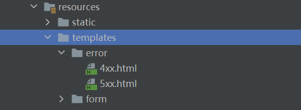
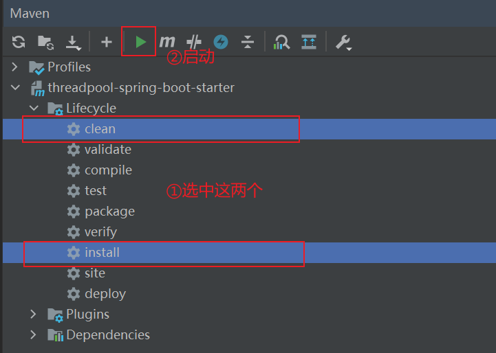
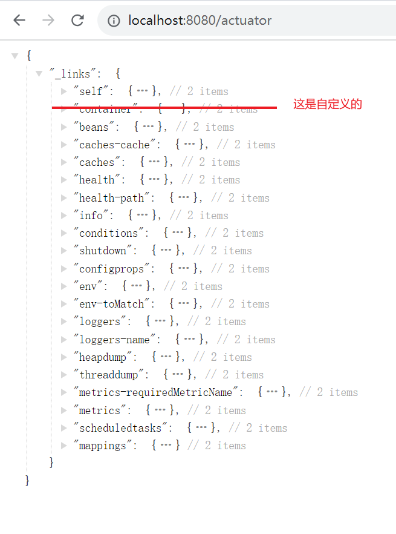
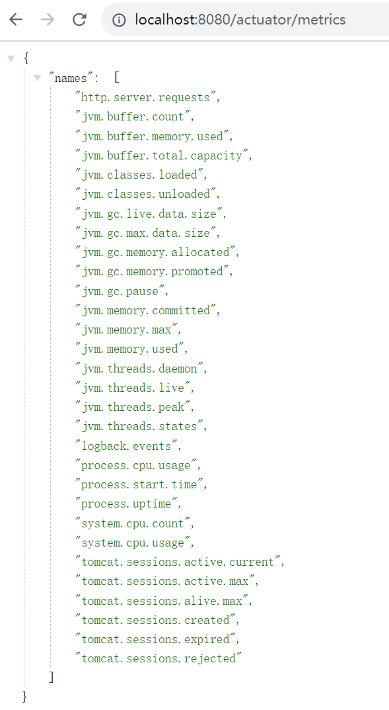
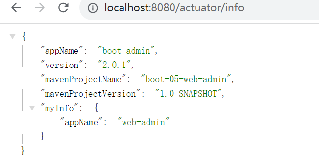
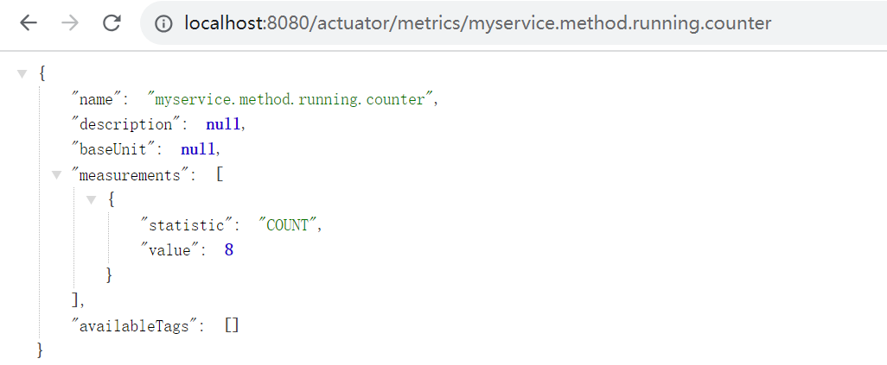
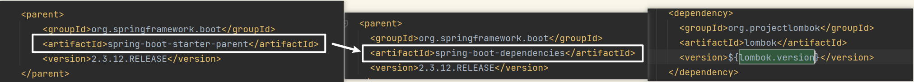
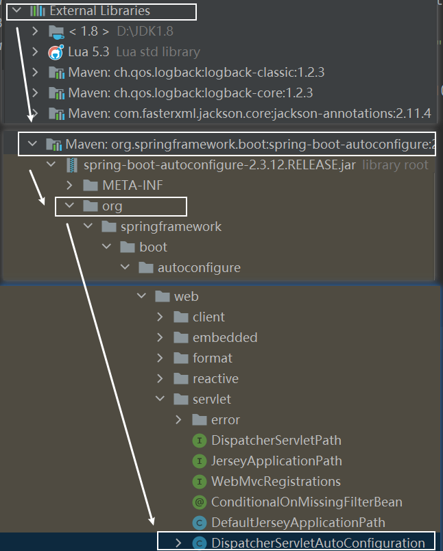
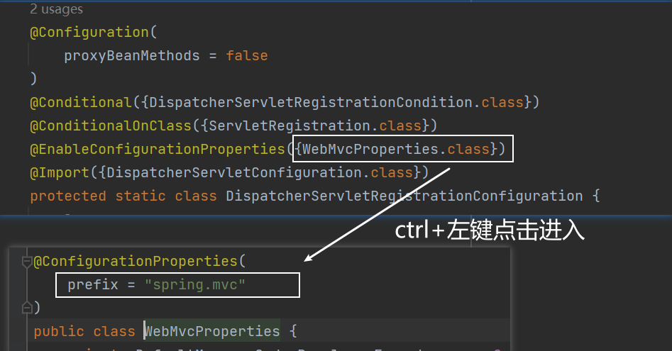

# SpringBoot使用手册

> author：spongehah	https://blog.hahhome.top/

[TOC]

# 1 容器功能

## 1.1 组件添加

### 1 @Configuration

用法：加在类上，告诉SpringBoot这是一个配置类 == 配置文件

属性：@Configuration(**proxyBeanMethods** = false)

> - 1、配置类里面使用@Bean标注在方法上给容器注册组件，默认也是单实例的
>
> - 2、配置类本身也是组件
>
> - 3、proxyBeanMethods：代理bean的方法，**默认为true**
>   - Full(proxyBeanMethods = **true**)、【保证每个@Bean方法被调用多少次返回的组件都是**单实例**的】
>   
>   - Lite(proxyBeanMethods = **false**)【每个@Bean方法被调用多少次返回的组件都是**新创建**的】
>
>   - 组件依赖必须使用Full模式默认。其他默认是否Lite模式
>   
>     - 配置类组件之间**无依赖**关系用Lite模式**加速容器启动过程，减少判断**
>   
>     - 配置类组件之间**有依赖**关系，方法会被调用得到之前单实例组件，用Full模式

### 2 @Import

用法：@Import({Xxx.class, Xxx.class}) //加在类上，给容器中自动创建出导入的全部类型的组件、默认组件的名字就是全类名

### 3 @Bean、@Component、@Controller、@Service、@Repository

都是用于声明Bean的注解，其中@Bean是加在方法上的，其它四个是加在类上的

@Bean注解修饰的方法还需要在@Configuration修饰的类下，才能被注册到容器中

### 4 @ConditionalOnXxx

包含@ConditionalOnBean、@ConditionalOnMissingBean...

条件装配：满足Conditional指定的条件，则进行组件注入

## 1.2 原生配置文件引入

### 1 @ImportResource

用法：@ImportResource("classpath:beans.xml") //加在配置类上，可以引入Spring等的原生配置文件，可以兼容只使用Spring的应用，避免手动将xml配置换为注解

## 1.3 配置绑定

### 1 @ConfigurationProperties

用法：

1. @EnableConfigurationProperties(Xxx.class)：加在配置类上
   	1、开启Xxx配置绑定功能
   	2、把这个Xxx这个组件自动注册到容器中
   @ConfigurationProperties(prefix = "xxx")：加在需要进行配置绑定的类Xxx上
2. @Component //只有在容器中的组件，才会拥有SpringBoot提供的强大功能
   @ConfigurationProperties(prefix = "xxx") //都加在需要进行配置绑定的类Xxx上

作用：可以在application.properties或application.yml配置文件中以xxx为前缀，定义改组件的属性，并通过以上注解进行绑定，封装成一个Bean

```xml
    <!-- 自定义的前缀在配置文件中配置时没有提示，加入这个依赖就可以有提示了 -->
	<dependency>
        <groupId>org.springframework.boot</groupId>
        <artifactId>spring-boot-configuration-processor</artifactId>
        <optional>true</optional>
    </dependency>


	<build>
        <plugins>
            <plugin>
                <!-- maven打包插件 -->
                <groupId>org.springframework.boot</groupId>
                <artifactId>spring-boot-maven-plugin</artifactId>
                <!-- 打包时忽略configuration-processor -->
                <configuration>
                    <excludes>
                        <exclude>
                            <groupId>org.springframework.boot</groupId>
                            <artifactId>spring-boot-configuration-processor</artifactId>
                        </exclude>
                    </excludes>
                </configuration>
            </plugin>
        </plugins>
    </build>
```

### 2 @Value

可以使用**@Value("${}")**注解绑定**配置文件**中的值，可以是自定义的，也可以是spring有的，甚至可以获取操作系统的环境变量等**系统信息**

用法示例：

```java
@Value("${person.name}")
private String personName;

@Value("${server.port}")
private String port;
```


## 1.4 自动装配原理

在笔记[《Spring源码解读》](https://blog.hahhome.top/blog/Spring%E6%BA%90%E7%A0%81%E8%A7%A3%E8%AF%BB)中

## 1.5 条件装配

使用**@ConditionalOnXxx**注解，有很多


# 2 静态资源访问

## 2.1 静态资源路径目录

**默认情况**下，将静态资源放在以下目录下，就能使用 **当前项目根路径/ + 静态资源名** 访问到对应的静态资源：

1. /static
2. /public
3. /resources
4. /META-INF/resources

> 这些目录可以是在resource目录下(即classpath)，也可以是在jar包(依赖引入的或打包的)下的这些目录下


修改默认的静态资源路径：

```yaml
spring:
  resources:
    static-locations: [classpath:/haha/]
    add-mappings: false   # 设置为false禁用所有静态资源规则，默认未true
```


> **原理：**根据SpringMVC处理请求，会先查询有无对应映射Controller，如果没有就交给静态资源处理器，看能否处理，若不能则返回404，若能静态资源处理器会先判断有无禁用所有静态资源规则，若未禁用，则①先判断是否是 `/webjars/**` 的映射规则，若是则匹配路径"classpath:/META-INF/resources/webjars/"下的资源；②再判断默认的 `/**` 的映射规则，去匹配默认的4个静态资源路径 /static 、 /public、 /resources、 /META-INF/resources 下的资源

## 2.2 静态资源访问前缀

**默认无前缀**，静态资源映射为/**

修改静态资源访问前缀：

```yaml
spring:
  mvc:
    static-path-pattern: /res/**
```

## 2.3 webjars

自动映射/webjars/**，如引入jquery依赖后，就有jquery的jar包，jar包下有目录/META-INF/resources/webjars/... ，所以访问路径 /webjars/xxx 时会自动映射到上述目录下查找

> 其实还是符合2.1的默认规则，在/META-INF/resources目录下

## 2.4 欢迎页和favicon

静态资源路径目录下放 index.html 和 favicon.ico

可以配置静态资源路径，但是不可以配置静态资源的访问前缀。否则导致 index.html 和 favicon.ico 不能被默认访问
欢迎页不能设置访问前缀是因为源码中写死了访问映射必须是 /** 


# 3 请求处理

## 3.1 请求映射

### 1 Rest表单提交：HiddenHttpMethodFilter

当我们使用**表单提交**时，由于表单中method只能写get和post两种请求，所以当我们想要发送put、delete、patch请求时：

1. 需要设置表单：method=post，隐藏域 _method=put/delete/patch

   ```html
   <input type="hidden" name="_method" value="put">
   ```

2. 配置文件手动开启HiddenHttpMethodFilter：

```yaml
spring:
  mvc:
    hiddenmethod:
      filter:
        enabled: true   #开启页面表单的Rest功能
```

> **原理：**当HiddenHttpMethodFilter拦截到**post请求**时，会获取到获取到**_method**的值，若获取到值并且是PUT、DELETE、PATCH三种请求的话，就使用包装模式requestWrapper重写了getMethod方法，**将请求的method修改为对应的_method的值**，以后的方法调用getMethod是**调用requestWrapper的重写的getMethod方法**


当使用**客户端**（如PostMan）时，会直接发送Put、delete等方式请求，无需Filter


修改隐藏域_method的名称：

```java
@Configuration
public class WebConfig {
    @Bean
    public HiddenHttpMethodFilter hiddenHttpMethodFilter() {
        HiddenHttpMethodFilter hiddenHttpMethodFilter = new HiddenHttpMethodFilter();
        hiddenHttpMethodFilter.setMethodParam("_m");
        return hiddenHttpMethodFilter;
    }
}
```


### 2 请求映射原理 

在笔记[《Spring源码解读》](https://blog.hahhome.top/blog/Spring%E6%BA%90%E7%A0%81%E8%A7%A3%E8%AF%BB)中


## 3.2 获取请求参数

### 1 @RequestParam

示例：

访问url：localhost:8080/hello?id=1&age=18

```java
@GetMapping("/hello")
public Map<String, Object> hello(@RequestParam("id") Integer id, 
                                 @RequestParam Map<String, String> map) {
    Map<String, Object> resultMap = new HashMap<>();
    resultMap.put("id", id);
    resultMap.put("map", map);
    return resultMap; 
}
```

### 2 @PathVarible

示例：

访问url：localhost:8080/hello/1/18

```java
@GetMapping("/hello/{id}/{age}")
public Map<String, Object> hello2(@PathVariable("id") Integer id,
                                  @PathVariable Map<String, String> map) {
    Map<String, Object> resultMap = new HashMap<>();
    resultMap.put("id", id);
    resultMap.put("map", map);
    return resultMap;
}
```

### 3 @RequestBody

适用于表单提交

示例：

访问url：localhost:8080/hello?id=1&age=18	method=POST

```java
@PostMapping("/hello5")
public Map<String, Object> hello3(@RequestBody String content) {
    Map<String, Object> resultMap = new HashMap<>();
    resultMap.put("content", content);
    return resultMap;
}
```

或是将@RequestBody的内容封装到某个具体的实体类当中

### 4 @RequestHeader

示例：

访问url：localhost:8080/hello4

```java
@GetMapping("/hello3")
public Map<String, Object> hello4(@RequestHeader("User-Agent") String userAgent,
                                  @RequestHeader Map<String, String> map) {
    Map<String, Object> resultMap = new HashMap<>();
    resultMap.put("userAgent", userAgent);
    resultMap.put("map", map);
    return resultMap;
}
```

### 5 @CookieValue

示例：

访问url：localhost:8080/hello5

```java
@GetMapping("/hello4")
public Map<String, Object> hello5(@CookieValue("b-user-id") String buserid,
                                  @CookieValue("b-user-id") Cookie cookie) {
    Map<String, Object> resultMap = new HashMap<>();
    resultMap.put("b-user-id", buserid);
    resultMap.put("cookie", cookie.getName() + cookie.getValue());
    return resultMap;
}
```

###  6 @RequestAttribute

示例：

访问url：localhost:8080/goto

```java
@Controller
public class RequestAttributeController {
    @GetMapping("/goto")
    public String gotoPage(HttpServletRequest request) {
        request.setAttribute("msg", "成功了。。。");
        return "forward:/success";
    }
    
    @ResponseBody
    @GetMapping("/success")
    public Map success(@RequestAttribute("msg") String msg, 
                       HttpServletRequest request) {
        Object msg1 = request.getAttribute("msg");
        Map<String, Object> map = new HashMap<>();
        map.put("msg", msg);
        map.put("msg1", msg1);
        return map;
    }
}
```

### 7 @MatrixVariable

矩阵变量

示例：

访问url：
localhost:8080/cars/sell;low=34;brand=byd,audi,yd
localhost:8080/boss/1;age=20/2;age=22

```java
@RestController
public class MatrixVariableController {
    //语法1： /cars/sell;low=34;brand=byd,audi,yd
    @GetMapping("/cars/{sell}")
    public Map carsSell(@MatrixVariable("low") Integer low,
                        @MatrixVariable("brand")List<String> brand) {
        Map<String, Object> map = new HashMap<>();
        map.put("low", low);
        map.put("brand", brand);
        return map;
    }

    //语法2： /boss/1;age=20/2;age=22
    @GetMapping("/boss/{bossId}/{empId}")
    public Map boss(@MatrixVariable(value = "age", pathVar = "bossId") Integer bossAge,
                    @MatrixVariable(value = "age", pathVar = "empId") Integer empAge) {
        Map<String, Object> map = new HashMap<>();
        map.put("bossAge", bossAge);
        map.put("empAge", empAge);
        return map;
    }
}

@Configuration
public class WebConfig implements WebMvcConfigurer {
    //开启矩阵变量方法1：WebConfig 实现 WebMvcConfigurer
    @Override
    public void configurePathMatch(PathMatchConfigurer configurer) {
        UrlPathHelper urlPathHelper = new UrlPathHelper();
        //设置为不移除分号(;)后面的内容，即开启矩阵变量
        urlPathHelper.setRemoveSemicolonContent(false);
        configurer.setUrlPathHelper(urlPathHelper);
    }
    
    //开启矩阵变量方法2：WebConfig 不实现 WebMvcConfigurer
    @Bean
    public WebMvcConfigurer webMvcConfigurer() {
        return new WebMvcConfigurer() {
            @Override
            public void configurePathMatch(PathMatchConfigurer configurer) {
                UrlPathHelper urlPathHelper = new UrlPathHelper();
                //设置为不移除分号(;)后面的内容，即开启矩阵变量
                urlPathHelper.setRemoveSemicolonContent(false);
                configurer.setUrlPathHelper(urlPathHelper);
            }
        };
    }
}
```

### 8 复杂类型参数

例如HttpServletRequest、**Model、Map**、RedirectAttributes、ServletResponse...等等等等

其中Model 和 Map 类型的数据，若是向里面放值，**最终都会被保存到requestAttribute请求域中**

> 为什么？原理：在笔记[《Spring源码解读》](https://blog.hahhome.top/blog/Spring%E6%BA%90%E7%A0%81%E8%A7%A3%E8%AF%BB)中

### 9 自定义对象类型参数

如自定义JavaBean 类型：Person、User等

> 自定义对象的参数解析原理：在笔记[《Spring源码解读》](https://blog.hahhome.top/blog/Spring%E6%BA%90%E7%A0%81%E8%A7%A3%E8%AF%BB)中

### 10 自定义Converter

converter：用于将传入的请求中的参数，封装到形参的JavaBean中

自定义converter：在 9自定义对象类型参数 的基础上，可以将传入的 "小黑,3" 转换为Pet对象

```java
@Configuration
public class WebConfig implements WebMvcConfigurer {

    @Override
    public void addFormatters(FormatterRegistry registry) {
        registry.addConverter(new Converter<String, Pet>() {
            @Override
            public Pet convert(String source) {
                // 小黑,3
                if (!StringUtils.isEmpty(source)) {
                    Pet pet = new Pet();
                    String[] split = source.split(",");
                    pet.setName(split[0]);
                    pet.setAge(split[1]);
                    return pet;
                }
                return null;
            }
        });
    }
}
```

### 11 参数处理原理

在笔记[《Spring源码解读》](https://blog.hahhome.top/blog/Spring%E6%BA%90%E7%A0%81%E8%A7%A3%E8%AF%BB)中


# 4 响应处理

## 4.1 数据响应原理

在笔记[《Spring源码解读》](https://blog.hahhome.top/blog/Spring%E6%BA%90%E7%A0%81%E8%A7%A3%E8%AF%BB)中

## 4.2 内容协商

内容协商即告诉服务器自己能够接收什么格式的数据

### 1 内容协商策略

**默认**情况下是**1 基于请求头的内容协商**，只能通过接收请求头中的Accept字段进行最佳匹配

但是使用浏览器时，我们无法修改请求头，于是可以**手动开启2 基于请求参数的内容协商功能**：

```yaml
spring:
    contentnegotiation:
      favor-parameter: true  #开启请求参数内容协商模式
```

请求格式：localhost:8080/goto?**format=xml**

在format中指定格式

要使用xml，还需要引入xml场景：

```xml
<dependency>
    <groupId>com.fasterxml.jackson.dataformat</groupId>
    <artifactId>jackson-dataformat-xml</artifactId>
</dependency>
```


> 内容协商**原理**：在笔记[《Spring源码解读》](https://blog.hahhome.top/blog/Spring%E6%BA%90%E7%A0%81%E8%A7%A3%E8%AF%BB)中

### 2 自定义MessageConverter

注意区分 MessageConverter 和 Converter 的区别

MessageConverter：用于写出数据，将指定的方法返回类型(JavaBean类型或简单数据类型)写出为指定格式的数据(如json、xml等)
Converter：用于读取数据，将传入的请求中的参数，封装到形参的JavaBean中

当我们需要自定义一种媒体格式MediaType(返回格式，常见有xml和json)时，
我们需要自定义一个MessageConverter，
然后添加配置注册该自定义MessageConverter，但是现在只能用于基于请求头的内容协商
如果还要使用基于参数的内容协商的话，还需要配置基于参数的内容协商策略支持的新MediaType：

```java
//自定义MessageConverter
public class CustomMessageConverter implements HttpMessageConverter<Person> {
    @Override
    public boolean canRead(Class<?> aClass, MediaType mediaType) {
        return false;
    }

    //写出场景
    @Override
    public boolean canWrite(Class<?> aClass, MediaType mediaType) {
        return aClass.isAssignableFrom(Person.class);
    }

    /**
     * 告诉服务器该MessageConverter能够写出的MediaType
     * 如json格式就是 application/json
     */
    @Override
    public List<MediaType> getSupportedMediaTypes() {
        return MediaType.parseMediaTypes("application/x-hah");
    }

    @Override
    public Person read(Class<? extends Person> aClass, HttpInputMessage httpInputMessage) throws IOException, HttpMessageNotReadableException {
        return null;
    }

    @Override
    public void write(Person person, MediaType mediaType, HttpOutputMessage httpOutputMessage) throws IOException, HttpMessageNotWritableException {
        //自定义写出的格式
        String data = person.getUserName() + ";" + person.getAge();
        //写出
        OutputStream body = httpOutputMessage.getBody();
        body.write(data.getBytes());
    }
}

//添加配置
@Configuration
public class WebConfig implements WebMvcConfigurer {
    // 注册自定义MessageConverter
    @Override
    public void extendMessageConverters(List<HttpMessageConverter<?>> converters) {
        converters.add(new CustomMessageConverter());
    }

    // 配置基于参数的内容协商策略支持的新MediaType
    @Override
    public void configureContentNegotiation(ContentNegotiationConfigurer configurer) {
        HeaderContentNegotiationStrategy headerStrategy = new HeaderContentNegotiationStrategy();
        Map<String, MediaType> mediaTypes = new HashMap<>();
        mediaTypes.put("json", MediaType.APPLICATION_JSON);
        mediaTypes.put("xml", MediaType.APPLICATION_XML);
        // 上面是原来的功能，下面是新增的功能
        mediaTypes.put("hh", MediaType.parseMediaType("application/x-hah"));
        ParameterContentNegotiationStrategy parameterStrategy = new ParameterContentNegotiationStrategy(mediaTypes);
        // 必须像源码一样，先放入parameterStrategy，先放headerStrategy会导致基于参数方式失效
        configurer.strategies(Arrays.asList(parameterStrategy,headerStrategy));
    }
}
```


# 5 常用操作

## 5.1 拦截器

以简单登录拦截器为例：

```java
//登录拦截器
@Slf4j
public class LoginInterceptor implements HandlerInterceptor {

    @Override
    public boolean preHandle(HttpServletRequest request, HttpServletResponse response, Object handler) throws Exception {
        String requestURI = request.getRequestURI();
        log.info("preHandle拦截的请求路径是{}",requestURI);
        //登录检查逻辑
        HttpSession session = request.getSession();
        Object loginUser = session.getAttribute("loginUser");
        if(loginUser != null){
            //放行
            return true;
        }
        //拦截住。未登录。跳转到登录页
        request.setAttribute("msg","请先登录");
        //re.sendRedirect("/");
        request.getRequestDispatcher("/").forward(request,response);
        return false;
    }

    @Override
    public void postHandle(HttpServletRequest request, HttpServletResponse response, Object handler, ModelAndView modelAndView) throws Exception {
        HandlerInterceptor.super.postHandle(request, response, handler, modelAndView);
    }

    @Override
    public void afterCompletion(HttpServletRequest request, HttpServletResponse response, Object handler, Exception ex) throws Exception {
        HandlerInterceptor.super.afterCompletion(request, response, handler, ex);
    }
}


//添加配置
@Configuration
public class WebAdminConfig implements WebMvcConfigurer {
    @Override
    public void addInterceptors(InterceptorRegistry registry) {
        registry.addInterceptor(new LoginInterceptor())
                .addPathPatterns("/**")
                .excludePathPatterns("/","/login","/css/**","/fonts/**","/js/**","/images/**");
    }
}
```


> 拦截器的执行顺序：在笔记[《Spring源码解读》](https://blog.hahhome.top/blog/Spring%E6%BA%90%E7%A0%81%E8%A7%A3%E8%AF%BB)中可以看出来，在《Spring重要知识点总结》中有详细说明

## 5.2 文件上传

表单：指明enctype="multipart/form-data"

```html
<form method="post" action="/upload" enctype="multipart/form-data">
    <input type="file" name="file"><br>
    <input type="submit" value="提交">
</form>
```

配置上传文件大小：

```yaml
spring: 
  servlet:
    multipart:
      max-file-size: 5MB
      max-request-size: 10MB
```

文件上传代码：

**推荐上传到OSS服务器**，下面给出//放到项目路径 和 //放到本机指定位置 两种写法

```java
//放到项目路径
@PostMapping("/upload")
public String upload(@RequestParam("email") String email,
                     @RequestParam("username") String username,
                     @RequestPart("headerImg")MultipartFile headerImg,
                     @RequestPart("photos") MultipartFile[] photos,
                     /*HttpSession session*/) throws IOException {
    
    //放到项目运行的web服务器(如tomcat)的真实运行路径
    /*ServletContext servletContext = session.getServletContext();
    String photoPath = servletContext.getRealPath("photo");*/
    
    //放到项目resources目录下的photo文件夹
    File file = new File("src/main/resources/static/photo");
    //上传到target处才能实时加载
	/File file = new File("target/classes/static/picture");
    if(!file.exists()){
        file.mkdirs();
    }

    if (!headerImg.isEmpty()) {
        String originalFilename = headerImg.getOriginalFilename();
        String hzName = originalFilename.substring(originalFilename.lastIndexOf("."));
        String filename = originalFilename.substring(0,originalFilename.lastIndexOf(".")) + UUID.randomUUID().toString() + hzName;
        headerImg.transferTo(new File(file.getAbsoluteFile() + File.separator + filename));
    }
    if(photos.length > 0){
        for (MultipartFile photo : photos) {
            if(!photo.isEmpty()){
                String originalFilename = photo.getOriginalFilename();
                String hzName = originalFilename.substring(originalFilename.lastIndexOf("."));
                String filename = originalFilename.substring(0,originalFilename.lastIndexOf(".")) + UUID.randomUUID().toString() + hzName;
                photo.transferTo(new File(file.getAbsoluteFile() + File.separator + filename));
            }
        }
    }
    return "main";
}

//放到本机指定位置
@PostMapping("/upload")
public String upload(@RequestParam("email") String email,
                     @RequestParam("username") String username,
                     @RequestPart("headerImg") MultipartFile headerImg,
                     @RequestPart("photos") MultipartFile[] photos) throws IOException {
    if(!headerImg.isEmpty()){
        //保存到文件服务器，OSS服务器
        String originalFilename = headerImg.getOriginalFilename();
        headerImg.transferTo(new File("H:\\cache\\"+originalFilename));
    }
    if(photos.length > 0){
        for (MultipartFile photo : photos) {
            if(!photo.isEmpty()){
                String originalFilename = photo.getOriginalFilename();
                photo.transferTo(new File("H:\\cache\\"+originalFilename));
            }
        }
    }
    return "main";
}
```

> 文件上传原理：在笔记[《Spring源码解读》](https://blog.hahhome.top/blog/Spring%E6%BA%90%E7%A0%81%E8%A7%A3%E8%AF%BB)中

## 5.3 文件下载

简单文件下载案例：

```java
@RequestMapping("/down")
public ResponseEntity<byte[]> testResponseEntity(HttpSession session) throws IOException {
    //获取ServletContext对象
    ServletContext servletContext = session.getServletContext();
    //获取服务器中文件的真实路径
    String realPath = servletContext.getRealPath("img");
    realPath = realPath + File.separator + "1.jpg";/*根路径：target/untitled-1.0-SNAPSHOT/img/1.jpg*/
    //创建输入流
    InputStream is = new FileInputStream(realPath);
    //创建字节数组
    byte[] bytes = new byte[is.available()];
    //将流读到字节数组中
    is.read(bytes);
    //创建HttpHeaders对象设置响应头信息
    MultiValueMap<String, String> headers = new HttpHeaders();
    //设置要下载方式以及下载文件的名字
    headers.add("Content-Disposition", "attachment;filename=1.jpg");
    //设置响应状态码
    HttpStatus statusCode = HttpStatus.OK;
    //创建ResponseEntity对象
    ResponseEntity<byte[]> responseEntity = new ResponseEntity<>(bytes, headers, statusCode);
    //关闭输入流
    is.close();
    return responseEntity;
}
```

## 5.4 自定义异常页

> 背景：整体项目，如使用thymeleaf模板引擎，非前后端分离

将自定义异常页，如404.html、4xx.html、5xx.html等等**放到 resources/templates/error/ 下**



当发生状态码为4开头或者5开头的异常时，就会匹配到error/下的对应的4xx或5xx页面

如果有精确的错误页面，如404.html，那么将会**优先匹配**，但如果只有404.html，而没有4xx.html，那么比如400、403等其它异常都不会被匹配到错误页，将会使用白页

## 5.5 自定义全局异常和异常解析器

案例一：

```java
//自定义全局异常的一种方式：使用@ResponseStatus注解，还有其它方式自己查询
@ResponseStatus(value= HttpStatus.FORBIDDEN,reason = "用户数量太多")
public class UserTooManyException extends RuntimeException {

    public  UserTooManyException(){

    }
    public  UserTooManyException(String message){
        super(message);
    }
}

//自定义异常处理器
@ControllerAdvice
//前后端分离场景会使用@RestControllerAdvice，因为返回的是json数据
public class GlobalExceptionHandler {
	
    //这些异常将会被这个异常解析器处理
    @ExceptionHandler({ArithmeticException.class,NullPointerException.class})  //处理异常
    public String handleArithException(Exception e){
		...
        return "login"; //视图地址
    }
}
```

案例二：

```java
@Data
public class YyghException extends RuntimeException {

    @ApiModelProperty(value = "异常状态码")
    private Integer code;

    /**
     * 通过状态码和错误消息创建异常对象
     * @param message
     * @param code
     */
    public YyghException(String message, Integer code) {
        super(message);
        this.code = code;
    }

    /**
     * 接收枚举类型对象
     * @param resultCodeEnum
     */
    public YyghException(ResultCodeEnum resultCodeEnum) {
        super(resultCodeEnum.getMessage());
        this.code = resultCodeEnum.getCode();
    }

    @Override
    public String toString() {
        return "YyghException{" +
                "code=" + code +
                ", message=" + this.getMessage() +
                '}';
    }
}

@RestControllerAdvice	//等于@ControllerAdvice + @ResponseBody
public class GlobalExceptionHandler {

    @ExceptionHandler(Exception.class)
    public Result error(Exception e){
        e.printStackTrace();
        return Result.fail();
    }

    @ExceptionHandler(YyghException.class)
    public Result error(YyghException e){
        e.printStackTrace();
//        return Result.fail();
        return Result.build(e.getCode(),e.getMessage());
    }
   
}
```

自定义一个全局异常的详细步骤：https://mp.weixin.qq.com/s?__biz=Mzg2OTA0Njk0OA==&mid=2247486379&idx=2&sn=48c29ae65b3ed874749f0803f0e4d90e&chksm=cea24460f9d5cd769ed53ad7e17c97a7963a89f5350e370be633db0ae8d783c3a3dbd58c70f8&token=1054498516&lang=zh_CN#rd

> 异常处理流程：在笔记[《Spring源码解读》](https://blog.hahhome.top/blog/Spring%E6%BA%90%E7%A0%81%E8%A7%A3%E8%AF%BB)中

## 5.6 AOP的使用

1. 在启动类上加上 **@EnableAspectJAutoProxy** 注解，参数proxyTargetClass的意思是是否使用cglib，默认为false，当有实现类时使用jdk动态代理，无实现类时使用cglib；配置为true时代表都使用cglib

2. 在切面上加上注解 **@Aspect** 和 **@Component**，被增强的类也需要被IoC管理(**声明Bean的四个注解**)

   - 切面的优先级可以通过注解 **@Order**(值越小优先级越高) 或 实现 **Ordered** 接口指定

   - 使用 **@PointCut**("execution(* com.*.*(**))") 声明切入点

   - 五种通知模式：

     1. **@Before**（前置通知）：目标对象的**方法调用之前**触发

     2. **@After** （后置通知）：目标对象的**方法调用之后**触发

     3. **@AfterReturning**（返回通知）：目标对象的方法调用完成，在**返回结果值之后**触发

     4. **@AfterThrowing**（异常通知）：目标对象的方法运行中**抛出 / 触发异常后**触发。AfterReturning 和 AfterThrowing 两者互斥。如果方法调用成功无异常，则会有返回值；如果方法抛出了异常，则不会有返回值。

     5. **@Around** （环绕通知）：编程式控制目标对象的方法调用。环绕通知是所有通知类型中可操作范围最大的一种，因为它可以直接拿到目标对象，以及要执行的方法，所以环绕通知可以任意的在目标对象的方法调用前后搞事，甚至不调用目标对象的方法

        > 获取连接点 方法形参、异常信息、返回信息 等：
        >
        > ```java
        > @Around ("pt()")
        > public Object around(ProceedingJoinPoint = pjp)throws Throwable{
        > 	//获取连接点方法的形参值
        > 	Object[] args = pjp.getArgs();
        > 
        > 	//获取执行签名信息
        > 	Signature signature = pjp.getsignature();
        > 	//通过签名获取执行类型（接口名）
        > 	String className = signature.getDeclaringTypeName();
        > 	//通过签名获取执行操作名称（方法名）
        > 	String methodName = signature.getName();
        > 
        > 	System.out.println("around before advice ...")
        > 	object ret = pjp.proceed();
        > 	System.out.println("around after advice ...")
        > 	return ret;
        > }
        > 
        > @After/ @Before	//若需要返回值或者抛出异常: @AfterReturning(value = "pt()",returning = "ret")/ @AfterThrowing(throwing="")
        > public void afterReturning(JoinPoint jp,Object ret){
        > 	//获取连接点方法的形参值
        > 	Object[] args = jp.getArgs();
        > 	System.out.println("afterReturning advice ..."+ret);
        > }
        > ```

## 5.7 事务的使用

1. 在启动类上加 **@EnableTransactionManagement** 开启事务管理 和 **配置事务管理器**(SpringBoot会自动完成)

2. 标注 @Transactional 注解开启事务：

   1. **方法**：推荐将注解使用于方法上，不过需要注意的是：**该注解只能应用到 public 方法上，否则不生效。**
   2. **类**：如果这个注解使用在类上的话，表明该注解对该类中所有的 public 方法都生效。
   3. **接口**：不推荐在接口上使用。

3. @Transactional 可配置属性：

   **常用的**5个事务属性：

   | 属性名      | 说明                                                         |
   | :---------- | :----------------------------------------------------------- |
   | propagation | 事务的传播行为，默认值为 REQUIRED，可选的值在上面介绍过      |
   | isolation   | 事务的隔离级别，默认值采用 DEFAULT，可选的值在上面介绍过     |
   | timeout     | 事务的超时时间，默认值为-1（不会超时）。如果超过该时间限制但事务还没有完成，则自动回滚事务。 |
   | readOnly    | 指定事务是否为只读事务，默认值为 false。                     |
   | rollbackFor | 用于指定能够触发事务回滚的异常类型，并且可以指定多个异常类型。 |

4. 另外要注解事务的7种失效场景

> 事务属性 和 失效场景 详情请看我的笔记[《Spring重要知识点总结》](https://blog.hahhome.top/blog/Spring%E9%87%8D%E8%A6%81%E7%9F%A5%E8%AF%86%E7%82%B9%E6%80%BB%E7%BB%93/)

## 5.8 参数校验

> 参数校验部分转载自 [JavaGuide](https://javaguide.cn/system-design/framework/spring/spring-common-annotations.html#_6-%E5%8F%82%E6%95%B0%E6%A0%A1%E9%AA%8C)

SpringBoot 项目的 spring-boot-starter-web 依赖中已经有 hibernate-validator 包，不需要引用相关依赖。

**注**：更新版本的 spring-boot-starter-web 依赖中不再有 hibernate-validator 包（如 2.3.11.RELEASE），需要自己引入 `spring-boot-starter-validation` 依赖。

```xml
<dependency>
    <groupId>org.springframework.boot</groupId>
    <artifactId>spring-boot-starter-validation</artifactId>
</dependency>
```

👉 需要注意的是：**所有的注解，推荐使用 JSR 注解，即`javax.validation.constraints`，而不是`org.hibernate.validator.constraints`**

**常用参数校验注解：**

- `@NotEmpty` 被注释的字符串的不能为 null 也不能为空
- `@NotBlank` 被注释的字符串非 null，并且必须包含一个非空白字符
- `@Null` 被注释的元素必须为 null
- `@NotNull` 被注释的元素必须不为 null
- `@AssertTrue` 被注释的元素必须为 true
- `@AssertFalse` 被注释的元素必须为 false
- `@Pattern(regex=,flag=)`被注释的元素必须符合指定的正则表达式
- `@Email` 被注释的元素必须是 Email 格式。
- `@Min(value)`被注释的元素必须是一个数字，其值必须大于等于指定的最小值
- `@Max(value)`被注释的元素必须是一个数字，其值必须小于等于指定的最大值
- `@DecimalMin(value)`被注释的元素必须是一个数字，其值必须大于等于指定的最小值
- `@DecimalMax(value)` 被注释的元素必须是一个数字，其值必须小于等于指定的最大值
- `@Size(max=, min=)`被注释的元素的大小必须在指定的范围内
- `@Digits(integer, fraction)`被注释的元素必须是一个数字，其值必须在可接受的范围内
- `@Past`被注释的元素必须是一个过去的日期
- `@Future` 被注释的元素必须是一个将来的日期
- ……

**校验请求体：**在需要验证的参数上加上了@Valid注解

```java
@RestController
@RequestMapping("/api")
public class PersonController {

    @PostMapping("/person")			//在需要验证的参数上加上了@Valid注解
    public ResponseEntity<Person> getPerson(@RequestBody @Valid Person person) {
        return ResponseEntity.ok().body(person);
    }
}

@Data
@AllArgsConstructor
@NoArgsConstructor
public class Person {

    @NotNull(message = "classId 不能为空")
    private String classId;

    @Size(max = 33)
    @NotNull(message = "name 不能为空")
    private String name;

    @Pattern(regexp = "((^Man$|^Woman$|^UGM$))", message = "sex 值不在可选范围")
    @NotNull(message = "sex 不能为空")
    private String sex;

    @Email(message = "email 格式不正确")
    @NotNull(message = "email 不能为空")
    private String email;

}
```

别忘了校验Sevice的方法也需要加上 @Validated 和 @Valid 注解

**校验参数：**类上加 @Validated 注解，参数上加 @Valid 和 其它相应参数校验注解

```java
@RestController
@RequestMapping("/api")
@Validated	//类上加 @Validated 注解
public class PersonController {

    @GetMapping("/person/{id}")			//参数上加 @Valid 和 其它相应参数校验注解，如@Max
    public ResponseEntity<Integer> getPersonByID(@Valid @PathVariable("id") @Max(value = 5,message = "超过 id 的范围了") Integer id) {
        return ResponseEntity.ok().body(id);
    }
}

```

> 更多丰富的参数校验：[看Guide哥文章](https://mp.weixin.qq.com/s?__biz=Mzg2OTA0Njk0OA==&mid=2247485783&idx=1&sn=a407f3b75efa17c643407daa7fb2acd6&chksm=cea2469cf9d5cf8afbcd0a8a1c9cc4294d6805b8e01bee6f76bb2884c5bc15478e91459def49&token=292197051&lang=zh_CN#rd)。

## 5.9 定时任务

1. 启动类加上 @EnableScheduling 注解

2. 创建定时任务类：

   示例：需要放入容器中

   ```java
   @Component
   public class Task1 {
       @Scheduled(cron ="*/1 * * * * ?")
       public void sayWord() {
           System.out.println("world");
       }
   }
   ```

3. 指定时间参数：

   1. **cron**表达式
   2. fixedDelay：控制方法执行的间隔时间，是以上一次方法执行完开始算起；若阻塞，上一次执行完，间隔给定的时间后，执行下一次。
   3. fixedRate：控制方法执行的间隔时间，是以上一次方法执行完开始算起；若阻塞，**累计应该执行的次数**，不再阻塞时，把这些**累计次数全部执行掉**，而后再按照固定速率继续执行
   4. initialDelay：延迟启动时间，表示在容器启动后延迟多久才执行一次定时器（只会启动一次，可与其它参数搭配使用）

4. cron表达式语法格式为："秒域 分域 时域 日域 月域 周域 年域"

   SpringBoot的cron表达式一般只支持前面六个域，不支持年域

   取值范围:

   | 域名 | 可取值               | 可取符号（仅列部分常用） |
   | ---- | -------------------- | ------------------------ |
   | 秒域 | 0~59的整数           | * - , /                  |
   | 分域 | 0~59的整数           | * - , /                  |
   | 时域 | 0~23的整数           | * - , /                  |
   | 日域 | 1~31的整数           | * - , / ? L              |
   | 月域 | 1~12的整数或 JAN~DEC | * - , /                  |
   | 周域 | 1~7的整数或 SUN~SAT  | * - , / ? L #            |
   | 年域 | 1970~2099的整数      | * - , /                  |

5. 若要开启多线程定时任务，只需在定时任务类上再加上 @EnableAsync 注解即可

> 还可以基于接口 SchedulingConfigurer 的方式实现定时任务
> 参考文章：https://blog.csdn.net/qianlixiaomage/article/details/106599951

## 5.10 为当前类初始化一些数据

在当前类加载时，为当前类初始化一些数据，一般放在容器中某个组件的方法上

可以有以下方法：

1. @PostConstruct 注解
2. 实现 InitializingBean 接口
3. @Bean(initMethod="")

> 就是Spring IOC容器初始化中，初始化Bean时会执行的三个回调方法

对应的，也有销毁：

1. @PreDestroy
2. 实现 DisposableBean 接口
3. @Bean(destroyMethod="")

## 5.11 原生Servlet、Filter、Listener

在启动类添加 **@ServletComponentScan(basePackages = "")** 注解

> 注意：
> 原生Servlet的路径不会被SpringBoot的拦截器拦截，所以要自己配置原生Filter，因为DispatcherServlet的路径是 /，根据**精确优先原则**，会走自定义原生Servlet
> 原生Filter的拦截路径/*对应Spring的/**

注册原生Servlet、Filter、Listener方式1：使用注解@WebServlet@WebFilter@WebListener

```java
@WebServlet(urlPatterns = "/my")
public class MyServlet extends HttpServlet {

    @Override
    protected void doGet(HttpServletRequest req, HttpServletResponse resp) throws ServletException, IOException {
        resp.getWriter().write("66666");
    }
}

@Slf4j
@WebFilter(urlPatterns={"/css/*","/images/*"}) //原生Filter的拦截路径/*对应Spring的/**
public class MyFilter implements Filter {
    @Override
    public void init(FilterConfig filterConfig) throws ServletException {
        log.info("MyFilter初始化完成");
    }

    @Override
    public void doFilter(ServletRequest request, ServletResponse response, FilterChain chain) throws IOException, ServletException {
        log.info("MyFilter工作");
        chain.doFilter(request,response);
    }

    @Override
    public void destroy() {
        log.info("MyFilter销毁");
    }
}

@Slf4j
@WebListener
public class MySwervletContextListener implements ServletContextListener {

    @Override
    public void contextInitialized(ServletContextEvent sce) {
        log.info("MySwervletContextListener监听到项目初始化完成");
    }

    @Override
    public void contextDestroyed(ServletContextEvent sce) {
        log.info("MySwervletContextListener监听到项目销毁");
    }
}
```

方式2：配置类，就可以不使用那三个注解了

```java
@Configuration
public class MyRegistConfig {

    @Bean
    public ServletRegistrationBean myServlet(){
        MyServlet myServlet = new MyServlet();

        return new ServletRegistrationBean(myServlet,"/my","/my02");
    }

    @Bean
    public FilterRegistrationBean myFilter(){

        MyFilter myFilter = new MyFilter();
        //return new FilterRegistrationBean(myFilter,myServlet());
        FilterRegistrationBean filterRegistrationBean = new FilterRegistrationBean(myFilter);
        filterRegistrationBean.setUrlPatterns(Arrays.asList("/my","/css/*"));
        return filterRegistrationBean;
    }

    @Bean
    public ServletListenerRegistrationBean myListener(){
        MySwervletContextListener mySwervletContextListener = new MySwervletContextListener();
        return new ServletListenerRegistrationBean(mySwervletContextListener);
    }
}
```

## 5.12 切换Web服务器

```xml
<dependency>
    <groupId>org.springframework.boot</groupId>
    <artifactId>spring-boot-starter-web</artifactId>
    <!--移除tomcat依赖-->
    <exclusions>
        <exclusion>
            <groupId>org.springframework.boot</groupId>
            <artifactId>spring-boot-starter-tomcat</artifactId>
        </exclusion>
    </exclusions>
</dependency>
<!--引入需要的web服务器依赖-->
<dependency>
    <groupId>org.springframework.boot</groupId>
    <artifactId>spring-boot-starter-undertow</artifactId>
</dependency>
```

## 5.13 更换配置

### 1 配置文件切换环境profile

- 默认配置文件  application.yaml；任何时候都会加载
- 指定环境配置文件 application-{env}.yaml
- 默认配置与环境配置同时生效
- 同名配置项，profile配置优先级高于默认配置文件

**指定环境：**

```yaml
spring:
  profiles:
    active: env
```

或者打包后直接使用命令行的方式进行指定：java -jar xxx.jar --**spring.profiles.active=env**

**profile的条件装配：**

使用@Profile("env")注解指定在什么配置环境下才会生效，可以用到类或者@Bean上

**profile分组：**

除了指定一个配置环境以外，我们还可以**将一个配置环境又再次拆分为多个配置文件**，变得更灵活

```
spring.profiles.active=production  
# 将会激活application-production.yaml、application-proddb.yaml、application-prodmq.yaml这h'j

spring.profiles.group.production[0]=proddb
spring.profiles.group.production[1]=prodmq
```

### 2 配置文件优先级

常用的外部配置源：**Java属性文件**、**YAML文件**、**环境变量**、**命令行参数**

有以下这些位置可以放配置文件：

- (1) classpath 根路径
- (2) classpath 根路径下config目录
- (3) jar包当前目录
- (4) jar包当前目录的config目录
- (5) /config子目录的直接子目录

加载顺序：

1. 当前jar包内部的application.properties和application.yml
2. 当前jar包内部的application-{profile}.properties 和 application-{profile}.yml
3. 引用的外部jar包的application.properties和application.yml
4. 引用的外部jar包的application-{profile}.properties 和 application-{profile}.yml

**指定环境优先，外部优先，后面的可以覆盖前面的同名配置项，命令行优先级最高**

## 5.14 自定义Starter

比如我们自定义一个 threadpool-spring-boot-starter，返回一个自定义线程池

新建一个项目threadpool-spring-boot-starter，
pom.xml：

```xml
<?xml version="1.0" encoding="UTF-8"?>
<project xmlns="http://maven.apache.org/POM/4.0.0"
         xmlns:xsi="http://www.w3.org/2001/XMLSchema-instance"
         xsi:schemaLocation="http://maven.apache.org/POM/4.0.0 http://maven.apache.org/xsd/maven-4.0.0.xsd">
    <modelVersion>4.0.0</modelVersion>

    <groupId>com.spongehah</groupId>
    <artifactId>threadpool-spring-boot-starter</artifactId>
    <version>1.0-SNAPSHOT</version>
    
    <parent>
        <groupId>org.springframework.boot</groupId>
        <artifactId>spring-boot-starter-parent</artifactId>
        <version>2.3.12.RELEASE</version>
    </parent>

    <properties>
        <maven.compiler.source>8</maven.compiler.source>
        <maven.compiler.target>8</maven.compiler.target>
    </properties>
    
    <dependencies>
        <dependency>
            <groupId>org.springframework.boot</groupId>
            <artifactId>spring-boot-starter</artifactId>
        </dependency>
    </dependencies>

</project>
```

在java包下新建com.spongehah.auto.MyThreadPoolAutoConfiguration：

```java
@Configuration
public class MyThreadPoolAutoConfiguration {
    
    @ConditionalOnClass(ThreadPoolExecutor.class)
    @Bean
    public ThreadPoolExecutor myThreadPool() {
        return new ThreadPoolExecutor(
                10,
                10,
                10,
                TimeUnit.SECONDS,
                new ArrayBlockingQueue<>(100),
                Executors.defaultThreadFactory(),
                new ThreadPoolExecutor.AbortPolicy()
        );
    }
}
```

resources 包下创建META-INF/spring.factories文件：

```properties
org.springframework.boot.autoconfigure.EnableAutoConfiguration=\
com.spongehah.auto.MyThreadPoolAutoConfiguration
```

然后进行maven仓库的安装：


测试：

新建一个项目，导入threadpool-spring-boot-starter的依赖：

```xml
<dependency>
    <groupId>com.spongehah</groupId>
    <artifactId>threadpool-spring-boot-starter</artifactId>
    <version>1.0-SNAPSHOT</version>
</dependency>
```

然后就可以进行导入了：

```java
@RestController
public class HelloController {
    @Autowired
    private ThreadPoolExecutor myThreadPool;
    
    @GetMapping("/hello")
    public String hello() {
        return myThreadPool.getCorePoolSize() + ":" + myThreadPool.getMaximumPoolSize();
    }
}
```

## 5.15 自定义事件监听组件

可自定义的事件监听组件有：

- ApplicationContextInitializer
- ApplicationListener
- SpringApplicationRunListener
- ApplicationRunner
- CommandLineRunner

> 各监听组件在SpringBoot的启动流程中的详细**执行时机**，请看我的笔记[《Spring源码解读》SpringBoot启动流程部分](https://blog.hahhome.top/blog/Spring%E6%BA%90%E7%A0%81%E8%A7%A3%E8%AF%BB)，视频配置演示：[B站尚硅谷视频](https://www.bilibili.com/video/BV19K4y1L7MT/?p=86&spm_id_from=333.880.my_history.page.click&vd_source=34da131fa0b4ef9d62e5e0c78828f630)。

参考配置：

新建com.spongehah.boot.listeners包，在包下创建以下监听组件：

```java
public class MyApplicationContextInitializer implements ApplicationContextInitializer {

    @Override
    public void initialize(ConfigurableApplicationContext applicationContext) {
        System.out.println("ApplicationContextInitializer.....initialize...........");
    }
}

public class MyApplicationListener implements ApplicationListener {

    @Override
    public void onApplicationEvent(ApplicationEvent event) {
        System.out.println("MyApplicationListener...........onApplicationEvent............");
    }
}

public class MySpringApplicationRunListener implements SpringApplicationRunListener {

    private SpringApplication application;
    
    public MySpringApplicationRunListener(SpringApplication application, String[] args) {
        this.application = application;
    }

    @Override
    public void starting(ConfigurableBootstrapContext bootstrapContext) {
        System.out.println("MySpringApplicationRunListener...........starting...............");
    }

    @Override
    public void environmentPrepared(ConfigurableBootstrapContext bootstrapContext, ConfigurableEnvironment environment) {
        System.out.println("MySpringApplicationRunListener...........environmentPrepared...............");
    }

    @Override
    public void contextPrepared(ConfigurableApplicationContext context) {
        System.out.println("MySpringApplicationRunListener...........contextPrepared...............");
    }

    @Override
    public void contextLoaded(ConfigurableApplicationContext context) {
        System.out.println("MySpringApplicationRunListener...........contextLoaded...............");
    }

    @Override
    public void started(ConfigurableApplicationContext context) {
        System.out.println("MySpringApplicationRunListener...........started...............");
    }

    @Override
    public void running(ConfigurableApplicationContext context) {
        System.out.println("MySpringApplicationRunListener...........running...............");
    }

    @Override
    public void failed(ConfigurableApplicationContext context, Throwable exception) {
        System.out.println("MySpringApplicationRunListener...........failed...............");
    }
}

@Component
public class MyApplicationRunner implements ApplicationRunner {

    @Override
    public void run(ApplicationArguments args) throws Exception {
        System.out.println("ApplicationRunner.........run............");
    }
}

@Component
public class MyCommandLineRunner implements CommandLineRunner {

    @Override
    public void run(String... args) throws Exception {
        System.out.println("CommandLineRunner...........run");
    }
}
```

其中ApplicationContextInitializer、ApplicationListener、SpringApplicationRunListener这三个组件在SpringBoot启动流程中都是从spring.fatories中读取出来的，于是我们依葫芦画瓢：

在resources下创建 META-INF/**spring.factories** 文件：

```properties
org.springframework.context.ApplicationContextInitializer=\
com.spongehah.boot.listeners.MyApplicationContextInitializer

org.springframework.context.ApplicationListener=\
com.spongehah.boot.listeners.MyApplicationListener

org.springframework.boot.SpringApplicationRunListener=\
com.spongehah.boot.listeners.MySpringApplicationRunListener
```

然后ApplicationRunner、CommandLineRunner这两个组件在启动流程中是从容器中加载的，所以我们要使用**@Component **注解

## 5.16 JVM本地缓存-Caffeine

构建cache对象：

```java
Cache<String, String> cache = Caffeine.newBuilder().initialCapacity(100).build();
```

- Caffeine.newBuilder().[参数].build();	构建缓存对象，可以设置参数如初始大小，驱逐策略等
- cache.getIfPresent(key);     如果存在缓存就获取，否则返回null
- cache.get(key, function);     如果存在缓存就返回缓存，否则执行function操作（一般是查询数据库操作）**并存入缓存**
- cache.put(key, object)	将object放入缓存
- cache.invalidate(key)     删除指定key的缓存


三种缓存驱逐策略：

- **基于容量**：设置缓存的数量上限

  ```java
  // 创建缓存对象
  Cache<String, String> cache = Caffeine.newBuilder()
      .maximumSize(1) // 设置缓存大小上限为 1
      .build();
  ```

- **基于时间**：设置缓存的有效时间

  ```java
  // 创建缓存对象
  Cache<String, String> cache = Caffeine.newBuilder()
      // 设置缓存有效期为 10 秒，从最后一次写入开始计时 
      .expireAfterWrite(Duration.ofSeconds(10)) 
      .build();
  ```

- **基于引用**：设置缓存为软引用或弱引用，利用GC来回收缓存数据。性能较差，不建议使用。

> 在默认情况下，当一个缓存元素过期的时候，Caffeine**不会自动立即**将其清理和驱逐。而是在一次读或写操作后，或者在空闲时间完成对失效数据的驱逐。


整合到SpringBoot：

```java
@Configuration
public class CaffeineConfig {

    @Bean
    public Cache<Long, Item> itemCache(){
        return Caffeine.newBuilder()
                .initialCapacity(100)
                .maximumSize(10_000) //_只是分隔符，可以不要
                .build();
    }

    @Bean
    public Cache<Long, ItemStock> stockCache(){
        return Caffeine.newBuilder()
                .initialCapacity(100)
                .maximumSize(10_000)
                .build();
    }
}

@RestController
@RequestMapping("item")
public class ItemController {

    @Autowired
    private IItemService itemService;
    @Autowired
    private IItemStockService stockService;

    @Autowired
    private Cache<Long, Item> itemCache;
    @Autowired
    private Cache<Long, ItemStock> stockCache;
    
    // ...其它略
    
    @GetMapping("/{id}")
    public Item findById(@PathVariable("id") Long id) {
        return itemCache.get(id, key -> itemService.query()
                .ne("status", 3).eq("id", key)
                .one()
        );
    }

    @GetMapping("/stock/{id}")
    public ItemStock findStockById(@PathVariable("id") Long id) {
        return stockCache.get(id, key -> stockService.getById(key));
    }
}
```

## 5.17 导出导入Excel

依赖：

```xml
<!-- https://mvnrepository.com/artifact/com.alibaba/easyexcel -->
<dependency>
    <groupId>com.alibaba</groupId>
    <artifactId>easyexcel</artifactId>
    <version>2.1.1</version>
</dependency>
```

**小数据量**读写：

```java
//导出数据字典到Excel接口
@Override
public void exportDictData(HttpServletResponse response) {
    //设置下载信息
    response.setContentType("application/vnd.ms-excel");
    response.setCharacterEncoding("utf-8");
    String fileName = "dict";
    response.setHeader("Content-disposition", "attachment;filename="+ fileName + ".xlsx");
    //查询数据库
    List<Dict> dictList = baseMapper.selectList(null);
    //Dict -> DictEeVo
    List<DictEeVo> dictVoList = new ArrayList<>();
    dictList.forEach(dict -> {
        DictEeVo dictEeVo = new DictEeVo();
        BeanUtils.copyProperties(dict,dictEeVo);
        dictVoList.add(dictEeVo);
    });
    
    //调用方法进行写操作
    try {
        EasyExcel.write(response.getOutputStream(),DictEeVo.class).sheet().doWrite(dictVoList);
    } catch (IOException e) {
        e.printStackTrace();
    }
}
```

```java
//导入Excel数据字典接口
@Override
public void importDictData(MultipartFile file) {
    try {
        EasyExcel.read(file.getInputStream(),DictEeVo.class,new DictListener(baseMapper)).sheet().doRead();
    } catch (IOException e) {
        e.printStackTrace();
    }
}

//使用监听器写入数据到数据库
public class DictListener extends AnalysisEventListener<DictEeVo> {
    
    private DictMapper dictMapper;

    public DictListener(DictMapper dictMapper) {
        this.dictMapper = dictMapper;
    }

    //一行一行读
    @Override
    public void invoke(DictEeVo dictEeVo, AnalysisContext analysisContext) {
        //调用方法添加到数据库
        Dict dict = new Dict();
        BeanUtils.copyProperties(dictEeVo,dict);
        dictMapper.insert(dict);
    }

    @Override
    public void doAfterAllAnalysed(AnalysisContext analysisContext) {

    }
}
```

> 大数据量读写：
> 思路：采用分批并且采用JDBC批量操作快于MyBatis批量操作
> 参考文章：[百万数据Excel导入导出解决方案](https://mp.weixin.qq.com/s/7eg0eqLiUui8-5XQJuAwOQ)

# 6 数据访问

## 6.1 连接MySQL和使用Druid数据源

引入依赖：

```xml
<dependency>
    <groupId>mysql</groupId>
    <artifactId>mysql-connector-java</artifactId>
    <!--<version></version> 若与SpringBoot自动导入的版本不一致需要指定自己的MySQL版本-->
</dependency>
<dependency>
    <groupId>com.alibaba</groupId>
    <artifactId>druid-spring-boot-starter</artifactId>
    <version>1.1.17</version>
</dependency>
<dependency>
    <groupId>com.baomidou</groupId>
    <artifactId>mybatis-plus-boot-starter</artifactId>
    <version>3.4.1</version>
</dependency>
```

配置Druid数据源：

官方文档：https://github.com/alibaba/druid
官方SpringBoot配置示例：https://github.com/alibaba/druid/tree/master/druid-spring-boot-starter

配置示例：

```yaml
spring:
  datasource:
    url: jdbc:mysql://localhost:3306/db_account
    driver-class-name: com.mysql.cj.jdbc.Driver
    username: root
    password: 123456

    druid:
      aop-patterns: com.spongehah.admin.*  #Spring监控AOP的切入点
      filters: stat,wall     # 底层开启功能，stat（sql监控），wall（防火墙）

      stat-view-servlet:   # 配置监控页功能
        enabled: true
        login-username: admin
        login-password: admin
        resetEnable: false

      web-stat-filter:  # 监控web
        enabled: true
        urlPattern: /*
        exclusions: '*.js,*.gif,*.jpg,*.png,*.css,*.ico,/druid/*'

      filter:
        stat:    # 对上面filters里面的stat的详细配置
          slow-sql-millis: 1000
          logSlowSql: true
          enabled: true
        wall:    # 对上面filters里面的wall的详细配置
          enabled: true
          config:
            drop-table-allow: false   # 禁止删表操作
```

**访问监控页**：localhost:8080/druid/

系统中所有filter：

| 别名          | Filter类名                                              |
| ------------- | ------------------------------------------------------- |
| default       | com.alibaba.druid.filter.stat.StatFilter                |
| stat          | com.alibaba.druid.filter.stat.StatFilter                |
| mergeStat     | com.alibaba.druid.filter.stat.MergeStatFilter           |
| encoding      | com.alibaba.druid.filter.encoding.EncodingConvertFilter |
| log4j         | com.alibaba.druid.filter.logging.Log4jFilter            |
| log4j2        | com.alibaba.druid.filter.logging.Log4j2Filter           |
| slf4j         | com.alibaba.druid.filter.logging.Slf4jLogFilter         |
| commonlogging | com.alibaba.druid.filter.logging.CommonsLogFilter       |

## 6.2 整合MyBatis

引入依赖：

```xml
<dependency>
    <groupId>org.mybatis.spring.boot</groupId>
    <artifactId>mybatis-spring-boot-starter</artifactId>
    <version>2.1.4</version>
</dependency>
```

配置示例：

```yaml
# 配置mybatis规则
mybatis:
  # config-location: classpath:mybatis-config.xml
  mapper-locations: classpath:mapper/*.xml
  configuration:  # MyBatis全局配置可以写在此处，与config-location配置文件中的配置不能重复设置
    map-underscore-to-camel-case: true
```

MyBatis全局xml配置文件示例：

```xml
<?xml version="1.0" encoding="UTF-8" ?>
<!DOCTYPE configuration
        PUBLIC "-//mybatis.org//DTD Config 3.0//EN"
        "http://mybatis.org/dtd/mybatis-3-config.dtd">
<configuration>

	<!--与SpringBoot配置文件中不能重复配置-->
    <settings>
        <!--
            当数据库表格字段名和实体类的属性名不一致时，将字段名中的下划线去掉，并将后继第一个字母改为大写
            eg：emp_name -> empName
        -->
        <setting name="mapUnderscoreToCamelCase" value="true"/>
        <!--延迟加载-->
        <setting name="lazyLoadingEnabled" value="true"/>
    </settings>

    <!--
        分页插件：
            index：当前页的起始索引
            pageSize：每页显示的条数
            pageNum：当前页的页码
            index=(pageNum-1)*pageSize

            使用MyBatis的分页插件实现分页功能：
            1.需要在查询功能之前开启分页
            pageHelper.startPage(int pageNum,int pageSize);
            2.在查询功能之后获取相关分页信息
            pageInfo<Emp> page = new pageInfo<>(emps,int navigatePages)
            System.out.println(page);
            emps:表示分页数据
            navigatePages:表示当前导航栏显示的页码数量/当前导航分页的数量
    -->

    <plugins>
        <!--设置分页插件-->
        <plugin interceptor="com.github.pagehelper.PageInterceptor"></plugin>
    </plugins>

</configuration>
```

然后在MapperInterface类上加上**@Mapper**注解，或者在启动类上加上**@MapperScan("")**注解，进行开发即可

xxxMapper.xml文件格式：

```xml
<?xml version="1.0" encoding="UTF-8" ?>
<!DOCTYPE mapper
        PUBLIC "-//mybatis.org//DTD Mapper 3.0//EN"
        "http://mybatis.org/dtd/mybatis-3-mapper.dtd">
<mapper namespace="">
</mapper>
```

## 6.3 整合MyBatis-Plus

引入依赖：

```xml
<dependency>
    <groupId>com.baomidou</groupId>
    <artifactId>mybatis-plus-boot-starter</artifactId>
    <version>3.4.1</version>
</dependency>
```

配置示例：

```yaml
mybatis-plus:
  mapper-locations: classpath:mapper/*.xml
  configuration:
    log-impl: org.apache.ibatis.logging.stdout.StdOutImpl
    map-underscore-to-camel-case: true
  global-config:
    db-config:
      table-prefix: t_
```

> 其中mapper-locations具有默认值：classpath*:/mapper/**/\*.xml；即任意包的类路径下的所有mapper文件夹下任意路径下的所有xml都是sql映射文件

使用MyBatis-Plus强大功能，可以不用再写简单的SQL语句：

```java
public interface UserService extends IService<User> {
}

@Service
public class UserServiceImpl extends ServiceImpl<UserMapper, User> implements UserService  {
}

@Mapper
public interface UserMapper extends BaseMapper<User> {
}
```

## 6.4 分页功能

**1 MyBatis-Plus自带分页：**

配置类添加分页拦截器：

```java
@Configuration
public class MyBatisConfig {
    
    @Bean
    public MybatisPlusInterceptor mybatisPlusInterceptor() {
        MybatisPlusInterceptor mybatisPlusInterceptor = new MybatisPlusInterceptor();
        PaginationInnerInterceptor paginationInnerInterceptor = new PaginationInnerInterceptor();
        paginationInnerInterceptor.setOverflow(true); //超出页码返回第一页
        paginationInnerInterceptor.setMaxLimit(500L); //每页最大记录数
        mybatisPlusInterceptor.addInnerInterceptor(paginationInnerInterceptor);
        return mybatisPlusInterceptor;
    }
}
```

分页语法：使用ServiceImpl和BaseMapper：

```java
//构造分页参数
Page<User> page = new Page<>(pageNum, pageSize);
//调用page进行分页
Page<User> userPage = userService.page(page, null);
//取数据时就看userPage中有什么：
//userPage.getRecords()
//userPage.getCurrent()
//userPage.getPages()
return userPage;
```


**2 pageHelper分页插件：**

pageHelper分页插件普通依赖：

```xml
<dependency>
	 <groupId>com.github.pagehelper</groupId>
	 <artifactId>pagehelper</artifactId>
	 <version>5.2.0</version>
</dependency>

<!--若使用MyBatis，请在MyBatis全局配置文件中，添加：-->
<plugins>
    <!--设置分页插件-->
	<plugin interceptor="com.github.pagehelper.PageInterceptor"></plugin>
</plugins>
```

pageHelper分页插件SpringBoot启动器依赖：

```xml
<dependency>
    <groupId>com.github.pagehelper</groupId>
    <artifactId>pagehelper-spring-boot-starter</artifactId>
    <version>1.4.1</version>
</dependency>

启动pageHelper: 
在配置文件中加入：
pagehelper:
  reasonable: true
```

分页语法：

```java
PageHelper.startPage(pageNum,pageSize);
List<User> list = userService.list();
PageInfo<Blog> pageInfo = new PageInfo<>(list);
```

## 6.5 JPA操作数据库

> 有些情况下可能会使用 JPA 而不是使用 MyBatis

引入依赖：

```xml
<dependency>
    <groupId>org.springframework.boot</groupId>
    <artifactId>spring-boot-starter-data-jpa</artifactId>
</dependency>
<dependency>
    <groupId>org.projectlombok</groupId>
    <artifactId>lombok</artifactId>
    <optional>true</optional>
</dependency>
```

> 更多丰富的JPA用法：[看Guide哥文章](https://mp.weixin.qq.com/s?__biz=Mzg2OTA0Njk0OA==&mid=2247485689&idx=1&sn=061b32c2222869932be5631fb0bb5260&chksm=cea24732f9d5ce24a356fb3675170e7843addbfcc79ee267cfdb45c83fc7e90babf0f20d22e1&token=292197051&lang=zh_CN#rd)。

常用注解：

- @Entity
- @Table
- @Id
- @GeneratedValue、@GenericGenerator
- @Column
- @Transient
- @Lob
- @Enumerated
- @Modifying
- @OneToOne
- @OneToMany
- @ManyToOne 
- @ManyToMany

## 6.6 连接Redis

引入依赖：

```xml
<!--redis依赖-->
<dependency>
    <groupId>org.springframework.boot</groupId>
    <artifactId>spring-boot-starter-data-redis</artifactId>
</dependency>
<!--common-pool-->
<dependency>
    <groupId>org.apache.commons</groupId>
    <artifactId>commons-pool2</artifactId>
</dependency>
```

配置示例：

```yaml
spring:
  redis:
    host: localhost
    port: 6379
    database: 0
    password: 123456
    lettuce:
      pool:
        max-active: 8  #最大连接
        max-idle: 8   #最大空闲连接
        min-idle: 0   #最小空闲连接
        max-wait: 100ms #连接等待时间
```

配置RedisTemplate的序列化器：

```java
@Configuration
public class RedisConfig {

    @Bean
    public RedisTemplate<String, Object> redisTemplate(RedisConnectionFactory connectionFactory){
        // 创建RedisTemplate对象
        RedisTemplate<String, Object> template = new RedisTemplate<>();
        // 设置连接工厂
        template.setConnectionFactory(connectionFactory);
        // 创建JSON序列化工具
        GenericJackson2JsonRedisSerializer jsonRedisSerializer = 
            							new GenericJackson2JsonRedisSerializer();
        // 设置Key的序列化
        template.setKeySerializer(RedisSerializer.string());
        template.setHashKeySerializer(RedisSerializer.string());
        // 设置Value的序列化
        template.setValueSerializer(jsonRedisSerializer);
        template.setHashValueSerializer(jsonRedisSerializer);
        // 返回
        return template;
    }
}
```

> 或者直接使用RedisTemplate的子类：**StringRedisTemplate**，这样就不用配置序列化器，但是使用StringRedisTemplate需要手动转换存入和取出Redis的数据

# 7 单元测试

> 单元测试参考自 尚硅谷B站教程配套笔记

## 7.1 JUnit5介绍和引入

**Spring Boot 2.2.0 版本开始引入 JUnit 5 作为单元测试默认库**

**JUnit 5 = JUnit Platform + JUnit Jupiter + JUnit Vintage**

**JUnit Platform**: Junit Platform是在JVM上启动测试框架的基础，不仅支持Junit自制的测试引擎，其他测试引擎也都可以接入。

**JUnit Jupiter**: JUnit Jupiter提供了JUnit5的新的编程模型，是JUnit5新特性的核心。内部 包含了一个**测试引擎**，用于在Junit Platform上运行。

**JUnit Vintage**: 由于JUint已经发展多年，为了照顾老的项目，JUnit Vintage提供了兼容JUnit4.x,Junit3.x的测试引擎。

> 注意：
> SpringBoot 2.4 以上版本移除了默认对 Vintage 的依赖。如果需要兼容junit4需要自行引入（不能使用junit4的功能 @Test）
>
> ```xml
> <dependency>
>     <groupId>org.junit.vintage</groupId>
>     <artifactId>junit-vintage-engine</artifactId>
>     <scope>test</scope>
>     <exclusions>
>         <exclusion>
>             <groupId>org.hamcrest</groupId>
>             <artifactId>hamcrest-core</artifactId>
>         </exclusion>
>     </exclusions>
> </dependency>
> ```

使用单元测试：

```xml
<dependency>
	<groupId>org.springframework.boot</groupId>
	<artifactId>spring-boot-starter-test</artifactId>
	<scope>test</scope>
</dependency>
```

JUnit5使用：

```java
@SpringBootTest
public class Boot05WebAdminApplicationTests {
    @Test
    void contextLoads() {

    }
}
```

之前的版本：

```java
@SpringBootTest
@RunWith(SpringTest.class)
```

## 7.2 常用注解

- **@Test :**表示方法是测试方法。但是与JUnit4的@Test不同，他的职责非常单一不能声明任何属性，拓展的测试将会由Jupiter提供额外测试，使用的是全类名：**org.junit.jupiter.api.Test**这个注解
- **@ParameterizedTest :**表示方法是参数化测试，下方会有详细介绍
- **@RepeatedTest :**表示方法可重复执行，下方会有详细介绍
- **@DisplayName :**为测试类或者测试方法设置展示名称
- **@BeforeEach :**表示在每个单元测试之前执行
- **@AfterEach :**表示在每个单元测试之后执行
- **@BeforeAll :**表示在所有单元测试之前执行
- **@AfterAll :**表示在所有单元测试之后执行
- **@Tag :**表示单元测试类别，类似于JUnit4中的@Categories
- **@Disabled :**表示测试类或测试方法不执行，类似于JUnit4中的@Ignore
- **@Timeout :**表示测试方法运行如果超过了指定时间将会返回错误
- **@ExtendWith :**为测试类或测试方法提供扩展类引用

## 7.3 断言assertions

一些断言**方法**，检查业务逻辑返回的数据是否合理。所有的测试运行结束以后，会有一个详细的测试报告。

**简单断言：**

| 方法            | 说明                                 |
| --------------- | ------------------------------------ |
| assertEquals    | 判断两个对象或两个原始类型是否相等   |
| assertNotEquals | 判断两个对象或两个原始类型是否不相等 |
| assertSame      | 判断两个对象引用是否指向同一个对象   |
| assertNotSame   | 判断两个对象引用是否指向不同的对象   |
| assertTrue      | 判断给定的布尔值是否为 true          |
| assertFalse     | 判断给定的布尔值是否为 false         |
| assertNull      | 判断给定的对象引用是否为 null        |
| assertNotNull   | 判断给定的对象引用是否不为 null      |

**数组断言：**

assertArrayEquals：断两个对象或原始类型的数组是否相等

**组合断言：**

assertAll：可以包含多个其它断言

```java
@Test
@DisplayName("assert all")
public void all() {
 assertAll("Math",
    () -> assertEquals(2, 1 + 1),
    () -> assertTrue(1 > 0)
 );
}
```

**异常断言：**

Assertions.assertThrows()：测试方法的异常情况

```java
@Test
@DisplayName("异常测试")
public void exceptionTest() {
    ArithmeticException exception = Assertions.assertThrows(
           //扔出断言异常
           ArithmeticException.class, () -> System.out.println(1 % 0));
}
```

**超时断言：**

Assertions.assertTimeout()：为测试方法设置超时时间

**快速失败：**

fail()：直接使得测试失败

## 7.4 前置条件assumptions

JUnit 5 中的前置条件（**assumptions【假设】**）类似于断言，不同之处在于**不满足的断言会使得测试方法失败**，而不满足的**前置条件只会使得测试方法的执行终止**。前置条件可以看成是测试方法执行的前提，当该前提不满足时，就没有继续执行的必要。

**assumeTrue** 和 **assumFalse** 确保给定的条件为 true 或 false，不满足条件会使得测试执行终止。

**assumingThat(bool,Executable)** 只有条件满足时，Executable 对象才会被执行；当条件不满足时，测试执行并不会终止。

```java
private final String environment = "DEV";
 
@Test
@DisplayName("simple")
public void simpleAssume() {
    assumeTrue(Objects.equals(this.environment, "DEV"));
    assumeFalse(() -> Objects.equals(this.environment, "PROD"));
}
 
@Test
@DisplayName("assume then do")
public void assumeThenDo() {
    assumingThat(
       Objects.equals(this.environment, "DEV"),
       () -> System.out.println("In DEV")
    );
}
```

## 7.5 嵌套测试

JUnit 5 可以通过 Java 中的内部类和**@Nested 注解实现嵌套测试**，从而可以更好的把相关的测试方法组织在一起。在内部类中可以使用**@BeforeEach 和@AfterEach** 注解，而且**嵌套的层次没有限制**。

代码示例：

内层的Test可以驱动外层的，但是外层的Test不能驱动内层的
比如class3中的测试方法，运行时会执行class3、class2、class1中的@BeforeEach的方法

```java
@DisplayName("A stack")
class TestingAStackDemo {

    Stack<Object> stack;

    @Test
    @DisplayName("is instantiated with new Stack()")
    void isInstantiatedWithNew() {
        new Stack<>();
    }

    @Nested
    @DisplayName("when new")
    class WhenNew {

        @BeforeEach
        void createNewStack() {
            stack = new Stack<>();
        }

        @Test
        @DisplayName("is empty")
        void isEmpty() {
            assertTrue(stack.isEmpty());
        }

        @Test
        @DisplayName("throws EmptyStackException when popped")
        void throwsExceptionWhenPopped() {
            assertThrows(EmptyStackException.class, stack::pop);
        }

        @Test
        @DisplayName("throws EmptyStackException when peeked")
        void throwsExceptionWhenPeeked() {
            assertThrows(EmptyStackException.class, stack::peek);
        }

        @Nested
        @DisplayName("after pushing an element")
        class AfterPushing {

            String anElement = "an element";

            @BeforeEach
            void pushAnElement() {
                stack.push(anElement);
            }

            @Test
            @DisplayName("it is no longer empty")
            void isNotEmpty() {
                assertFalse(stack.isEmpty());
            }

            @Test
            @DisplayName("returns the element when popped and is empty")
            void returnElementWhenPopped() {
                assertEquals(anElement, stack.pop());
                assertTrue(stack.isEmpty());
            }

            @Test
            @DisplayName("returns the element when peeked but remains not empty")
            void returnElementWhenPeeked() {
                assertEquals(anElement, stack.peek());
                assertFalse(stack.isEmpty());
            }
        }
    }
}
```

## 7.6 参数化测试

利用**@ParameterizedTest 和 @ValueSource**等注解，指定入参，我们将可以使用不同的参数进行多次单元测试，而不需要每新增一个参数就新增一个单元测试，省去了很多冗余代码。

- **@ValueSource**: 为参数化测试指定入参来源，支持八大基础类以及String类型,Class类型
- **@NullSource**: 表示为参数化测试提供一个null的入参
- **@EnumSource**: 表示为参数化测试提供一个枚举入参
- **@CsvFileSource**：表示读取指定CSV文件内容作为参数化测试入参
- **@MethodSource**：表示读取指定方法的返回值作为参数化测试入参(注意方法返回需要是一个流)

> 当然如果参数化测试仅仅只能做到指定普通的入参还达不到让我觉得惊艳的地步。让我真正感到他的强大之处的地方在于他可以支持外部的各类入参。如:CSV,YML,JSON 文件甚至方法的返回值也可以作为入参。只需要去实现**ArgumentsProvider**接口，任何外部文件都可以作为它的入参。

示例：

```java
@ParameterizedTest
@ValueSource(strings = {"one", "two", "three"})
@DisplayName("参数化测试1")
public void parameterizedTest1(String string) {
    System.out.println(string);
    Assertions.assertTrue(StringUtils.isNotBlank(string));
}


@ParameterizedTest
@MethodSource("method")    //指定方法名
@DisplayName("方法来源参数")
public void testWithExplicitLocalMethodSource(String name) {
    System.out.println(name);
    Assertions.assertNotNull(name);
}

static Stream<String> method() {
    return Stream.of("apple", "banana");
}
```

## 7.7 迁移指南

在JUnit4 向 JUnit5 进行迁移的时候需要注意如下的变化：

- 注解在 org.junit.jupiter.api 包中，断言在 org.junit.jupiter.api.Assertions 类中，前置条件在 org.junit.jupiter.api.Assumptions 类中。
- 把@Before 和@After 替换成@BeforeEach 和@AfterEach。
- 把@BeforeClass 和@AfterClass 替换成@BeforeAll 和@AfterAll。
- 把@Ignore 替换成@Disabled。
- 把@Category 替换成@Tag。
- 把@RunWith、@Rule 和@ClassRule 替换成@ExtendWith。


# 8 指标监控actuator

> 指标监控参考自 尚硅谷B站教程配套笔记

## 8.1 介绍和引入依赖

未来每一个微服务在云上部署以后，我们都需要对其进行监控、追踪、审计、控制等。SpringBoot就抽取了Actuator场景，使得我们每个微服务快速引用即可获得生产级别的应用监控、审计等功能。

```xml
<dependency>
    <groupId>org.springframework.boot</groupId>
    <artifactId>spring-boot-starter-actuator</artifactId>
</dependency>
```

```yaml
management:
  endpoints:
    enabled-by-default: true #暴露所有端点信息
    web: #web模式配置
      exposure:
        include: '*'  #以web方式暴露
  endpoint: # 单独控制暴露某个端点信息 和 详细配置
    health:
      enabled: true 
      show-details: always  # 始终展示详细信息，默认为nerver
    metrics:
      enabled: true
```

访问路径：localhost:8080/actuator/endpointName/detailPath

包含两种模式：

1. **web**模式，即通过url的方式进行查看监控指标，默认只暴露**health**和**info** Endpoint
2. **jmx**模式：通过jconsole查看监控指标，默认暴露**所有**Endpoint

## 8.2 所有和常用Endpoints

### 1 所有Endpoint

默认有以下这些endpoint：


| ID               | 描述                                                         |
| ---------------- | ------------------------------------------------------------ |
| auditevents      | 暴露当前应用程序的审核事件信息。需要一个AuditEventRepository组件。 |
| beans            | 显示应用程序中所有Spring Bean的完整列表。                    |
| caches           | 暴露可用的缓存。                                             |
| conditions       | 显示自动配置的所有条件信息，包括匹配或不匹配的原因。         |
| configprops      | 显示所有@ConfigurationProperties。                           |
| env              | 暴露Spring的属性ConfigurableEnvironment                      |
| flyway           | 显示已应用的所有Flyway数据库迁移。 需要一个或多个Flyway组件。 |
| health           | 显示应用程序运行状况信息。                                   |
| httptrace        | 显示HTTP跟踪信息（默认情况下，最近100个HTTP请求-响应）。需要一个HttpTraceRepository组件。 |
| info             | 显示应用程序信息。                                           |
| integrationgraph | 显示Spring integrationgraph 。需要依赖spring-integration-core。 |
| loggers          | 显示和修改应用程序中日志的配置。                             |
| liquibase        | 显示已应用的所有Liquibase数据库迁移。需要一个或多个Liquibase组件。 |
| metrics          | 显示当前应用程序的“指标”信息。                               |
| mappings         | 显示所有@RequestMapping路径列表。                            |
| scheduledtasks   | 显示应用程序中的计划任务。                                   |
| sessions         | 允许从Spring Session支持的会话存储中检索和删除用户会话。需要使用Spring Session的基于Servlet的Web应用程序。 |
| shutdown         | 使应用程序正常关闭。默认禁用。                               |
| startup          | 显示由ApplicationStartup收集的启动步骤数据。需要使用SpringApplication进行配置BufferingApplicationStartup。 |
| threaddump       | 执行线程转储。                                               |

如果您的应用程序是Web应用程序（Spring MVC，Spring WebFlux或Jersey），则可以使用以下附加端点：

| ID         | 描述                                                         |
| ---------- | ------------------------------------------------------------ |
| heapdump   | 返回hprof堆转储文件。                                        |
| jolokia    | 通过HTTP暴露JMX bean（需要引入Jolokia，不适用于WebFlux）。需要引入依赖jolokia-core。 |
| logfile    | 返回日志文件的内容（如果已设置logging.file.name或logging.file.path属性）。支持使用HTTPRange标头来检索部分日志文件的内容。 |
| prometheus | 以Prometheus服务器可以抓取的格式公开指标。需要依赖micrometer-registry-prometheus。 |

最常用的Endpoint

- **Health：健康状况**
- **Metrics：运行时指标**
- **Loggers：日志记录**

### 2 Health健康状况

健康检查端点，我们一般用于在云平台，平台会定时的检查应用的健康状况

重要的几点：

- health endpoint返回的结果，应该是**一系列健康检查**后的一个**汇总报告**，所有健康才健康
- 很多的健康检查默认已经自动配置好了，比如：数据库、redis等
- 可以很容易的添加自定义的健康检查机制

```yaml
management:
  endpoints:
    enabled-by-default: true #暴露所有端点信息
    web: #web模式配置
      exposure:
        include: '*'  #以web方式暴露
  endpoint: # 单独控制暴露某个端点信息 和 详细配置
    health:
      enabled: true 
      show-details: always  # 始终展示详细信息，默认为nerver
    metrics:
      enabled: true
```

访问路径：localhost:8080/actuator/health ，后面还可以跟详细路径

### 3 Metrics运行时指标

提供详细的、层级的、空间指标信息，这些信息可以被pull（主动推送）或者push（被动获取）方式得到；

- 通过Metrics对接多种监控系统
- 简化核心Metrics开发
- 添加自定义Metrics或者扩展已有Metrics

有以下这些运行时指标：


访问路径：localhost:8080/actuator/metrics ，后面还可以跟详细路径

## 8.3 定制endpoint

### 1 定制Health信息

健康检查Health有多项检查汇总完成，所以我们可以新增一项自己的健康检查：

```java
@Component
public class MyComHealthIndicator extends AbstractHealthIndicator {
    
    @Override
    protected void doHealthCheck(Health.Builder builder) throws Exception {
        //mongodb。  获取连接进行测试
        Map<String,Object> map = new HashMap<>();
        // 检查完成
        if(1 == 1){
//            builder.up(); //健康
            builder.status(Status.UP);
            map.put("count",1);
            map.put("ms",100);
        }else {
//            builder.down();
            builder.status(Status.OUT_OF_SERVICE);
            map.put("err","连接超时");
            map.put("ms",3000);
        }
        
        builder.withDetail("code",100)
                .withDetails(map);
    }
}
```

### 2 定制Info信息

默认情况下，info信息是为空的

我们可以有两种方式定制项目的info信息：

方式1：添加配置：

示例：

```yaml
info:
  appName: boot-admin
  version: 2.0.1
  mavenProjectName: @project.artifactId@  #使用@@可以获取maven的pom文件值
  mavenProjectVersion: @project.version@
```

方式2：编写InfoContributor

```java
@Component
public class MyInfoContributor implements InfoContributor {
    @Override
    public void contribute(Info.Builder builder) {
        builder.withDetail("myInfo", Collections.singletonMap("appName", "web-admin"));
    }
}
```




### 3 定制Metrics信息

在Metrics中添加自己自定义的运行时指标

```java
class MyService{
    Counter counter;
    public MyService(MeterRegistry meterRegistry){
         counter = meterRegistry.counter("myservice.method.running.counter");
    }

    public void hello() {
        counter.increment();
    }
}


//也可以使用下面的方式
@Bean
MeterBinder queueSize(Queue queue) {
    return (registry) -> Gauge.builder("queueSize", queue::size).register(registry);
}
```

添加计数器后的结果如下：


### 4 自定义完整的Endpoint

上面我们都是拓展已有的Endpoint，现在我们可以自定义一个全新的Endpoint

使用**@Endpoint(id = "")**注解，声明为一个Endpoint，然后指定id即为Endpoint的名称

```java
@Component
@Endpoint(id = "container")
public class DockerEndpoint {

    @ReadOperation
    public Map getDockerInfo(){
        return Collections.singletonMap("info","docker started...");
    }

    @WriteOperation
    private void restartDocker(){
        System.out.println("docker restarted....");
    }

}
```

## 8.4 可视化平台

一个现有的actuator可视化平台：https://github.com/codecentric/spring-boot-admin

新建一个新项目：

pom.xml：

```xml
<?xml version="1.0" encoding="UTF-8"?>
<project xmlns="http://maven.apache.org/POM/4.0.0" xmlns:xsi="http://www.w3.org/2001/XMLSchema-instance"
         xsi:schemaLocation="http://maven.apache.org/POM/4.0.0 https://maven.apache.org/xsd/maven-4.0.0.xsd">
    <modelVersion>4.0.0</modelVersion>
    <parent>
        <groupId>org.springframework.boot</groupId>
        <artifactId>spring-boot-starter-parent</artifactId>
        <version>2.4.0</version>
        <relativePath/> <!-- lookup parent from repository -->
    </parent>
    <groupId>com.atguigu</groupId>
    <artifactId>boot-05-adminserver</artifactId>
    <version>0.0.1-SNAPSHOT</version>
    <name>boot-05-adminserver</name>
    <description>Demo project for Spring Boot</description>

    <properties>
        <java.version>1.8</java.version>
    </properties>

    <dependencies>
        <dependency>
            <groupId>org.springframework.boot</groupId>
            <artifactId>spring-boot-starter-web</artifactId>
        </dependency>

        <dependency>
            <groupId>org.springframework.boot</groupId>
            <artifactId>spring-boot-starter-test</artifactId>
            <scope>test</scope>
        </dependency>

        <dependency>
            <groupId>de.codecentric</groupId>
            <artifactId>spring-boot-admin-starter-server</artifactId>
            <version>2.3.1</version>
        </dependency>
    </dependencies>

    <build>
        <plugins>
            <plugin>
                <groupId>org.springframework.boot</groupId>
                <artifactId>spring-boot-maven-plugin</artifactId>
            </plugin>
        </plugins>
    </build>

</project>
```

修改端口号避免冲突：

```properties
server.port=8888
```

主启动类：

```java
@EnableAdminServer
@SpringBootApplication
public class Boot05AdminserverApplication {
    public static void main(String[] args) {
        SpringApplication.run(Boot05AdminserverApplication.class, args);
    }
}
```


在需要被监控的项目中：

引入依赖：

```xml
<dependency>
    <groupId>de.codecentric</groupId>
    <artifactId>spring-boot-admin-starter-client</artifactId>
    <version>2.3.1</version>
</dependency>
```

修改配置：

```yaml
spring:
  application:
    name: boot-05-web-admin
  boot:
    admin:
      client:
        url: http://localhost:8888
        instance:
          prefer-ip: true # 使用ip注册

# 暴露想要暴露的端点，这里就暴露所有
management:
  endpoints:
    web:
      exposure:
        include: '*'  #以web方式暴露
```


# 附录

## 找常见依赖写法



在pom.xml中的parent，按住CTRL点击<artifactId>，然后搜索想要引入的依赖，就能找到对应的<dependency>的写法了


## 找配置文件前缀

方法1：



在Maven管理的jar包中找到想要修改配置的xxxAutoConfiguration的源码，然后找到@EnableConfigurationProperties注解绑定的xxxProperties，就可以看到对应的配置prefix是什么了


方法2：在IDEA中直接CTRL+N，搜索xxxAutoConfiguration的源码，然后像方法1一样找到前缀

> 补充：在META-INF下可以找到spring.factories，里面有SpringBoot启动时自动加载的组件


## pom.xml示例

```xml
<?xml version="1.0" encoding="UTF-8"?>
<project xmlns="http://maven.apache.org/POM/4.0.0" xmlns:xsi="http://www.w3.org/2001/XMLSchema-instance"
         xsi:schemaLocation="http://maven.apache.org/POM/4.0.0 https://maven.apache.org/xsd/maven-4.0.0.xsd">
    <modelVersion>4.0.0</modelVersion>
    
    <groupId>com.spongehah</groupId>
    <artifactId></artifactId>
    <version>0.0.1-SNAPSHOT</version>
    
    <parent>
        <groupId>org.springframework.boot</groupId>
        <artifactId>spring-boot-starter-parent</artifactId>
        <version>2.3.12.RELEASE</version>
        <relativePath/> <!-- lookup parent from repository -->
    </parent>
    
    <properties>
        <java.version>1.8</java.version>
    </properties>
    
    <dependencies>
        <dependency>
            <groupId>org.springframework.boot</groupId>
            <artifactId>spring-boot-starter-thymeleaf</artifactId>
        </dependency>
        <dependency>
            <groupId>org.springframework.boot</groupId>
            <artifactId>spring-boot-starter-web</artifactId>
        </dependency>

        <dependency>
            <groupId>mysql</groupId>
            <artifactId>mysql-connector-java</artifactId>
        </dependency>

        <dependency>
            <groupId>com.alibaba</groupId>
            <artifactId>druid-spring-boot-starter</artifactId>
            <version>1.1.17</version>
        </dependency>
<!--        <dependency>-->
<!--            <groupId>org.mybatis.spring.boot</groupId>-->
<!--            <artifactId>mybatis-spring-boot-starter</artifactId>-->
<!--            <version>2.1.4</version>-->
<!--        </dependency>-->
        <dependency>
            <groupId>com.baomidou</groupId>
            <artifactId>mybatis-plus-boot-starter</artifactId>
            <version>3.4.1</version>
        </dependency>
        <!-- 分页启动器 -->
        <dependency>
            <groupId>com.github.pagehelper</groupId>
            <artifactId>pagehelper-spring-boot-starter</artifactId>
            <version>1.4.1</version>
        </dependency>

        <!--导入jedis 要在配置文件中将client-type设置为jedis才能生效-->
<!--        <dependency>-->
<!--            <groupId>redis.clients</groupId>-->
<!--            <artifactId>jedis</artifactId>-->
<!--        </dependency>-->

        <!--RedisTemplate 默认使用lettuce-->
<!--        <dependency>-->
<!--            <groupId>org.springframework.boot</groupId>-->
<!--            <artifactId>spring-boot-starter-data-redis</artifactId>-->
<!--        </dependency>-->

        <dependency>
            <groupId>org.apache.commons</groupId>
            <artifactId>commons-pool2</artifactId>
        </dependency>

        <dependency>
            <groupId>commons-lang</groupId>
            <artifactId>commons-lang</artifactId>
            <version>2.6</version>
        </dependency>

        <!--aop相关的依赖引入-->
        <!--<dependency>
            <groupId>org.springframework.boot</groupId>
            <artifactId>spring-boot-starter-aop</artifactId>
        </dependency>-->

        <!--commonmark-java-->
        <!--<dependency>
            <groupId>org.commonmark</groupId>
            <artifactId>commonmark</artifactId>
            <version>0.18.1</version>
        </dependency>
        <dependency>
            <groupId>org.commonmark</groupId>
            <artifactId>commonmark-ext-gfm-tables</artifactId>
            <version>0.18.1</version>
        </dependency>
        <dependency>
            <groupId>org.commonmark</groupId>
            <artifactId>commonmark-ext-heading-anchor</artifactId>
            <version>0.18.1</version>
        </dependency>
        <dependency>
            <groupId>org.springframework.boot</groupId>
            <artifactId>spring-boot-starter-mail</artifactId>
        </dependency>-->

        <!--actuator指标监控-->
        <!--<dependency>
            <groupId>org.springframework.boot</groupId>
            <artifactId>spring-boot-starter-actuator</artifactId>
        </dependency>-->

        <!--actuator指标监控可视化界面客户端依赖-->
        <!--<dependency>
            <groupId>de.codecentric</groupId>
            <artifactId>spring-boot-admin-starter-client</artifactId>
            <version>2.6.1</version>
        </dependency>-->

        <!--内容协商xml场景-->
<!--        <dependency>-->
<!--            <groupId>com.fasterxml.jackson.dataformat</groupId>-->
<!--            <artifactId>jackson-dataformat-xml</artifactId>-->
<!--        </dependency>-->

        <dependency>
            <groupId>org.springframework.boot</groupId>
            <artifactId>spring-boot-devtools</artifactId>
            <scope>runtime</scope>
            <optional>true</optional>
        </dependency>
        <dependency>
            <groupId>org.springframework.boot</groupId>
            <artifactId>spring-boot-configuration-processor</artifactId>
            <optional>true</optional>
        </dependency>
        <dependency>
            <groupId>org.projectlombok</groupId>
            <artifactId>lombok</artifactId>
            <optional>true</optional>
        </dependency>
        <dependency>
            <groupId>org.springframework.boot</groupId>
            <artifactId>spring-boot-starter-test</artifactId>
            <scope>test</scope>
        </dependency>
    </dependencies>

    <build>
        <plugins>
            <plugin>
                <groupId>org.springframework.boot</groupId>
                <artifactId>spring-boot-maven-plugin</artifactId>
                <configuration>
                    <excludes>
                        <exclude>
                            <groupId>org.springframework.boot</groupId>
                            <artifactId>spring-boot-configuration-processor</artifactId>
                        </exclude>
                    </excludes>
                </configuration>
            </plugin>
        </plugins>
    </build>

</project>
```


