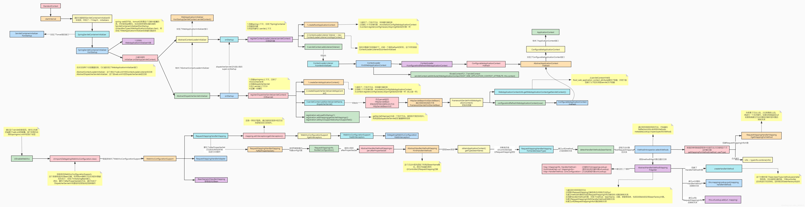

# SpringMVC源码分析

> 转载，原文链接：
> https://blog.csdn.net/win7system/article/details/90674757
> https://blog.csdn.net/qq_38826019/article/details/117877511
> 两篇文章基本一致，但各有所长，我进行了合并

此篇文章比较详细的从源码的角度去分析Spring MVC的运行机制，阅读过后受益匪浅，可以结合自己追踪Spring源代码去理解效果更好，基本能把Spring MVC的请求处理过程串联起来，对自己仿写类似的web框架提供了宝贵的经验和动力，希望和大家一起成长。【基于源码3.1.0】，版本可能相对比较老，具体流程可能有点不大一样，但是，具体思路还是一样的。如有需要，可以debug追踪：1、容器初始化的时候 2、rest请求 基本可以把这些流程理顺，同时还能了解下spring容器的运行规则。

# 一、SpringMVC概述

## 1.1 SpringMVC请求处理流程

> 在阅读源码之前先进行SpringMVC源码环境的搭建SpringMVC环境搭建
> 里面也对Controller控制器的几种实现方式，进行了简单说明，便于我们后续的理解。
> 下面先给出一张流程图，方便我们进行梳理。


> `DispatcherServlet`：DispatcherServlet是SpringMVC中的前端控制器，负责接收request并将request转发给对应的处理组件。
>
> `HandlerMapping`：HanlerMapping是SpringMVC中完成url到Controller映射的组件。
>
> `Handler`：Handler处理器，其实就是我们的Controller，Controller是SpringMVC中负责处理request的组件。
>
> `ModelAndView`：ModelAndView是封装结果视图的组件。
>
> `ViewResolver`：ViewResolver视图解析器，解析ModelAndView对象，并返回对应的视图View给客户端。

> 处理流程：
>
> - 1.首先，请求进入DispatcherServlet，由DispatcherServlet从HandlerMapping中提取对应的Handler。
> - 2.此时，只是获取到了对应的Handler，然后得去寻找对应的适配器，即：HandlerAdapter。
>
> - 3.拿到对应的HandlerAdapter后，开始调用对应的Handler处理业务逻辑，执行完成之后返回一个ModelAndView。
>
> - 4.这时候交给我们的ViewResolver，通过视图名称查找对应的视图，然后返回。
>
> - 5.最后，渲染视图，返回渲染后的视图，响应给客户端。

## 1.2 SpringMVC工作机制

> 在容器初始化时会**建立所有url和controller的对应关系**，保存到**Map<url,controller>**中。
>
> tomcat启动时会通知spring初始化容器(加载bean的定义信息和初始化所有单例bean)，然后springmvc会遍历容器中的bean，获取每一个controller中的所有方法访问的url，然后将url和Controller保存到一个Map中；
>
> 这样就可以根据request快速定位到Controller，因为最终处理request的是Controller中的方法，Map中只保留了url和Controller中的对应关系，所以要根据request的url进一步确认Controller中的method。
>
> 这一步工作的原理就是拼接Controller的url(**Controller上@RequestMapping的值)和方法的url(method上@RequestMapping的值**)，与request的url进行匹配,找到匹配的那个方法；　　

> 确定处理请求的method后，接下来的任务就是**参数绑定**，把request中参数绑定到方法的形式参数上，这一步是整个请求处理过程中最复杂的一个步骤。
>
> SpringMVC提供了两种request参数与方法形参的绑定方法：
>
> `1.通过注解进行绑定 @RequestParam`
>
> 使用注解进行绑定，我们只要在方法参数前面声明**@RequestParam("userName")**，就可以将request中参数a的值绑定到方法的该参数上。
>
> `2.通过参数名称进行绑定`
>
> 使用参数名称进行绑定的前提是必须要获取方法中参数的名称，Java反射只提供了获取方法的参数的类型，并没有提供获取参数名称的方法。
>
> SpringMVC解决这个问题的方法是用asm框架读取字节码文件，来获取方法的参数名称。
>
> asm框架是一个字节码操作框架，关于asm更多介绍可以参考它的官网。个人建议，使用注解来完成参数绑定，这样就可以省去asm框架的读取字节码的操作。


# 二、SpringMVC源码分析

## 2.0 流程图


> 图片可以在新标签页打开查看或者下载下来方法查看

[processOn](https://www.processon.com/view/5ef48ffb1e0853263742d27f)

> 我们根据工作机制中三部分来分析SpringMVC的源码
>
> 1. ApplicationContext初始化时建立所有Url和Controller类的对应关系(用Map保存)。
>
> 2. 根据请求Url找到对应的Controller，并从Controller中找到处理请求的方法。
>
> 3. Request参数绑定到方法的形参，执行方法处理请求，并返回结果视图。

## 2.1 建立Map<url, controller>的关系

我们首先看第一个步骤，也就是建立Map<url,controller>关系的部分。第一部分的入口类为ApplicationObjectSupport的setApplicationContext方法。

setApplicationContext方法中核心部分就是初始化容器initApplicationContext(context)，子类AbstractDetectingUrlHandlerMapping实现了该方法，所以我们直接看子类中的初始化容器方法。

```java
public void initApplicationContext() throws ApplicationContextException {
        super.initApplicationContext();
        detectHandlers();
    }

    /**
     * 　　  * 建立当前ApplicationContext中的所有controller和url的对应关系
     *
     */
    protected void detectHandlers() throws BeansException {
        if (logger.isDebugEnabled()) {
            logger.debug("Looking for URL mappings in application context: " + getApplicationContext());
        }
　　　　 // 获取ApplicationContext容器中所有bean的Name
        String[] beanNames = (this.detectHandlersInAncestorContexts ?
                BeanFactoryUtils.beanNamesForTypeIncludingAncestors(getApplicationContext(), Object.class) :
                getApplicationContext().getBeanNamesForType(Object.class));

        // 遍历beanNames,并找到这些bean对应的url
        for (String beanName : beanNames) {
　　　　　　 // 找bean上的所有url(controller上的url+方法上的url),该方法由对应的子类实现
            String[] urls = determineUrlsForHandler(beanName);
            if (!ObjectUtils.isEmpty(urls)) {
                // 保存urls和beanName的对应关系,put it to Map<urls,beanName>,该方法在父类AbstractUrlHandlerMapping中实现
                registerHandler(urls, beanName);
            } else {
                if (logger.isDebugEnabled()) {
                    logger.debug("Rejected bean name '" + beanName + "': no URL paths identified");
                }
            }
        }
    }
    /** 获取controller中所有方法的url,由子类实现,典型的模板模式 **/
　　

    protected abstract String[] determineUrlsForHandler(String beanName);
```

> determineUrlsForHandler(String beanName)方法的作用是获取每个controller中的url，不同的子类有不同的实现,这是一个典型的模板设计模式。因为开发中我们用的最多的就是用注解来配置controller中的url，DefaultAnnotationHandlerMapping是AbstractDetectingUrlHandlerMapping的子类，处理注解形式的url映射。所以我们这里以DefaultAnnotationHandlerMapping来进行分析。我们看DefaultAnnotationHandlerMapping是如何查beanName上所有映射的url。

**BeanNameUrlHandlerMapping#determineUrlsForHandler**

```java
    /**
     * 获取controller中所有的url
     */
	protected String[] determineUrlsForHandler(String beanName) {
        // 获取ApplicationContext容器 
　　　　ApplicationContext context = getApplicationContext();
        // 从容器中获取controller
　　　　Class<?> handlerType = context.getType(beanName);
　　　　 // 获取controller上的@RequestMapping注解
        RequestMapping mapping = context.findAnnotationOnBean(beanName, RequestMapping.class);
        if (mapping != null) { // controller上有注解
            this.cachedMappings.put(handlerType, mapping);
　　　　　　  // 返回结果集
            Set<String> urls = new LinkedHashSet<String>();
　　　　　　  // controller的映射url
            String[] typeLevelPatterns = mapping.value();
            if (typeLevelPatterns.length > 0) { // url>0
                // 获取controller中所有方法及方法的映射url
                String[] methodLevelPatterns = determineUrlsForHandlerMethods(handlerType, true);
                for (String typeLevelPattern : typeLevelPatterns) {
                    if (!typeLevelPattern.startsWith("/")) {
                        typeLevelPattern = "/" + typeLevelPattern;
                    }
                    boolean hasEmptyMethodLevelMappings = false;
                    for (String methodLevelPattern : methodLevelPatterns) {
                        if (methodLevelPattern == null) {
                            hasEmptyMethodLevelMappings = true;
                        } else {
　　　　　　　　　　　　　　　　// controller的映射url+方法映射的url
                            String combinedPattern = getPathMatcher().combine(typeLevelPattern, methodLevelPattern);
　　　　　　　　　　　　　　　　// 保存到set集合中
　　　　　　　　　　　　　　　　addUrlsForPath(urls, combinedPattern);
                        }
                    }
                    if (hasEmptyMethodLevelMappings ||
                            org.springframework.web.servlet.mvc.Controller.class.isAssignableFrom(handlerType)) {
                        addUrlsForPath(urls, typeLevelPattern);
                    }
                }
　　　　　　　　　// 以数组形式返回controller上的所有url
                return StringUtils.toStringArray(urls);
            } else {
                // controller上的@RequestMapping映射url为空串,直接找方法的映射url
                return determineUrlsForHandlerMethods(handlerType, false);
            }
        } // controller上没@RequestMapping注解
        else if (AnnotationUtils.findAnnotation(handlerType, Controller.class) != null) {
            // 获取controller中方法上的映射url
            return determineUrlsForHandlerMethods(handlerType, false);
        } else {
            return null;
        }
    }
```

**AbstractUrlHandlerMapping#registerHandler**

```java
protected void registerHandler(String urlPath, Object handler) throws BeansException, IllegalStateException {
	Assert.notNull(urlPath, "URL path must not be null");
	Assert.notNull(handler, "Handler object must not be null");
	Object resolvedHandler = handler;
 
	// Eagerly resolve handler if referencing singleton via name.
	if (!this.lazyInitHandlers && handler instanceof String) {
		// 转为beanName
		String handlerName = (String) handler;
		ApplicationContext applicationContext = obtainApplicationContext();
		if (applicationContext.isSingleton(handlerName)) {
			// 根据beanName获取bean，对应到我们的controller类
			resolvedHandler = applicationContext.getBean(handlerName);
		}
	}
 
	Object mappedHandler = this.handlerMap.get(urlPath);
	if (mappedHandler != null) {
		if (mappedHandler != resolvedHandler) {
			throw new IllegalStateException(
					"Cannot map " + getHandlerDescription(handler) + " to URL path [" + urlPath +
					"]: There is already " + getHandlerDescription(mappedHandler) + " mapped.");
		}
	}
	else {
		if (urlPath.equals("/")) {
			if (logger.isInfoEnabled()) {
				logger.info("Root mapping to " + getHandlerDescription(handler));
			}
			setRootHandler(resolvedHandler);
		}
		else if (urlPath.equals("/*")) {
			if (logger.isInfoEnabled()) {
				logger.info("Default mapping to " + getHandlerDescription(handler));
			}
			setDefaultHandler(resolvedHandler);
		}
		else {
			// 最终put到map集合中，Map<url,controller>
			this.handlerMap.put(urlPath, resolvedHandler);
			if (logger.isInfoEnabled()) {
				logger.info("Mapped URL path [" + urlPath + "] onto " + getHandlerDescription(handler));
			}
		}
	}
}
```

> 到这里HandlerMapping组件就已经建立所有url和controller的对应关系。

## 2.2 根据访问url找到对应controller中处理请求的方法

> 下面我们开始分析第二个步骤,第二个步骤是由请求触发的，所以入口为DispatcherServlet。
>
> DispatcherServlet的核心方法为doService()，doService()中的核心逻辑由doDispatch()实现，我们查看doDispatch()的源代码。

```java
/** 中央控制器,控制请求的转发 **/
protected void doDispatch(HttpServletRequest request, HttpServletResponse response) throws Exception {
	HttpServletRequest processedRequest = request;
	HandlerExecutionChain mappedHandler = null;
	boolean multipartRequestParsed = false;
	// 异步编程
	WebAsyncManager asyncManager = WebAsyncUtils.getAsyncManager(request);
 
	try {
		// 定义ModelAndView变量
		ModelAndView mv = null;
		Exception dispatchException = null;
 
		try {
			// 1.检查是否是文件上传的请求
			processedRequest = checkMultipart(request);
			multipartRequestParsed = (processedRequest != request);
 
			// Determine handler for the current request.
			// 2.取得处理当前请求的controller,这里也称为handler处理器,第一个步骤的意义就在这里体现了
			//   这里并不是直接返回controller,而是返回的HandlerExecutionChain请求处理器链对象,该对象封装了handler和interceptors
			mappedHandler = getHandler(processedRequest);
			// 如果handler为空,则返回404
			if (mappedHandler == null) {
				noHandlerFound(processedRequest, response);
				return;
			}
 
			// Determine handler adapter for the current request.
			// 推断适配器，不同的controller类型，交给不同的适配器去处理
			// 如果是一个bean，mappedHandler.getHandler()返回的是一个对象
			// 如果是一个method，mappedHandler.getHandler()返回的是一个方法
			// 3.获取处理request的处理器适配器handlerAdapter
			HandlerAdapter ha = getHandlerAdapter(mappedHandler.getHandler());
			// 到这里，spring才确定我要怎么反射调用
 
			// Process last-modified header, if supported by the handler.
			String method = request.getMethod();
			boolean isGet = "GET".equals(method);
			if (isGet || "HEAD".equals(method)) {
				// 处理last-modified请求头
				long lastModified = ha.getLastModified(request, mappedHandler.getHandler());
				if (logger.isDebugEnabled()) {
					logger.debug("Last-Modified value for [" + getRequestUri(request) + "] is: " + lastModified);
				}
				if (new ServletWebRequest(request, response).checkNotModified(lastModified) && isGet) {
					return;
				}
			}
 
			// 4.拦截器的预处理方法
			if (!mappedHandler.applyPreHandle(processedRequest, response)) {
				return;
			}
 
			// Actually invoke the handler.
			// 通过适配器，处理请求（可以理解为，反射调用方法）（重点）
			// 5.实际的处理器处理请求，返回结果视图对象
			mv = ha.handle(processedRequest, response, mappedHandler.getHandler());
 
			if (asyncManager.isConcurrentHandlingStarted()) {
				return;
			}
 
			// 结果视图对象的处理
			applyDefaultViewName(processedRequest, mv);
 
			// 6.拦截器的后处理方法
			mappedHandler.applyPostHandle(processedRequest, response, mv);
		}
		catch (Exception ex) {
			dispatchException = ex;
		}
		catch (Throwable err) {
			// As of 4.3, we're processing Errors thrown from handler methods as well,
			// making them available for @ExceptionHandler methods and other scenarios.
			dispatchException = new NestedServletException("Handler dispatch failed", err);
		}
		processDispatchResult(processedRequest, response, mappedHandler, mv, dispatchException);
	}
	catch (Exception ex) {
		triggerAfterCompletion(processedRequest, response, mappedHandler, ex);
	}
	catch (Throwable err) {
		triggerAfterCompletion(processedRequest, response, mappedHandler,
				new NestedServletException("Handler processing failed", err));
	}
	finally {
		if (asyncManager.isConcurrentHandlingStarted()) {
			// Instead of postHandle and afterCompletion
			if (mappedHandler != null) {
				mappedHandler.applyAfterConcurrentHandlingStarted(processedRequest, response);
			}
		}
		else {
			// Clean up any resources used by a multipart request.
			if (multipartRequestParsed) {
				cleanupMultipart(processedRequest);
			}
		}
	}
}
```

> 第2步:getHandler(processedRequest)方法实际上就是从HandlerMapping中找到url和controller的对应关系。这也就是第一个步骤:建立Map<url,Controller>的意义。
>
> 我们知道，最终处理request的是controller中的方法，我们现在只是知道了controller，还要进一步确认controller中处理request的方法。
>
> 由于下面的步骤和第三个步骤关系更加紧密，直接转到第三个步骤

## 2.3 反射调用处理请求的方法，返回结果视图

上面的方法中，第2步其实就是从第一个步骤中的Map<urls,beanName>中取得Controller，然后经过拦截器的预处理方法，到最核心的部分--第5步调用controller的方法处理请求。在第2步中我们可以知道处理request的Controller，第5步就是要根据url确定Controller中处理请求的方法，然后通过反射获取该方法上的注解和参数，解析方法和参数上的注解，最后反射调用方法获取ModelAndView结果视图。因为上面采用注解url形式说明的，所以我们这里继续以注解处理器适配器来说明。第5步调用的就是AnnotationMethodHandlerAdapter的handle().handle()中的核心逻辑由invokeHandlerMethod(request, response, handler)实现。

```java
/** 获取处理请求的方法,执行并返回结果视图 **/
protected ModelAndView invokeHandlerMethod(HttpServletRequest request, HttpServletResponse response, Object handler)
            throws Exception {
　　　　 // 1.获取方法解析器
        ServletHandlerMethodResolver methodResolver = getMethodResolver(handler);
　　　　 // 2.解析request中的url,获取处理request的方法 
        Method handlerMethod = methodResolver.resolveHandlerMethod(request);
　　　　 // 3.方法调用器
        ServletHandlerMethodInvoker methodInvoker = new ServletHandlerMethodInvoker(methodResolver);
        ServletWebRequest webRequest = new ServletWebRequest(request, response);
        ExtendedModelMap implicitModel = new BindingAwareModelMap();
　　　　 // 4.执行方法
        Object result = methodInvoker.invokeHandlerMethod(handlerMethod, handler, webRequest, implicitModel);
　　　　 // 5.封装结果视图
        ModelAndView mav =
                methodInvoker.getModelAndView(handlerMethod, handler.getClass(), result, implicitModel, webRequest);
        methodInvoker.updateModelAttributes(handler, (mav != null ? mav.getModel() : null), implicitModel, webRequest);
        return mav;
}
```

这一部分的核心就在2和4了。先看第2步，通过request找controller的处理方法。实际上就是拼接controller的url和方法的url，与request的url进行匹配，找到匹配的方法。

```java
public Method resolveHandlerMethod(HttpServletRequest request) throws ServletException {
　　　　　　  // 如果请求url为,localhost:8080/springmvc/helloWorldController/say.action, 则lookupPath=helloWorldController/say.action
        String lookupPath = urlPathHelper.getLookupPathForRequest(request);
        Comparator<String> pathComparator = pathMatcher.getPatternComparator(lookupPath);
        Map<RequestSpecificMappingInfo, Method> targetHandlerMethods = new LinkedHashMap<RequestSpecificMappingInfo, Method>();
        Set<String> allowedMethods = new LinkedHashSet<String>(7);
        String resolvedMethodName = null;
　　　　　　 // 遍历controller上的所有方法,获取url匹配的方法
        for (Method handlerMethod : getHandlerMethods()) {
            RequestSpecificMappingInfo mappingInfo = new RequestSpecificMappingInfo(this.mappings.get(handlerMethod));
            boolean match = false;
            if (mappingInfo.hasPatterns()) {// 获取方法上的url
                for (String pattern : mappingInfo.getPatterns()) { // 方法上可能有多个url,springmvc支持方法映射多个url
                    if (!hasTypeLevelMapping() && !pattern.startsWith("/")) {
                        pattern = "/" + pattern;
                    }
　　　　　　　　　　　　　　// 获取controller上的映射和url和方法上的url,拼凑起来与lookupPath是否匹配
                    String combinedPattern = getCombinedPattern(pattern, lookupPath, request);
                    if (combinedPattern != null) {
                        if (mappingInfo.matches(request)) {
                            match = true;
                            mappingInfo.addMatchedPattern(combinedPattern);
                        } else {
                            if (!mappingInfo.matchesRequestMethod(request)) {
                                allowedMethods.addAll(mappingInfo.methodNames());
                            }
                            break;
                        }
                    }
                }
                mappingInfo.sortMatchedPatterns(pathComparator);
            } else if (useTypeLevelMapping(request)) {
              　// other 
            }

        }
    ...
}
```

通过上面的代码，已经可以找到处理request的Controller中的方法了，现在看如何解析该方法上的参数,并调用该方法。也就是执行方法这一步。执行方法这一步最重要的就是获取方法的参数，然后我们就可以反射调用方法了。

```java
public final Object invokeHandlerMethod(Method handlerMethod, Object handler,
                                            NativeWebRequest webRequest, ExtendedModelMap implicitModel) throws Exception {
       
　　　　Method handlerMethodToInvoke = BridgeMethodResolver.findBridgedMethod(handlerMethod);
        try {
            boolean debug = logger.isDebugEnabled();
　　　　　　　// 处理方法上的其他注解
            for (String attrName : this.methodResolver.getActualSessionAttributeNames()) {
                Object attrValue = this.sessionAttributeStore.retrieveAttribute(webRequest, attrName);
                if (attrValue != null) {
                    implicitModel.addAttribute(attrName, attrValue);
                }
            }
            for (Method attributeMethod : this.methodResolver.getModelAttributeMethods()) {
                Method attributeMethodToInvoke = BridgeMethodResolver.findBridgedMethod(attributeMethod);
                Object[] args = resolveHandlerArguments(attributeMethodToInvoke, handler, webRequest, implicitModel);
                if (debug) {
                    logger.debug("Invoking model attribute method: " + attributeMethodToInvoke);
                }
                String attrName = AnnotationUtils.findAnnotation(attributeMethod, ModelAttribute.class).value();
                if (!"".equals(attrName) && implicitModel.containsAttribute(attrName)) {
                    continue;
                }
                ReflectionUtils.makeAccessible(attributeMethodToInvoke);
                Object attrValue = attributeMethodToInvoke.invoke(handler, args);
                if ("".equals(attrName)) {
                    Class resolvedType = GenericTypeResolver.resolveReturnType(attributeMethodToInvoke, handler.getClass());
                    attrName = Conventions.getVariableNameForReturnType(attributeMethodToInvoke, resolvedType, attrValue);
                }
                if (!implicitModel.containsAttribute(attrName)) {
                    implicitModel.addAttribute(attrName, attrValue);
                }
            }
　　　　　　　// 核心代码,获取方法上的参数值
            Object[] args = resolveHandlerArguments(handlerMethodToInvoke, handler, webRequest, implicitModel);
            if (debug) {
                logger.debug("Invoking request handler method: " + handlerMethodToInvoke);
            }
            ReflectionUtils.makeAccessible(handlerMethodToInvoke);
            return handlerMethodToInvoke.invoke(handler, args);
        }

    }
}
```

　　 resolveHandlerArguments方法实现代码比较长，它最终要实现的目的就是：完成request中的参数和方法参数上数据的绑定。

SpringMVC中提供两种request参数到方法中参数的绑定方式：

　　① 通过注解进行绑定 @RequestParam

　　② 通过参数名称进行绑定
　　使用注解进行绑定，我们只要在方法参数前面声明@RequestParam("a")，就可以将request中参数a的值绑定到方法的该参数上。使用参数名称进行绑定的前提是必须要获取方法中参数的名称，Java反射只提供了获取方法的参数的类型，并没有提供获取参数名称的方法。SpringMVC解决这个问题的方法是用asm框架读取字节码文件,来获取方法的参数名称。asm框架是一个字节码操作框架，关于asm更多介绍可以参考它的官网。个人建议，使用注解来完成参数绑定，这样就可以省去asm框架的读取字节码的操作。

```java
private Object[] resolveHandlerArguments(Method handlerMethod, Object handler,
                                             NativeWebRequest webRequest, ExtendedModelMap implicitModel) throws Exception {
　　　　 // 1.获取方法参数类型的数组
        Class[] paramTypes = handlerMethod.getParameterTypes();
　　　　// 声明数组,存参数的值
        Object[] args = new Object[paramTypes.length];
　　　　// 2.遍历参数数组,获取每个参数的值
        for (int i = 0; i < args.length; i++) {
            MethodParameter methodParam = new MethodParameter(handlerMethod, i);
            methodParam.initParameterNameDiscovery(this.parameterNameDiscoverer);
            GenericTypeResolver.resolveParameterType(methodParam, handler.getClass());
            String paramName = null;
            String headerName = null;
            boolean requestBodyFound = false;
            String cookieName = null;
            String pathVarName = null;
            String attrName = null;
            boolean required = false;
            String defaultValue = null;
            boolean validate = false;
            int annotationsFound = 0;
            Annotation[] paramAnns = methodParam.getParameterAnnotations();
　　　　　　 // 处理参数上的注解
            for (Annotation paramAnn : paramAnns) {
                if (RequestParam.class.isInstance(paramAnn)) {
                    RequestParam requestParam = (RequestParam) paramAnn;
                    paramName = requestParam.value();
                    required = requestParam.required();
                    defaultValue = parseDefaultValueAttribute(requestParam.defaultValue());
                    annotationsFound++;
                } else if (RequestHeader.class.isInstance(paramAnn)) {
                    RequestHeader requestHeader = (RequestHeader) paramAnn;
                    headerName = requestHeader.value();
                    required = requestHeader.required();
                    defaultValue = parseDefaultValueAttribute(requestHeader.defaultValue());
                    annotationsFound++;
                } else if (RequestBody.class.isInstance(paramAnn)) {
                    requestBodyFound = true;
                    annotationsFound++;
                } else if (CookieValue.class.isInstance(paramAnn)) {
                    CookieValue cookieValue = (CookieValue) paramAnn;
                    cookieName = cookieValue.value();
                    required = cookieValue.required();
                    defaultValue = parseDefaultValueAttribute(cookieValue.defaultValue());
                    annotationsFound++;
                } else if (PathVariable.class.isInstance(paramAnn)) {
                    PathVariable pathVar = (PathVariable) paramAnn;
                    pathVarName = pathVar.value();
                    annotationsFound++;
                } else if (ModelAttribute.class.isInstance(paramAnn)) {
                    ModelAttribute attr = (ModelAttribute) paramAnn;
                    attrName = attr.value();
                    annotationsFound++;
                } else if (Value.class.isInstance(paramAnn)) {
                    defaultValue = ((Value) paramAnn).value();
                } else if ("Valid".equals(paramAnn.annotationType().getSimpleName())) {
                    validate = true;
                }
            }
　　
            if (annotationsFound > 1) {
                throw new IllegalStateException("Handler parameter annotations are exclusive choices - " +
                        "do not specify more than one such annotation on the same parameter: " + handlerMethod);
            }

            if (annotationsFound == 0) {// 如果没有注解
                Object argValue = resolveCommonArgument(methodParam, webRequest);
                if (argValue != WebArgumentResolver.UNRESOLVED) {
                    args[i] = argValue;
                } else if (defaultValue != null) {
                    args[i] = resolveDefaultValue(defaultValue);
                } else {
                    Class paramType = methodParam.getParameterType();
　　　　　　　　　　  // 将方法声明中的Map和Model参数,放到request中,用于将数据放到request中带回页面
                    if (Model.class.isAssignableFrom(paramType) || Map.class.isAssignableFrom(paramType)) {
                        args[i] = implicitModel;
                    } else if (SessionStatus.class.isAssignableFrom(paramType)) {
                        args[i] = this.sessionStatus;
                    } else if (HttpEntity.class.isAssignableFrom(paramType)) {
                        args[i] = resolveHttpEntityRequest(methodParam, webRequest);
                    } else if (Errors.class.isAssignableFrom(paramType)) {
                        throw new IllegalStateException("Errors/BindingResult argument declared " +
                                "without preceding model attribute. Check your handler method signature!");
                    } else if (BeanUtils.isSimpleProperty(paramType)) {
                        paramName = "";
                    } else {
                        attrName = "";
                    }
                }
            }
　　　　　　　// 从request中取值,并进行赋值操作
            if (paramName != null) {
　　　　　　　　　// 根据paramName从request中取值,如果没有通过RequestParam注解指定paramName,则使用asm读取class文件来获取paramName
                args[i] = resolveRequestParam(paramName, required, defaultValue, methodParam, webRequest, handler);
            } else if (headerName != null) {
                args[i] = resolveRequestHeader(headerName, required, defaultValue, methodParam, webRequest, handler);
            } else if (requestBodyFound) {
                args[i] = resolveRequestBody(methodParam, webRequest, handler);
            } else if (cookieName != null) {
                args[i] = resolveCookieValue(cookieName, required, defaultValue, methodParam, webRequest, handler);
            } else if (pathVarName != null) {
                args[i] = resolvePathVariable(pathVarName, methodParam, webRequest, handler);
            } else if (attrName != null) {
                WebDataBinder binder =
                        resolveModelAttribute(attrName, methodParam, implicitModel, webRequest, handler);
                boolean assignBindingResult = (args.length > i + 1 && Errors.class.isAssignableFrom(paramTypes[i + 1]));
                if (binder.getTarget() != null) {
                    doBind(binder, webRequest, validate, !assignBindingResult);
                }
                args[i] = binder.getTarget();
                if (assignBindingResult) {
                    args[i + 1] = binder.getBindingResult();
                    i++;
                }
                implicitModel.putAll(binder.getBindingResult().getModel());
            }
        }
　　　　 // 返回参数值数组
        return args;
}
```

​    关于asm框架获取方法参数的部分，这里就不再进行分析了。感兴趣的话F3进去就能看到这个过程。

　　到这里,方法的参数值列表也获取到了，就可以直接进行方法的调用了。整个请求过程中最复杂的一步就是在这里了。ok，到这里整个请求处理过程的关键步骤都分析完了。理解了SpringMVC中的请求处理流程,整个代码还是比较清晰的。

# 三、一些流程图

## 3.1 SpringMVC初始化流程



初始化流程可以回到https://blog.hahhome.top/blog/Spring%E6%BA%90%E7%A0%81%E8%A7%A3%E8%AF%BB进行查看

## 3.2 DispatcherServlet入口


## 3.3 DispatcherServlet流程


# 四、谈谈SpringMVC的优化

　　上面我们已经对SpringMVC的工作原理和源码进行了分析,在这个过程发现了几个优化点：

　　1、Controller如果能保持单例，尽量使用单例,这样可以减少创建对象和回收对象的开销。也就是说，如果Controller的类变量和实例变量可以以方法形参声明的尽量以方法的形参声明，不要以类变量和实例变量声明，这样可以避免线程安全问题。

　　2、处理request的方法中的形参务必加上@RequestParam注解，这样可以避免SpringMVC使用asm框架读取class文件获取方法参数名的过程。即便SpringMVC对读取出的方法参数名进行了缓存，如果不要读取class文件当然是更加好。

　　3、阅读源码的过程中,发现SpringMVC并没有对处理url的方法进行缓存，也就是说**每次都要根据请求url去匹配Controller中的方法url**，如果把url和method的关系缓存起来，会不会带来性能上的提升呢？有点恶心的是，负责解析url和method对应关系的ServletHandlerMethodResolver是一个private的内部类，不能直接继承该类增强代码，必须要该代码后重新编译。当然，如果缓存起来，必须要考虑缓存的线程安全问题。

​    后续笔者将会根据自己的理解补充相应体会，及时更新新版本带来的好处~


更新：SpringMVC 版本4以上的流程

