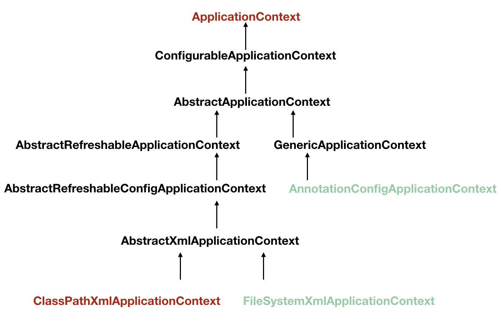

#  Spring源码解读

> author：spongehah	(blog-website: https://blog.hahhome.top)

[TOC]


# Spring IoC源码解读

> 详细Spring IoC源码分析请看：https://blog.hahhome.top/blog/SpringIoC%E5%AE%B9%E5%99%A8%E6%BA%90%E7%A0%81%E5%88%86%E6%9E%90
>
> 阅读下面的内容前可以先看一下我 设计模式中的 自定义Spring IoC，里面会对Spring IoC的底层结构有大致分析，并有一个手写简单Spring IoC的案例，**是下面讲解内容的核心简便版(只包含最最最重要的部分)**：https://blog.hahhome.top/blog/Java%E8%AE%BE%E8%AE%A1%E6%A8%A1%E5%BC%8F/#7%E8%87%AA%E5%AE%9A%E4%B9%89spring%E6%A1%86%E6%9E%B6

## BeanFactory和ApplicationContext





最基本的IoC容器是BeanFactory，Spring IoC容器有 延迟加载 和 非延迟加载两种类型：

- BeanFactory属于**延时加载**，只有当Bean被使用时，BeanFactory才会对该Bean进行实例化与依赖关系的装配。（是Spring内部的使用接口，不提供开发人员进行使用）
- ApplicationContext属于**非延时加载**，它的超类是 BeanFactory，扩展了BeanFactory，**开发人员一般使用它的子类**


第二层三个接口：

* ListableBeanFactory接口表示这些Bean**可列表化**(可获取多个Bean)。因为最顶层 BeanFactory 接口的方法都是获取单个 Bean 的
* HierarchicalBeanFactory表示这些Bean 是有继承关系的，也就是每个 Bean 可能有父 Bean
* AutowireCapableBeanFactory 接口定义Bean的**自动装配规则**。


我们平时**常用的IoC容器的实现**(它们都继承了**AbstractApplicationContext**类)：

1. ClasspathXmlApplicationContext : 根据**类路径加载xml**配置文件，并创建IOC容器对象。
2. FileSystemXmlApplicationContext :根据**系统路径加载xml**配置文件，并创建IOC容器对象。
3. AnnotationConfigApplicationContext :加载**注解类配置**，并创建IOC容器。


几个重要接口：

1. **ApplicationContext** 继承了 ListableBeanFactory，这个 Listable 的意思就是，通过这个接口，我们可以获取多个 Bean，大家看源码会发现，最顶层 BeanFactory 接口的方法都是获取单个 Bean 的。ApplicationContext 还继承了 HierarchicalBeanFactory，Hierarchical 单词本身已经能说明问题了，也就是说我们可以在应用中起多个 BeanFactory，然后可以将各个 BeanFactory 设置为父子关系。
2. AutowireCapableBeanFactory 这个名字中的 Autowire 大家都非常熟悉，它就是用来自动装配 Bean 用的，但是仔细看上图，ApplicationContext 并没有继承它，不过不用担心，不使用继承，不代表不可以使用组合，如果你看到 ApplicationContext 接口定义中的最后一个方法 getAutowireCapableBeanFactory() 就知道了。
3. **ConfigurableListableBeanFactory** 也是一个特殊的接口，看图，特殊之处在于它**继承了第二层所有的三个接口**，而 ApplicationContext 没有。它的子类**`DefaultListableBeanFactory`**也是唯一一个实现了三个接口的类，将会在ApplicationContext的子实现类中使用它来实例化BeanFactory，因为它**最为强大**。


## 一些数据结构

三个接口：

**BeanDefinition**：即配置文件(如xml文件)中定义的Bean会被封装为BeanDefinition对象（由后面的BeanDifinitionReader进解析xml文件然后注册到注册表BeanDefinitionRegistry中）

**BeanDefinitionReader**：BeanDefinitionReader用来解析xml文件，并将xml文件中定义的bean封装成BeanDefinition对象，然后注册到BeanDefinitionRegistry中

**BeanDefinitionRegistry**：由BeanDefinitionReader解析xml文件，封装成的BeanDefinition便是注册到该接口的实现类中


## IoC容器的启动流程

ClassPathXmlApplicationContext对Bean配置资源的载入是从refresh（）方法开始的。refresh（）方法是一个模板方法，规定了 IoC 容器的启动流程，有些逻辑要交给其子类实现。它对 Bean 配置资源进行载入，ClassPathXmlApplicationContext通过调用其父类AbstractApplicationContext的refresh（）方法启动整个IoC容器对Bean定义的载入过程。

- 创建ClassPathXmlApplicationContext：

  传入参数的configLocation即类路径ClassPath下的文件名applicationContext.xml

  ```java
  public ClassPathXmlApplicationContext(String configLocation) throws BeansException {
      this(new String[]{configLocation}, true, (ApplicationContext)null);
  }
  ```

- 上面的构造器调用了this这个另一个构造器：

  ```java
  public ClassPathXmlApplicationContext(String[] configLocations, boolean refresh, @Nullable ApplicationContext parent) throws BeansException {
      super(parent);
      this.setConfigLocations(configLocations);
      if (refresh) { //refresh即上一个构造器this种的第二个参数，为true
          this.refresh(); //核心方法
      }
  }
  ```

  会调用refresh()这个方法：

- 这个refresh()方法是父类**AbstractApplicationContext**中的方法：

  ```java
  public void refresh() throws BeansException, IllegalStateException {
      synchronized(this.startupShutdownMonitor) {
          ...
          ...
      }
  }
  ```

  **refresh()**方法做的事：简单来说就是**加载配置文件，封装、注册BeanDefinition，并且初始化Bean对象，将Bean对象存储在容器里，然后进行一系列的回调**

  > 为什么是 refresh()，而不是 init() 这种名字的方法。因为 ApplicationContext 建立起来以后，其实我们是可以通过调用 **refresh() 这个方法重建的**，refresh() 会将原来的 ApplicationContext 销毁，然后再重新执行一次初始化操作。


AbstractApplicationContext.refresh()：

```java
public void refresh() throws BeansException, IllegalStateException {
    //上锁，避免同一时间重复创造或重建容器
    synchronized(this.startupShutdownMonitor) {
        //创建 Bean 容器前的一些准备工作
        this.prepareRefresh();
        /**
          * 重点1.这个类型是上面说的唯一一个实现了三个接口的接口，其实真正接收的是它的子类DefaultListableBeanFactory(后面会说)
          * 配置文件就会解析成一个个 Bean 定义(BeanDefinition)，注册到 BeanFactory 中(BeanDefinitionRegistry)
          * 注册也只是将这些信息都保存到了注册中心(说到底核心是一个 beanName-> beanDefinition 的 map)
          */
        ConfigurableListableBeanFactory beanFactory = this.obtainFreshBeanFactory();
        //设置 BeanFactory 的类加载器，添加几个 BeanPostProcessor，手动注册几个特殊的 bean
        this.prepareBeanFactory(beanFactory);

        try {
            //具体的子类可以在这步的时候添加一些特殊的 BeanFactoryPostProcessor 的实现类或做点什么事
            this.postProcessBeanFactory(beanFactory);
            //调用 BeanFactoryPostProcessor 各个实现类的 postProcessBeanFactory(factory) 方法
            this.invokeBeanFactoryPostProcessors(beanFactory);
            //注册 BeanPostProcessor 的实现类，注意看和 BeanFactoryPostProcessor 的区别
            //此接口两个方法: postProcessBeforeInitialization 和 postProcessAfterInitialization
            //两个方法分别在 Bean 初始化之前和初始化之后得到执行。注意，到这里 Bean 还没初始化
            this.registerBeanPostProcessors(beanFactory);
            this.initMessageSource();
            //事件驱动：初始化当前 ApplicationContext 的事件广播器，这里也不展开了
            this.initApplicationEventMulticaster();
            this.onRefresh();
            //事件驱动：注册事件监听器，监听器需要实现 ApplicationListener 接口。这也不是我们的重点，过
            this.registerListeners();
            /**
              * 重点2.初始化所有的 singleton beans(lazy-init 的除外)
              */
            this.finishBeanFactoryInitialization(beanFactory);
            //事件驱动：最后，广播事件，ApplicationContext 初始化完成
            this.finishRefresh();
        } catch (BeansException var9) {
            if (this.logger.isWarnEnabled()) {
                this.logger.warn("Exception encountered during context initialization - cancelling refresh attempt: " + var9);
            }

            this.destroyBeans();
            this.cancelRefresh(var9);
            throw var9;
        } finally {
            this.resetCommonCaches();
        }

    }
}
```

我会只着重说 重点1和重点2，其它将会一笔带过

1. 创建 Bean 容器前的一些准备工作：this.prepareRefresh();
   具体讲解：https://javadoop.com/post/spring-ioc#toc_3

2. **重点1：这里将会初始化 BeanFactory(容器)、读取配置文件封装 Bean、注册 Bean 等等：**ConfigurableListableBeanFactory beanFactory = this.**`obtainFreshBeanFactory()`**;

   - 初始化一个 `DefaultListableBeanFactory beanFactory`(唯一一个实现了第二层三个接口的类，即**功能最强大**，这也是为什么这边会使用这个类来实例化的原因)

   - 设置 beanFactory 的两个配置属性：是否允许 Bean 覆盖、是否允许循环引用：customizeBeanFactory(beanFactory)

   - **加载 Bean 到 beanFactory 中**：`loadBeanDefinitions(beanFactory)`;

     - 实例化一个XmlBeanDefinitionReader，从 xml 根节点开始解析文件，处理默认的标签<import />、<alias />、<beans />、<font color='red'><bean /></font>，其他的属于 custom 的，挑我们的重点 <bean /> 标签出来说
     -  将 <bean /> 节点中的信息提取出来，然后封装到一个 BeanDefinitionHolder 中，
        将 name 属性的定义按照 “逗号、分号、空格” 切分，形成一个 别名列表数组，如果你不定义 name 属性的话，就是空的了
        根据 <bean ...>...</bean> 中的配置创建 BeanDefinition，然后把配置中的信息都设置到实例中 
        到这里，整个 <bean /> 标签就算解析结束了，**一个 BeanDefinition 就形成了**。重复多次
     - 根据beanName注册BeanDefinition，如果还有别名(alias)的话，也要根据别名全部注册一遍，不然根据别名就会找不到 Bean 了，
       将一个个BeanDefinition注册到包含Map<beanName,BeanDefinition>的注册中心BeanDefinitionRegistry中

     到这里已经初始化了 Bean 容器，<bean /> 配置也相应的转换为了一个个 BeanDefinition，然后注册了各个 BeanDefinition 到注册中心，并且发送了注册事件。

3. Spring 把我们在 xml 配置的 bean 都注册以后，会**"手动"注册一些特殊的 bean。**
   设置 BeanFactory 的类加载器，添加几个 BeanPostProcessor，忽略自动装配并手动注册几个特殊的 bean，如environment、systemProperties、systemEnvironment等
   具体讲解：https://javadoop.com/post/spring-ioc#toc_6

4. **重点2：初始化所有的 singleton beans**：
                    this.**`finishBeanFactoryInitialization(beanFactory)`**;

   到目前为止，应该说 BeanFactory 已经创建完成，并且所有的实现了 BeanFactoryPostProcessor 接口的 Bean 都已经初始化并且其中的 postProcessBeanFactory(factory) 方法已经得到回调执行了。而且 Spring 已经“手动”注册了一些特殊的 Bean，如 environment、systemProperties 等，剩下的就是初始化 singleton beans 了

   - **beanFactory**.preInstantiateSingletons();注意这里的beanFactory是重点1中的DefaultListableBeanFactory
   - **遍历所有的beanName**，
     如果是FactoryBean 的话，在 beanName 前面加上 ‘&’ 符号，再调用 getBean()
     普通的 Bean，直接调用 getBean(beanName)
   - `getBean()`，模板方法模式，由具体的子类实现
     根据是FactoryBean还是普通Bean，作用域是singleton还是prototype执行 创建Bean(利用反射)
     进行Bean的依赖注入，如果是 bean 依赖，先初始化依赖的 bean
   - 处理各种回调：如果 bean 实现了 BeanNameAware、BeanClassLoaderAware 或 BeanFactoryAware 各种**Aware接口**，回调。**BeanPostProcessor** 的 postProcessBeforeInitialization 回调。处理 bean 中定义的 **init-method**，或者如果 bean 实现了 **InitializingBean** 接口，调用 afterPropertiesSet() 方法。**BeanPostProcessor** 的 postProcessAfterInitialization 回调
     即BeanPostProcessor 的两个回调都发生在这边，只不过中间处理了 init-method


## 流程图


# SpringMVC源码解读

> 详细SpringMVC源码分析请看：https://blog.hahhome.top/blog/SpringMVC%E6%BA%90%E7%A0%81%E5%88%86%E6%9E%90

## 各组件

> `DispatcherServlet`：DispatcherServlet是SpringMVC中的**前端控制器**，负责接收request并将request转发给对应的处理组件。
>
> `HandlerMapping`：**处理器映射器**：HanlerMapping是SpringMVC中完成url到Controller映射的组件。
>
> `HandlerAdapter`：适配器模式，controller是被适配者，HandlerAdapter是**处理器适配器**，通过HandlerAdpter对处理器(控制器方法)进行执行
>
> `Handler`：Handler**处理器**，其实就是我们的Controller，Controller是SpringMVC中负责处理request的组件。
>
> `ModelAndView`：ModelAndView是封装结果视图的组件。
>
> `ViewResolver`：ViewResolver**视图解析器**，解析ModelAndView对象，并返回对应的视图View给客户端。


## SpringMVC初始化流程

DispatcherServlet 本质上是一个 Servlet，所以天然的遵循 Servlet 的生命周期。所以宏观上是 Servlet生命周期来进行调度。


1. 初始化WebApplicationContext

   - ```java
     protected WebApplicationContext initWebApplicationContext() {
     	...
         // 创建WebApplicationContext
     	wac = createWebApplicationContext(rootContext);
     	...
         // 刷新WebApplicationContext
     	onRefresh(wac);
     	...
     	return wac;
     }
     
     ```

2. 创建WebApplicationContext

   - ```java
     protected WebApplicationContext createWebApplicationContext(@Nullable ApplicationContext parent) {
         Class<?> contextClass = getContextClass();
         if (!ConfigurableWebApplicationContext.class.isAssignableFrom(contextClass)) {
             throw new ApplicationContextException(
                     "Fatal initialization error in servlet with name '" +
                             getServletName() +
                             "': custom WebApplicationContext class [" + contextClass.getName() +
                             "] is not of type ConfigurableWebApplicationContext");
         }
         // 通过反射创建 IOC 容器对象
         ConfigurableWebApplicationContext wac =
                 (ConfigurableWebApplicationContext)
                         BeanUtils.instantiateClass(contextClass);
     
         wac.setEnvironment(getEnvironment());
         // 设置父容器
         wac.setParent(parent);
         String configLocation = getContextConfigLocation();
         if (configLocation != null) {
             wac.setConfigLocation(configLocation);
         }
         configureAndRefreshWebApplicationContext(wac);
     
         return wac;
     }
     ```

     > wac是SpringMVC的IoC容器，这里对wac设置了一个父容器，即Spring的IoC容器，**由于子容器可以访问父容器中的组件，所以SpringMVC加载controller时，才能注入Spring容器中的service组件**

3. DispatcherServlet初始化策略

   - FrameworkServlet创建WebApplicationContext后，刷新容器，调用onRefresh(wac)，此方法在DispatcherServlet中进行了重写，调用了initStrategies(context)方法，初始化策略，即**初始化DispatcherServlet的各个组件**

     ```java
     protected void initStrategies(ApplicationContext context) {
         initMultipartResolver(context);
         initLocaleResolver(context);
         initThemeResolver(context);
         initHandlerMappings(context);
         initHandlerAdapters(context);
         initHandlerExceptionResolvers(context);
         initRequestToViewNameTranslator(context);
         initViewResolvers(context);
         initFlashMapManager(context);
     }
     ```


## SpringMVC处理请求流程


> 处理流程：
>
> - 1.首先，请求进入DispatcherServlet，由DispatcherServlet从HandlerMapping中提取对应的Handler。
> - 2.此时，只是获取到了对应的Handler，然后得去寻找对应的适配器，即：HandlerAdapter。
> - 3.拿到对应的HandlerAdapter后，开始调用对应的Handler处理业务逻辑，执行完成之后返回一个ModelAndView。
> - 4.这时候交给我们的ViewResolver，通过视图名称查找对应的视图，然后返回。
> - 5.最后，渲染视图，返回渲染后的视图，响应给客户端。


DispatcherServlet.doDispatch()：

```java
/** 中央控制器,控制请求的转发 **/
protected void doDispatch(HttpServletRequest request, HttpServletResponse response) throws Exception {
	HttpServletRequest processedRequest = request;
	HandlerExecutionChain mappedHandler = null;
	boolean multipartRequestParsed = false;
	// 异步编程
	WebAsyncManager asyncManager = WebAsyncUtils.getAsyncManager(request);
 
	try {
		// 定义ModelAndView变量
		ModelAndView mv = null;
		Exception dispatchException = null;
 
		try {
			// 1.检查是否是文件上传的请求
			processedRequest = checkMultipart(request);
			multipartRequestParsed = (processedRequest != request);
 
			// 2.取得处理当前请求的controller,这里也称为handler处理器,第一个步骤的意义就在这里体现了
			//   这里并不是直接返回controller,而是返回的HandlerExecutionChain请求处理器链对象,该对象封装了handler和interceptors
			mappedHandler = getHandler(processedRequest);
			// 如果handler为空,则返回404
			if (mappedHandler == null) {
				noHandlerFound(processedRequest, response);
				return;
			}
 
			// 推断适配器，不同的controller类型，交给不同的适配器去处理
			// 如果是一个bean，mappedHandler.getHandler()返回的是一个对象
			// 如果是一个method，mappedHandler.getHandler()返回的是一个方法
			// 3.获取处理request的处理器适配器handlerAdapter
			HandlerAdapter ha = getHandlerAdapter(mappedHandler.getHandler());
			// 到这里，spring才确定我要怎么反射调用
 
			String method = request.getMethod();
			boolean isGet = "GET".equals(method);
			if (isGet || "HEAD".equals(method)) {
				// 处理last-modified请求头
				long lastModified = ha.getLastModified(request, mappedHandler.getHandler());
				if (logger.isDebugEnabled()) {
					logger.debug("Last-Modified value for [" + getRequestUri(request) + "] is: " + lastModified);
				}
				if (new ServletWebRequest(request, response).checkNotModified(lastModified) && isGet) {
					return;
				}
			}
 
			// 4.拦截器的预处理方法
			if (!mappedHandler.applyPreHandle(processedRequest, response)) {
				return;
			}
 
			// 通过适配器，处理请求（可以理解为，反射调用方法）（重点）
			// 5.实际的处理器处理请求，返回结果视图对象
			mv = ha.handle(processedRequest, response, mappedHandler.getHandler());
 
			if (asyncManager.isConcurrentHandlingStarted()) {
				return;
			}
 			// 返回的mv中的视图地址view如果为空，就设置一个默认的地址为uri的最后一个路径
			applyDefaultViewName(processedRequest, mv);

			// 6.拦截器的后处理方法
			mappedHandler.applyPostHandle(processedRequest, response, mv);
		}
		catch (Exception ex) {
			dispatchException = ex;
		}
        // 7.获取视图名称，并渲染视图，然后执行拦截器的afterCompletion方法
        this.processDispatchResult(processedRequest, response, mappedHandler, mv, (Exception)dispatchException);
	}
	catch (Exception ex) {
		triggerAfterCompletion(processedRequest, response, mappedHandler, ex);
	}
	finally {
		...
	}
}
```

> 这里简单说一下流程，下面的SpringBoot源码解读部分将会详细深入每一个步骤进行讲解

1. **初始化MVC容器，建立Map<URL,controller>之间的关系：**
   - Tomcat启动时会通知Spring初始化容器(加载bean的定义信息和初始化所有单例bean)，然后SpringMVC会遍历容器中所有的bean的beanName，获取每一个controller中的所有方法访问的url，然后将url和Controller保存到一个Map中；
2. processRequest() --> doService() --> doDispatch() --> processDispatchResult()
   **DispatcherServlet.doDispatch()处理request：**
   - 0.检查是否是文件上传的请求
   - 1.请求被前端控制器 DispatcherServlet捕获，对URL进行解析得到请求资源标识符(URI)，判断请求URI对应的映射（即进行请求映射，后面springBoot有具体讲解）：
     - **不存在**，若配置了default-servlet-handler，则访问目标资源(一般为静态资源)，若**没找到或没配置**default-servlet-handler则会返回**404**
     - **存在**映射关系，则会执行下面流程
   - 2.从HandlerMapping取得处理当前请求的controller（新版本中获得的直接是HandlerMethod对象）,这里也称为handler处理器，`返回HandlerExecutionChain请求处理链对象`，该对象封装了handler、interceptors和interceptorIndex
     - 这里就是从Map<urls,controller>中取得Controller
   - 3.获取处理request的处理器适配器handlerAdapter
   - 4.顺序执行所有拦截器的`预处理`preHandle方法(前提是拦截器返回都为true)
   - 5.实际的处理器**`handlerAdapter.handle()`**处理请求，返回结果视图对象ModelAndView
     - 要根据url确定Controller中处理请求的方法，然后通过反射获取该方法上的注解和参数，解析方法和参数上的注解，最后反射调用方法获取ModelAndView结果视图
   - 6.倒序执行所有拦截器的`后处理`postHandle方法(前提是拦截器返回都为true)
   - 7.processDispatchResult()处理派发结果：
     - 7.1.获取视图名称获得视图对象，渲染视图
     - 7.2.倒序执行所有拦截器的afterCompletion方法(前提是拦截器返回都为true)
   


**核心方法handlerAdapter.handle()处理过程：**

- 1.获取方法解析器methodResolver并调用resolveHandlerMethod()解析request中的url,获取处理request的方法对象`handlerMethod`（新版本已在2.2步获取到了HandlerMethod）

- 2.方法调用器methodInvoker调用`invokeHandlerMethod()`得到result并封装为ModelAndView对象，在此方法中会进行`参数绑定`，然后通过`反射`调用方法
  
  - ① 通过**注解进行绑定** @RequestParam，很简单（推荐）
  - ② 通过参数名称进行绑定，会用**asm框架读取字节码文件**，来获取方法的参数名称
  
  > 入参过程中，可能会发生数据转换、数据格式化、数据验证等操作：
  > a) HttpMessageConveter： 将请求消息（如Json、xml等数据）转换成一个对象，将对象转换为指定的响应信息
  > b) 数据转换：对请求消息进行数据转换。如String转换成Integer、Double等
  > c) 数据格式化：对请求消息进行数据格式化。 如将字符串转换成格式化数字或格式化日期等
  > d) 数据验证： 验证数据的有效性（长度、格式等），验证结果存储到BindingResult或Error中


## 流程图


> 请 将图保存下来放大查看 或者 新标签页打开放大查看


# SpringBoot源码解读

## SpringBoot自动装配原理

@SpringBootApplication
<==> @SpringBootConfiguration + @EnableAutoConfiguration + @ComponentScan

```java
@SpringBootConfiguration
@EnableAutoConfiguration
@ComponentScan(excludeFilters = { @Filter(type = FilterType.CUSTOM, classes = TypeExcludeFilter.class),
		@Filter(type = FilterType.CUSTOM, classes = AutoConfigurationExcludeFilter.class) })
public @interface SpringBootApplication{}
```

### 1 @SpringBootConfiguration

就相当于@Configuration，代表当前是一个配置类

### 2 @ComponetScan

指定扫描哪些包下的Spring注解

### 3 @EnableAutoConfiguration

```java
@AutoConfigurationPackage
@Import(AutoConfigurationImportSelector.class)
public @interface EnableAutoConfiguration {}
```

#### 1 @AutoConfigurationPackage

```java
@Import(AutoConfigurationPackages.Registrar.class)  //给容器中导入一个组件
public @interface AutoConfigurationPackage {}
```

给容器中导入了一个叫Registrar的组件：

```java
static class Registrar implements ImportBeanDefinitionRegistrar, DeterminableImports {
	...
    public void registerBeanDefinitions(AnnotationMetadata metadata, BeanDefinitionRegistry registry) {
        AutoConfigurationPackages.register(registry, (String[])(new PackageImports(metadata)).getPackageNames().toArray(new String[0]));
    }
	...
}
```

> AnnotationMetadata metadata：注解的元数据
> (new PackageImports(metadata)).getPackageNames()：通过注解的元数据得到该注解**标记位置的所在包**
>
> 这个注解是@SpringBootApplication的子注解，所以是标记在启动类上的，所以就是启动类下的所在包

所以该组件的作用是：往容器中批量注册一系列组件，即：**将启动类所在包下的所有组件导入进来**


#### 2 @Import(AutoConfigurationImportSelector.class)

```java
public String[] selectImports(AnnotationMetadata annotationMetadata) {
    ...
        AutoConfigurationEntry autoConfigurationEntry = this.getAutoConfigurationEntry(annotationMetadata);
    ...
}
```

> **调用链：**
>
> 1、利用getAutoConfigurationEntry(annotationMetadata);给容器中批量导入一些组件
> 2、调用List<String> configurations = getCandidateConfigurations(annotationMetadata, attributes)获取到所有需要导入到容器中的配置类
> 3、利用工厂加载 Map<String, List<String>> **loadSpringFactories**(@Nullable ClassLoader classLoader)；得到所有的组件

最终调用的是loadSpringFactories()，该方法的作用是：**加载META-INF/spring.factories这个文件中写死的所有组件(按需自动装配)**

SpringBoot启动时，会默认加载 spring-boot-autoconfigure-2.3.12.RELEASE.jar包里面的META-INF/spring.factories 
中的org.springframework.boot.autoconfigure.EnableAutoConfiguration=后面的127个组件


> 虽然我们127个场景的所有自动配置启动的时候**默认全部加载**。
> 但是，按照**条件装配**规则（@ConditionalOnXxx），**最终会按需配置**。


### 总结

- SpringBoot先加载**启动类包下的所有组件** 和 **所有的自动配置类**xxxAutoConfiguration
- 每个自动配置类按照**条件**进行**生效**，默认都会绑定配置文件指定的值。通过修改application.properties的对应前缀的值又可以绑定xxxProperties的值
  - 从源码找对应类头上的 @EnableConfigurationProperties({xxxProperties.class})，就可以知道对应配置的前缀，在application.properties中进行定义化配置
- 生效的配置类就会给容器中装配很多组件，只要容器中有这些组件，相当于这些功能就有了

定制化配置：

1. 用户直接自己@Bean替换底层的组件
2. 根据对应xxxProperties的前缀去application.properties进行修改

**xxxAutoConfiguration --> 组件 --> xxxProperties里面拿值 --> application.properties**


## SpringBoot请求映射原理

### 1 映射流程

> 这里的请求映射即，上面 在SpringMVC源码解读中的处理请求流程，中的第2.1和2.2步：从HandlerMapping取得处理当前请求的controller

匹配HandlerMapping：


这里我们可以看到有五个handlerMapping：
**0 - RequestMappingHandlerMapping**保存了所有@RequestMapping 和handler的映射规则。
4 - WelcomePageHandlerMapping是处理欢迎页index.html的handlerMapping
...

这里会从**第一个handlerMapping开始遍历**看是否能处理改请求，所以我们在MVC的处理请求流程中说了，会先判断是否有url和handler的映射关系，若没有才看是否能处理静态资源


handlerMapping保存的映射规则：


从下面这副图可以看到，通过handlerMapping获取的HanderExecutionChain对象已经是包含HandlerMethod对象了


### 2 处理静态资源

当RequestMappingHandlerMapping不能处理请求时，当**静态资源处理器处理请求**时：
看能否处理，若不能则返回404，若能静态资源处理器会先判断有无禁用所有静态资源规则，若未禁用，则①先判断是否是 `/webjars/**` 的映射规则，若是则匹配路径"classpath:/META-INF/resources/webjars/"下的资源；②再判断默认的 `/**` 的映射规则，去匹配默认的4个静态资源路径 /static 、/public、/resources、 /META-INF/resources 下的资源


## SpringBoot参数处理、数据响应、视图解析原理

> 这里的参数处理即，上面 在SpringMVC源码解读中的处理请求流程，中的第2.3~2.7步：获取HandlerAdapter，然后执行ha.handle()方法，进行参数处理和方法执行
>
> 在这里细分的话包含：
> 1 参数处理原理
> 2 补充1：自定义JavaBean的转换过程(参数处理原理的一部分)
> 3 数据响应原理
> 4 补充2：内容协商原理(数据响应原理的一部分)
> 5 视图解析原理
> 6 补充3：形参类型Model、Map为什么会达到和请求域一致的效果？(视图解析原理的一部分)

1. 获取HandlerAdapter
   

   **0 - RequestMappingHandlerAdapter:** 支持方法上标注@RequestMapping 的HandlerAtapter 
   1 - HandlerFunctionAdapter：支持函数式编程的HandlerAtapter
   ...

   一般情况下我们获取的是0-RequestMappingHandlerAdapter

2. 执行目标方法ha.handle()

   调用链：

   1. mav = invokeHandlerMethod(request, response, handlerMethod);

      获取 参数解析器 和 返回值处理器：

      

      `参数解析器：`
      0 - **RequestParam**MethodArgumentResolver：解析注解@RequestParam标识的参数
      1 - **RequestParamMap**MethodArgumentResolver：解析注解@RequestParam标识的map参数
      2 - **PathVariable**MethodArgumentResolver：解析注解@PathVariable标识的参数
      3 - **PathVariableMap**MethodArgumentResolver：解析注解@PathVariable标识的map参数
      ...其它注解和其它类型的参数解析器
      25- ServletMethodAttributeMethodProcessor：**解析自定义JavaBean类型的参数**

      参数解析器ArgumentResolver有两个方法：
      方法1：supportsParameter(MethodParameter)：当前解析器是否支持解析这种参数
      方法2：resolveArgument(MethodParameter,...)：支持就调用该方法解析参数

      `返回值处理器：`
      0 - **ModelAndView**MethodReturnValueHandler
      1 - **Model**MethodProcessor
      ...
      11- Request**ResponseBody**MethodProcessor：**处理返回值标了@ResponseBody注解的**
      12- **ViewName**MethodReturnValueHandler：**处理视图**的返回值处理器
      ...

      返回值处理器ReturnValueHandler也有两个方法：
      方法1：supportsReturnType(MethodParameter)：能否处理该类型返回值
      方法2：handleReturnValue(Object,MethodParameter,...)：处理返回值

   2. 遍历合适的参数解析器并进行**参数解析**：Object[] args = this.getMethodArgumentValues(request, mavContainer, providedArgs);

      ```java
      protected Object[] getMethodArgumentValues(NativeWebRequest request, @Nullable ModelAndViewContainer mavContainer, Object... providedArgs) throws Exception {
          MethodParameter[] parameters = this.getMethodParameters();
          if (ObjectUtils.isEmpty(parameters)) {
              return EMPTY_ARGS;
          } else {
              Object[] args = new Object[parameters.length];
      
              for(int i = 0; i < parameters.length; ++i) {
                  MethodParameter parameter = parameters[i];
                  parameter.initParameterNameDiscovery(this.parameterNameDiscoverer);
                  args[i] = findProvidedArgument(parameter, providedArgs);
                  if (args[i] == null) {
                      //1.参数解析器父类的supportsParameter()方法，挨个调用所有解析器的supportsParameter()方法
      				//直到找到能够能够支持解析该参数的参数解析器
                      if (!this.resolvers.supportsParameter(parameter)) {
                          throw new IllegalStateException(formatArgumentError(parameter, "No suitable resolver"));
                      }
      
                      try {
                          //2.里面会调用支持的那个参数解析器的resolveArgument()方法
                          args[i] = this.resolvers.resolveArgument(parameter, mavContainer, request, this.dataBinderFactory);
                      } catch (Exception var10) {
                          if (this.logger.isDebugEnabled()) {
                              String exMsg = var10.getMessage();
                              if (exMsg != null && !exMsg.contains(parameter.getExecutable().toGenericString())) {
                                  this.logger.debug(formatArgumentError(parameter, exMsg));
                              }
                          }
                          throw var10;
                      }
                  }
              }
              return args;
          }
      }
      
      ################步骤1.挨个调用所有解析器的supportsParameter()方法#################
      @Nullable
      private HandlerMethodArgumentResolver getArgumentResolver(MethodParameter parameter) {
          HandlerMethodArgumentResolver result = (HandlerMethodArgumentResolver)this.argumentResolverCache.get(parameter);
          if (result == null) {
              Iterator var3 = this.argumentResolvers.iterator();
      
              while(var3.hasNext()) {
                  HandlerMethodArgumentResolver resolver = (HandlerMethodArgumentResolver)var3.next();
                  if (resolver.supportsParameter(parameter)) {
                      result = resolver;
                      this.argumentResolverCache.put(parameter, resolver);
                      break;
                  }
              }
          }
          return result;
      }
      ```

      > 自此，参数解析就完成了，如果没有使用注解，那么参数绑定将会使用asm框架来读取字节码文件来获取方法的参数名称

   3. 执行目标方法：doInvoke0()执行到controller中的方法

   3. 执行方法后，遍历合适的返回值处理器**处理返回值**：

      一般情况下，我们会使用@ResponseBody注解，所以经过supportsReturnType()会遍历到我们的第**11- RequestResponseBodyMethodProcessor**，然后调用它的handleReturnValue()方法

      ```java
      @Override
      public void handleReturnValue(@Nullable Object returnValue, MethodParameter returnType, ModelAndViewContainer mavContainer, NativeWebRequest webRequest)
      			throws IOException, HttpMediaTypeNotAcceptableException, HttpMessageNotWritableException {
      
      	mavContainer.setRequestHandled(true);
      	ServletServerHttpRequest inputMessage = createInputMessage(webRequest);
      	ServletServerHttpResponse outputMessage = createOutputMessage(webRequest);
      
          // 使用消息转换器进行写出操作
      	writeWithMessageConverters(returnValue, returnType, inputMessage, outputMessage);
      }
      ```

      handleReturnValue()方法中会使用 **消息转换器MessageConverters** 进行写出操作

      处理步骤：

      ​	1 **内容协商**：内容协商管理器contentNegotiationManager**默认使用基于请求头的内容协商策略**，所以浏览器会以请求头**Accept**告诉服务器他能接受什么样的内容类型
      

      ​	2 遍历所有的**HttpMessageConverter**，看谁能处理我们的方法返回类型(如Person、String)，将能处理的HttpMessageConverter的写出类型(如json、xml等)**统计起来**

      ​	3 挨个遍历统计起来的写出类型与Accept字段中的接收类型从前往后进行最佳匹配(前面的佳)，找到**最佳**(即匹配到的第一个)的那个写出类型对应的HttpMessageConverter
      

      ​	每个HttpMessageConverter会有canRead()和**canWrite()**两个方法判断是否能处理，这里的场景主要判断是否能canWrite()，canRead()是用于读取场景，而这里是响应场景
      ​	spring-boot-starter-web(Web场景)自动引入了json场景(jackson)
      ​	最终会遍历得到**7-MappingJackson2HttpMessageConverter**可以处理返回值类型(**一定为true**)，它写出类型为json，统计起来，最终进行最佳匹配是**写出json**，于是调用该converter进行写出数据为json

      ​	补充：若我们引入xml场景依赖，那么根据上面的Accept，发现xml在*. *的前面，所以统计时会统计jsonConverter和xmlConverter，但是最佳匹配会匹配到xmlConverter

   3. 上述过程中，所有数据都会放在 **ModelAndViewContainer**；包含**Model数据**和要去的**视图地址View**

      **当controller的方法设置Map、Model等类型的参数，当往其中添加数据过后，都会被封装到ModelAndView的Model数据中**
      
      
      最终任何目标方法执行完成以后都会**返回 ModelAndView（数据和视图地址）**。

3. 处理派发结果processDispatchResult()：

   render(mv, request, response)：

   ​	根据方法的String返回值得到视图名称viewName，然后根据viewName获取视图对象view，叫**视图解析**
   
   > **视图解析结果分类：**
   >
   > 1. 返回值String以 **forward** 开始： new InternalResourceView(forwardUrl);视图渲染时最后调用servlet的request.getRequestDispatcher(path).forward(request, response)进行**转发**
   > 2. 返回值String以 **redirect** 开始： new RedirectView();视图渲染时最后调用servlet的response.sendRedirect(path)进行**重定向**
   > 3. 返回值String时 **普通字符串**：new ThymeleafView();然后进行正常**视图渲染**操作
   >
   > 具体步骤如下：
   
   ​		1 遍历所有的视图解析器
   ​		
   ​		2 会选中第一个内容协商视图解析器，该解析器内又包含其它所有视图解析器：
   ​		
   
   ​		3 再次遍历内部的四个视图解析器，比如使用thymeleaf模板引擎的时候，我们一般会选中ThymeleafViewResolver，然后利用选中的视图解析器获得到视图对象view(三种类型)
   
   ​		4 然后调用view.render(mv.getModelInternal(), request, response)进行**渲染视图**：
   ​		根据view是转发视图、重定向视图还是普通视图，渲染的区别如下：
   
   ​			4.1 转发视图和重定向视图：进行转发或重定向到新的地址，然后重新进行视图解析
   
   ​			4.2 普通视图：进行页面数据的渲染


### 补充1：自定义对象参数的封装过程

在我们的controller方法中还可以传入 自定义JavaBean 的参数

```java
/**
 *     姓名： <input name="userName"/> <br/>
 *     年龄： <input name="age"/> <br/>
 *     宠物姓名：<input name="pet.name"/><br/>
 *     宠物年龄：<input name="pet.age"/>
 */
@Data
public class Person {
    
    private String userName;
    private Integer age;
    private Pet pet;
    
}

@Data
public class Pet {

    private String name;
    private String age;

}
```

将request中的String类型的各字符串参数转化为JavaBean中的各个属性的类型，
这个封装过程是使用上面的 **25 - ServletMethodAttributeMethodProcessor** 这个参数解析器来解析的


首先判断是否能解析JavaBean类型的参数：supportsParameter()：

判断参数要处理的参数是否是简单类型，该参数解析器**解析**的是标注了@ModelAttribute注解 或 **不是简单类型的参数**

```java
public static boolean isSimpleValueType(Class<?> type) {
	return (Void.class != type && void.class != type &&
			(ClassUtils.isPrimitiveOrWrapper(type) ||
			Enum.class.isAssignableFrom(type) ||
			CharSequence.class.isAssignableFrom(type) ||
			Number.class.isAssignableFrom(type) ||
			Date.class.isAssignableFrom(type) ||
			Temporal.class.isAssignableFrom(type) ||
			URI.class == type ||
			URL.class == type ||
			Locale.class == type ||
			Class.class == type));
}
```

显然我们的自定义JavaBean不是简单类型的参数，所以可以由25-ServletMethodAttributeMethodProcessor进行解析


然后进行解析参数：resolveArgument()：

```java
@Nullable
public final Object resolveArgument(MethodParameter parameter, @Nullable ModelAndViewContainer mavContainer, NativeWebRequest webRequest, @Nullable WebDataBinderFactory binderFactory) throws Exception {
    ...
    if (bindingResult == null) {
        // 创建一个 Web数据绑定器
        WebDataBinder binder = binderFactory.createBinder(webRequest, attribute, name);
        if (binder.getTarget() != null) {
            if (!mavContainer.isBindingDisabled(name)) {
                this.bindRequestParameters(binder, webRequest);
            }
	...
    return attribute;
}
```

**WebDataBinder：web数据绑定器，作用是将请求参数的值绑定到指定的JavaBean里面**，步骤是设置每一个值的时候遍历里面的**GenericConversionService**里面的 Converters 查找适合的converter将请求数据转成指定的数据类型

接口：public interface Converter<S, T>：将**S**ource类型转换为**T**arget类型


### 补充2：内容协商原理

**默认**情况下是**基于请求头的内容协商**策略：原理：在上面SpringBoot参数处理、数据响应、视图解析原理 2.4中进行了讲解


但是使用浏览器时，我们无法修改请求头，于是可以**手动开启基于请求参数的内容协商功能**。

原理：不再以请求头accept告诉服务器能接收什么类型的数据，**而是在请求url中，以请求参数format告诉服务器指定格式**，然后在进行最佳匹配的时候，直接奔着指定格式去（其它与基于请求头的相同）
eg: localhost:8080/goto?format=xml

开启基于请求参数的内容协商：

```yaml
spring:
    contentnegotiation:
      favor-parameter: true  #开启请求参数内容协商模式
```

要使用xml，还需要引入xml场景：

```xml
<dependency>
    <groupId>com.fasterxml.jackson.dataformat</groupId>
    <artifactId>jackson-dataformat-xml</artifactId>
</dependency>
```


### 补充3：形参类型Model、Map为什么会达到和请求域一致的效果？

结合上面 SpringBoot参数处理、数据响应、视图解析原理 第3步处理派发结果来看具体场景

调用链：render() --> view.render() --> renderMergedOutputModel() --> exposeModelAsRequestAttributes(model, request);

```java
// 将model中的值全部设置到请求域requestAttribute中
protected void exposeModelAsRequestAttributes(Map<String, Object> model, HttpServletRequest request) throws Exception {
    model.forEach((name, value) -> {
        if (value != null) {
            request.setAttribute(name, value);
        } else {
            request.removeAttribute(name);
        }

    });
}
```

这个方法会**将model中的值全部设置到请求域requestAttribute中**，这就是为什么，在方法形参中，Model、Map、HttpServletRequest类型的对象，都可以往请求域中放数据的原因


## 文件上传原理

> 这里的文件上传检查即，上面 在SpringMVC源码解读中的处理请求流程，中的第2.0步：检查是否是文件上传的请求

SpringBoot自动装配了文件上传解析器 StandardServletMultipartResolver

在doDispatch()方法中的第一步，就是检查是否是文件上传请求：checkMultipart(request);
检查方式：StringUtils.startsWithIgnoreCase(request.getContentType(), "multipart/");
所以说我们上传文件的表单必须指明是文件上传表单

然后我们会和正常的MVC处理流程一样：
我们在执行ha.handle()方法时，遍历使用到的参数解析器是**8-RequestPartMethodArgumentResolver**，使用该参数解析器调用方法resolveArgument()将request中的文件封装为MultipartFile，然后放到一个map中：MultiValueMap<String, MultipartFile>
执行方法底层调用 FileCopyUtils 实现文件流的拷贝


