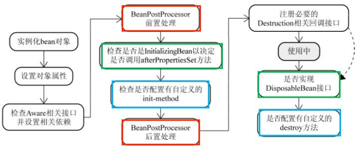

# Spring重要知识点总结

> author：spongehah（website：https://blog.hahhome.top）
>
> 截取参考来源：https://javaguide.cn
>
> 注：本笔记只是围绕Guide的文章总结了Spring中我认为的重点中的重点，并不全面，全面的请参考上列来源链接javaguide

[TOC]

# Spring IoC

> 关于Spring IoC的理解，可以看Guide哥的文章：https://javaguide.cn/system-design/framework/spring/ioc-and-aop.html

**IoC（Inversion of Control:控制反转）** 是一种**设计思想**，而不是一个具体的技术实现。IoC 的思想就是将原本在程序中手动创建对象的控制权，交由 Spring 框架来管理。不过， IoC 并非 Spring 特有，在其他语言中也有应用。

**为什么叫控制反转？**

- **控制**：指的是对象创建（实例化、管理）的权力
- **反转**：控制权交给外部环境（Spring 框架、IoC 容器）

使用IoC的好处：

1. 对象之间的耦合度或者说依赖程度降低；
2. 资源变的容易管理；比如你用 Spring 容器提供的话很容易就可以实现一个单例。

**IoC** 最常见以及最合理的**实现方式**叫做**依赖注入**（Dependency Injection，简称 **DI**）。

**DI**(Dependency Inject,依赖注入)**也是**实现控制反转的一种**设计模式**，依赖注入就是将实例变量传入到一个对象中去。

> Spri127.0.0.1:7890ng IoC源码分析：https://blog.hahhome.top/blog/Spring%E6%BA%90%E7%A0%81%E8%A7%A3%E8%AF%BB

## 声明Bean和注入Bean

Spring配置元数据可以是 **配置文件(常用为XML)**、**注解**、Java配置类

**声明Bean：**

- 配置文件举例：

  ```xml
  <bean id="..." class="...">
  	...
  </bean>
  ```

- 注解举例：

  ```java
  @Component //通用的注解
  @Repository //Dao 层
  @Service //服务层
  @Controller //MVC控制层
  public class xxx{
      ...
  }
  ```

  注解声明的**默认beanName就是类名的小驼峰**，也可以在括号中配置想要的beanName
  
  第三方库中的类需要使用**@Bean**注解配置方法来声明Bean，若是Spring应用还需要在xml文件中使用bean标签进行注册bean，但若是SpringBoot应用则配置在@Configuration注解下即可自动注册

**注入Bean：**

- 配置文件举例：

  xml方式也可以实现自动装配，即不用写property和constructor-arg标签，在bean标签中加入属性autowire="byType/byName"即可

  ```xml
  <bean id="..." class="...">
     <property name="..." ref="..." value="..."><property/> <!-- set注入注入bean -->
     <constructor-arg name="..." value="..."></constructor-arg> <!-- 构造注入注入bean -->
  </bean>
  ```

- 注解举例(其实是自动装配)：可以使用的注解有**@Autowired**、**@Resource**、@Inject

  注解方式也有构造注入和set注入，在构造方法或者set方法上面加@Autowired即可
  
  ```java
  @Autowired
  private IService service;
  ```

  - `@Autowired` 属于 Spring 内置的注解，默认的注入方式为`byType`（根据类型进行匹配）

    **这会有什么问题呢？** 当一个接口存在多个实现类的话，`byType`这种方式就无法正确注入对象了，因为这个时候 Spring 会同时找到多个满足条件的选择，默认情况下它自己不知道选择哪一个。这种情况下，注入方式会变为 `byName`（根据名称进行匹配），但是byName也会遇到一些问题，如下：
  
    ```java
    // 报错，byName 和 byType 都无法匹配到 bean
    @Autowired
    private SmsService smsService;
    
    // 正确注入 SmsServiceImpl1 对象对应的 bean
    @Autowired
    private SmsService smsServiceImpl1;
    
    // 正确注入  SmsServiceImpl1 对象对应的 bean
    // smsServiceImpl1 就是我们上面所说的名称
    @Autowired
    @Qualifier(value = "smsServiceImpl1")
    private SmsService smsService;
    ```

    **建议**通过 `@Qualifier` 注解来显式指定名称而不是依赖变量的名称。

  - `@Resource`属于 JDK 提供的注解，默认注入方式为 `byName`。如果无法通过名称匹配到对应的 Bean 的话，注入方式会变为`byType`。

    `@Resource` 有两个比较重要且日常开发常用的属性：`name`（名称）、`type`（类型）。

    如果仅指定 `name` 属性则注入方式为`byName`，如果仅指定`type`属性则注入方式为`byType`，如果同时指定`name` 和`type`属性（不建议这么做）则注入方式为`byType`+`byName`。
  
    ```java
    // 报错，byName 和 byType 都无法匹配到 bean
    @Resource
    private SmsService smsService;
    // 正确注入 SmsServiceImpl1 对象对应的 bean
    @Resource
    private SmsService smsServiceImpl1;
    // 正确注入 SmsServiceImpl1 对象对应的 bean（比较推荐这种方式）
    @Resource(name = "smsServiceImpl1")
    private SmsService smsService;
    ```

    **建议**通过指定@Resource注解的`name属性`来显式指定名称。
  
  - 二者的使用场景：`@Autowired` 支持在构造函数、方法、字段和参数上使用。`@Resource` 主要用于方法和字段上的注入，不支持在构造函数或参数上使用。

## Bean的作用域(获得的是否是同一个bean)

Spring 中 Bean 的作用域通常有下面几种：

- **`singleton`** : IoC 容器中只有唯一的 bean 实例。Spring 中的 bean **默认**都是单例的，是对单例设计模式的应用。
- **`prototype`** : 每次获取都会创建一个新的 bean 实例。也就是说，连续 `getBean()` 两次，得到的是不同的 Bean 实例。
- **request** （仅 Web 应用可用）: 每一次 HTTP 请求都会产生一个新的 bean（请求 bean），该 bean 仅在当前 HTTP request 内有效。
- **session** （仅 Web 应用可用） : 每一次来自新 session 的 HTTP 请求都会产生一个新的 bean（会话 bean），该 bean 仅在当前 HTTP session 内有效。
- **application/global-session** （仅 Web 应用可用）：每个 Web 应用在启动时创建一个 Bean（应用 Bean），该 bean 仅在当前应用启动时间内有效。
- **websocket** （仅 Web 应用可用）：每一次 WebSocket 会话产生一个新的 bean。

**如何配置 bean 的作用域呢？**

xml 方式：

```xml
<bean id="..." class="..." scope="singleton"></bean>
```

注解方式：

```java
@Bean
@Scope(value = ConfigurableBeanFactory.SCOPE_PROTOTYPE)
public Person personPrototype() {
    return new Person();
}
```

> Bean是线程安全的吗？
> 在scope = singleton时，如果这个 bean 是有状态的话，那就存在线程安全问题
> 原文:https://javaguide.cn/system-design/framework/spring/spring-knowledge-and-questions-summary.html#bean-%E6%98%AF%E7%BA%BF%E7%A8%8B%E5%AE%89%E5%85%A8%E7%9A%84%E5%90%97


## Bean的生命周期

> 原文链接：https://javaguide.cn/system-design/framework/spring/spring-knowledge-and-questions-summary.html#bean-%E7%9A%84%E7%94%9F%E5%91%BD%E5%91%A8%E6%9C%9F%E4%BA%86%E8%A7%A3%E4%B9%88

1. Bean 容器找到配置文件中 Spring Bean 的定义。
2. Bean 容器利用 Java Reflection API 创建一个 Bean 的实例。
3. 如果涉及到一些属性值 利用 `set()`方法设置一些属性值。
4. 如果 Bean 实现了 `BeanNameAware` 接口，调用 `setBeanName()`方法，传入 Bean 的名字。
5. 如果 Bean 实现了 `BeanClassLoaderAware` 接口，调用 `setBeanClassLoader()`方法，传入`ClassLoader`对象的实例。
6. 如果 Bean 实现了 `BeanFactoryAware` 接口，调用 `setBeanFactory()`方法，传入 `BeanFactory`对象的实例。
7. 与上面的类似，如果实现了其他 `*.Aware`接口，就调用相应的方法。
8. 如果有和加载这个 Bean 的 Spring 容器相关的 `BeanPostProcessor` 对象，执行`postProcessBeforeInitialization()` 方法
9. 如果 Bean 实现了`InitializingBean`接口，执行`afterPropertiesSet()`方法。
10. 如果 Bean 在配置文件中的定义包含 init-method 属性，执行指定的方法。
11. 如果有和加载这个 Bean 的 Spring 容器相关的 `BeanPostProcessor` 对象，执行`postProcessAfterInitialization()` 方法
12. 当要销毁 Bean 的时候，如果 Bean 实现了 `DisposableBean` 接口，执行 `destroy()` 方法。
13. 当要销毁 Bean 的时候，如果 Bean 在配置文件中的定义包含 destroy-method 属性，执行指定的方法。




## 普通Bean和工厂Bean

- 普通Bean：在配置文件中定义bean类型就是返回类型(创建自己)
- 工厂Bean(FactoryBean)：在配置文件定义bean类型可以和返回类型不一样(创建别人)

案例：

```xml
<bean id="myBean" class="org.spongehah.springdemo.factorybean.MyBean">
</bean>
```

```java
public class MyBean implements FactoryBean<User> {

    @Override
    public User getObject() throws Exception {
        return new User("zs",18,"zs@163.com");
    }

    @Override
    public Class<?> getObjectType() {
        return User.class;
    }

    @Override
    public boolean isSingleton() {
        return FactoryBean.super.isSingleton();
    }
}

@Test
public void test1() {
    ApplicationContext applicationContext = new ClassPathXmlApplicationContext("applicationContext.xml");
    User myBean = applicationContext.getBean("myBean", User.class);
    System.out.println(myBean);
}
```


# Spring AOP

> 关于Spring AOP的理解，可以看Guide哥的文章：https://javaguide.cn/system-design/framework/spring/ioc-and-aop.html

AOP(Aspect-Oriented Programming:**面向切面编程**)：AOP 是 OOP（面向对象编程）的一种延续，二者互补，并不对立。能够将那些与业务无关，却为业务模块所共同调用的逻辑或责任（例如事务处理、日志管理、权限控制等）封装起来，便于**减少系统的重复代码，降低模块间的耦合度**，提高代码的**可维护性**和**可拓展性**。

Spring AOP 就是**基于动态代理**的，如果要代理的对象，**实现了某个接口**，那么 Spring AOP 会使用 **JDK Proxy(JDK动态代理)**，去创建代理对象，而对于**没有实现接口的对象**，就无法使用 JDK Proxy 去进行代理了，这时候 Spring AOP 会使用 **Cglib** 生成一个被代理对象的子类来作为代理


AOP解决的问题：

OOP 不能很好地处理一些分散在多个类或对象中的公共行为（如日志记录、事务管理、权限控制、接口限流、接口幂等等），这些行为通常被称为 **横切关注点（cross-cutting concerns）** 。如果我们在每个类或对象中都重复实现这些行为，那么会导致代码的冗余、复杂和难以维护。

AOP 可以将横切关注点（如日志记录、事务管理、权限控制、接口限流、接口幂等等）从 **核心业务逻辑（core concerns，核心关注点）** 中分离出来，实现关注点的分离。

> 动态代理模式常用的两种实现方式：JDK动态代理、Cglib动态代理
> 在我的博客《Java23种设计模式》中有讲过：https://blog.hahhome.top/blog/Java%E8%AE%BE%E8%AE%A1%E6%A8%A1%E5%BC%8F/


## Spring AOP 和 AspectJ AOP 的区别

Spring AOP 已经**集成了 AspectJ** ，AspectJ 应该算的上是 Java 生态系统中最完整的 AOP 框架了。AspectJ 相比于 Spring AOP 功能更加强大，但是 Spring AOP 相对来说更简单，

**Spring AOP 属于运行时增强，而 AspectJ 是编译时增强。** Spring AOP 基于代理(Proxying)，而 AspectJ 基于字节码操作(Bytecode Manipulation)。

如果我们的切面比较少，那么两者性能差异不大。但是，**当切面太多的话，最好选择 AspectJ** ，它比 Spring AOP 快很多。


## 一些专用术语

AOP 切面编程涉及到的一些专业术语：

| 术语                                 | 含义                                                         |
| :----------------------------------- | :----------------------------------------------------------- |
| 目标(Target)                         | 被通知的对象                                                 |
| 横切关注点（cross-cutting concerns） | 多个类或对象中的公共行为（如日志记录、事务管理、权限控制、接口限流、接口幂等等） |
| 代理(Proxy)                          | 向目标对象应用通知之后创建的代理对象                         |
| 连接点(JoinPoint)                    | 目标对象的所属类中，定义的所有方法均为连接点                 |
| 切入点(Pointcut)                     | 被切面拦截 / 增强的连接点（**切入点一定是连接点，连接点不一定是切入点**）可以通过注解、正则表达式、逻辑运算等方式来定义 |
| 通知(Advice)                         | 增强的逻辑 / 代码，也即拦截到目标对象的连接点之后要做的事情  |
| 切面(Aspect)                         | 切入点(Pointcut)+通知(Advice)                                |
| Weaving(织入)                        | 将通知应用到目标对象，进而生成代理对象的过程动作             |


## AOP的使用

SpringBoot环境下：(Spring环境下需要在xml文件中配置包扫描器和@configuration注解，或者使用全注解编程)

1. 在启动类上加上注解 @EnableAspectJAutoProxy，参数proxyTargetClass的意思是是否使用cglib，默认为false，当有实现类时使用jdk动态代理，无实现类时使用cglib；配置为true时代表都使用cglib

2. 在切面上加上注解 @Aspect 和 **@Component**，被增强的类也需要被IoC管理(**声明Bean的四个注解**)

   - 多个切面的执行顺序如何控制？

     1、通常使用`@Order` 注解直接定义切面顺序

     ```java
     // 值越小优先级越高
     @Order(3)
     @Component
     @Aspect
     public class LoggingAspect implements Ordered {
     ```

     2、实现`Ordered` 接口重写 `getOrder` 方法。

     ```java
     @Component
     @Aspect
     public class LoggingAspect implements Ordered {
     
         // ....
     
         @Override
         public int getOrder() {
             // 返回值越小优先级越高
             return 1;
         }
     }
     ```

3. 使用 @PointCut("execution(* com.*.*(**))") 声明切入点，然后使用下列5种注解进行切入加强：

   1. **@Before**（前置通知）：目标对象的**方法调用之前**触发
   
   2. **@After** （后置通知）：目标对象的**方法调用之后**触发
   
   3. **@AfterReturning**（返回通知）：目标对象的方法调用完成，在**返回结果值之后**触发
   
   4. **@AfterThrowing**（异常通知）：目标对象的方法运行中**抛出 / 触发异常后**触发。AfterReturning 和 AfterThrowing 两者互斥。如果方法调用成功无异常，则会有返回值；如果方法抛出了异常，则不会有返回值。
   
   5. **@Around** （环绕通知）：编程式控制目标对象的方法调用。环绕通知是所有通知类型中可操作范围最大的一种，因为它可以直接拿到目标对象，以及要执行的方法，所以环绕通知可以任意的在目标对象的方法调用前后搞事，甚至不调用目标对象的方法
   
      > 获取连接点 方法形参、异常信息、返回信息 等：
      >
      > ```java
      > @Around ("pt()")
      > public Object around(ProceedingJoinPoint = pjp)throws Throwable{
      > 	//获取连接点方法的形参值
      > 	Object[] args = pjp.getArgs();
      > 
      > 	//获取执行签名信息
      > 	Signature signature = pjp.getsignature();
      > 	//通过签名获取执行类型（接口名）
      > 	String className = signature.getDeclaringTypeName();
      > 	//通过签名获取执行操作名称（方法名）
      > 	String methodName = signature.getName();
      > 
      > 	System.out.println("around before advice ...")
      > 	object ret = pjp.proceed();
      > 	System.out.println("around after advice ...")
      > 	return ret;
      > }
      > 
      > @After/ @Before	//若需要返回值或者抛出异常: @AfterReturning(value = "pt()",returning = "ret")/ @AfterThrowing(throwing="")
      > public void afterReturning(JoinPoint jp,Object ret){
      > 	//获取连接点方法的形参值
      > 	Object[] args = jp.getArgs();
      > 	System.out.println("afterReturning advice ..."+ret);
      > }
      > ```


# Spring MVC

MVC 是**模型(Model)、视图(View)、控制器(Controller)**的简写，其核心思想是通过将业务逻辑、数据、显示分离来组织代码。

MVC 是一种设计模式，Spring MVC 是一款很优秀的 MVC 框架。Spring MVC 可以帮助我们进行更简洁的 Web 层的开发，并且它天生与 Spring 框架集成。Spring MVC 下我们一般把后端项目分为 Service 层（处理业务）、Dao 层（数据库操作）、Entity 层（实体类）、Controller 层(控制层，返回数据给前台页面)。


## Spring MVC 的核心组件

记住了下面这些组件，也就记住了 SpringMVC 的工作原理。

- **`DispatcherServlet`**：**核心的中央处理器**，负责接收请求、分发，并给予客户端响应。
- **`HandlerMapping`**：**处理器映射器**，根据 URL 去匹配查找能处理的 `Handler` ，并会将请求涉及到的拦截器和 `Handler` 一起封装。
- **`HandlerAdapter`**：**处理器适配器**，根据 `HandlerMapping` 找到的 `Handler` ，适配执行对应的 `Handler`；
- **`Handler`**：**请求处理器**，处理实际请求的处理器。
- **`ViewResolver`**：**视图解析器**，根据 `Handler` 返回的逻辑视图 / 视图，解析并渲染真正的视图，并传递给 `DispatcherServlet` 响应客户端


## SpringMVC 处理请求流程

> 详细流程和SpringMVC源码分析：https://blog.hahhome.top/blog/Spring%E6%BA%90%E7%A0%81%E8%A7%A3%E8%AF%BB

**流程说明（重要）：**

1. 客户端（浏览器）发送请求， `DispatcherServlet`拦截请求并进行判断映射处理。
2. `DispatcherServlet` 根据请求信息调用 `HandlerMapping` 。`HandlerMapping` 根据 URL 去匹配查找能处理的 `Handler`（也就是我们平常说的 `Controller` 控制器） ，并会将请求涉及到的拦截器和 `Handler` 一起封装。
3. `DispatcherServlet` 调用 `HandlerAdapter`适配器执行 `Handler` 。
4. `Handler` 完成对用户请求的处理后，会返回一个 `ModelAndView` 对象给`DispatcherServlet`，`ModelAndView` 顾名思义，包含了数据模型以及相应的视图的信息。`Model` 是返回的数据对象，`View` 是个逻辑上的 `View`。
5. `ViewResolver` 会根据逻辑 `View` 查找实际的 `View`。
6. `DispaterServlet` 把返回的 `Model` 传给 `View`（视图渲染）。
7. 把 `View` 返回给请求者（浏览器）

**Spring MVC 原理如下图所示：**


## 多个拦截器的执行顺序

在根据request调用HandleMapping匹配Handle时返回的是**HandlerExecutionChain处理链对象，该对象封装了handler、所有的interceptor、interceptor Index**

在执行ha.handle()前会执行拦截器的**preHandle**方法
在执行ha.handle()后会执行拦截器的**postHandle**方法
在执行render()后会执行拦截器的**afterCompletion**方法

1. 若每个拦截器的preHandle()都是返回true：
   - 会**顺序**遍历配置的interceptor，挨个执行preHandle方法，
     **此时每返回一个true，interceptorIndex = i，i为当前interceptor下标**
   - 会**倒序**遍历配置的interceptor，挨个执行postHandle方法
   - 会**从interceptorIndex倒序**遍历interceptor，挨个执行afterCompletion方法
2. 若某个拦截器的preHandle()先返回false：
   - 会**顺序**执行完返回false的那个preHandle()，**包含**false的那个interceptor
   - postHandle()都不会执行
   - 会**从interceptorIndex倒序**执行afterCompletion()，**不包含**false的那个interceptor，因为返回false并没有使interceptorIndex++


## 全局异常处理

> 下面只是简单的介绍，详细配置一个全局异常处理请看Guide哥文章：https://mp.weixin.qq.com/s?__biz=Mzg2OTA0Njk0OA==&mid=2247486379&idx=2&sn=48c29ae65b3ed874749f0803f0e4d90e&chksm=cea24460f9d5cd769ed53ad7e17c97a7963a89f5350e370be633db0ae8d783c3a3dbd58c70f8&token=1054498516&lang=zh_CN#rd

推荐使用注解的方式统一异常处理，具体会使用到 `@ControllerAdvice` + `@ExceptionHandler` 这两个注解 

```java
/*
	ResponseEntity、BaseException等为代名词，例如ResponseEntity要替换为自定义全局返回类Result，BaseException可以使用Exception
*/
@ControllerAdvice
@ResponseBody	//或者将这两个合并为一个注解：@RestControllerAdvice
public class GlobalExceptionHandler {

    @ExceptionHandler(BaseException.class)
    public ResponseEntity<?> handleAppException(BaseException ex, HttpServletRequest request) {
      //......
    }

    @ExceptionHandler(ResourceNotFoundException.class)
    public ResponseEntity<ErrorReponse> handleResourceNotFoundException(ResourceNotFoundException ex, HttpServletRequest request) {
      //......
    }
}
```

这种异常处理方式下，会给所有或者指定的 `Controller` 织入异常处理的逻辑（AOP），当 `Controller` 中的方法抛出异常的时候，由被`@ExceptionHandler` 注解修饰的方法进行处理。

`ExceptionHandlerMethodResolver` 中 `getMappedMethod` 方法决定了异常具体被哪个被 `@ExceptionHandler` 注解修饰的方法处理异常。

```java
@Nullable
private Method getMappedMethod(Class<? extends Throwable> exceptionType) {
	List<Class<? extends Throwable>> matches = new ArrayList<>();
	//找到可以处理的所有异常信息。mappedMethods 中存放了异常和处理异常的方法的对应关系
	for (Class<? extends Throwable> mappedException : this.mappedMethods.keySet()) {
		if (mappedException.isAssignableFrom(exceptionType)) {
			matches.add(mappedException);
		}
	}
	// 不为空说明有方法处理异常
	if (!matches.isEmpty()) {
  		// 按照匹配程度从小到大排序
		matches.sort(new ExceptionDepthComparator(exceptionType));
  		// 返回处理异常的方法
		return this.mappedMethods.get(matches.get(0));
	}
	else {
		return null;
	}
}
```

从源代码看出：**`getMappedMethod()`会首先找到可以匹配处理异常的所有方法信息，然后对其进行从小到大的排序，最后取最小的那一个匹配的方法(即匹配度最高的那个)**

> 若要自定义全局异常，就写一个自定义异常类，将上面的第二个@ExceptionHandler的value替换为自定义异常类，然后若自定义了全局返回类，需要ResponseEntity替换为自定义全局返回类
>
> 自定义异常类举例：
>
> ```java
> @Data
> @ApiModel(value = "自定义全局异常类")
> public class CustomException extends RuntimeException {
> 
>      @ApiModelProperty(value = "异常状态码")
>      private Integer code;
> 
>  	/**
>      * 通过状态码和错误消息创建异常对象
>      * @param message
>      * @param code
>      */
>     public CustomException(String message, Integer code) {
>         super(message);
>         this.code = code;
>     }
> 
>     /**
>      * 接收枚举类型对象
>      * @param resultCodeEnum
>      */
>     public CustomException(ResultCodeEnum resultCodeEnum) {
>         super(resultCodeEnum.getMessage());
>         this.code = resultCodeEnum.getCode();
>     }
> 
>     @Override
>     public String toString() {
>         return "CustomException{" +
>                 "code=" + code +
>                 ", message=" + this.getMessage() +
>                 '}';
>     }
> }
> ```


# Spring 框架中用到了哪些设计模式？

> 关于下面这些设计模式的详细介绍，可以看Guide哥的 [Spring 中的设计模式详解](https://javaguide.cn/system-design/framework/spring/spring-design-patterns-summary.html) 这篇文章。
>
> 另外自定义Spring IoC和Spring IoC中的设计模式，可以看我的博客《Java23种设计模式》种的自定义Spring IoC：https://blog.hahhome.top/blog/Java%E8%AE%BE%E8%AE%A1%E6%A8%A1%E5%BC%8F/#74-%E8%87%AA%E5%AE%9A%E4%B9%89spring-ioc

- **工厂设计模式** : Spring 使用工厂模式通过 `BeanFactory`、`ApplicationContext` 创建 bean 对象。
- **单例设计模式** : Spring 中的 Bean 默认都是单例的。
- **模板方法模式** : AbstractApplicationContext 类中的 finishBeanFactoryInitialization () 方法调用了子类的 `getBean ()` 方法；还有Spring 中 `jdbcTemplate`、`hibernateTemplate` 等以 Template 结尾的对数据库操作的类，它们就使用到了模板模式。
- **代理设计模式** : Spring AOP 功能的实现。
- **策略模式** : 选择 JDK 代理或者 CGLIB 代理使用到了**策略模式**
- **依赖注入** : 依赖注入也是一种设计模式，就是将实例变量传入到一个对象中去
- **包装器设计模式/装饰器模式** : 我们的项目需要连接多个数据库，而且不同的客户在每次访问中根据需要会去访问不同的数据库。这种模式让我们可以根据客户的需求能够动态切换不同的数据源。
- **观察者模式** : Spring **事件驱动**模型就是观察者模式很经典的一个应用。[ [链接：点击跳转] ](https://javaguide.cn/system-design/framework/spring/spring-design-patterns-summary.html#%E8%A7%82%E5%AF%9F%E8%80%85%E6%A8%A1%E5%BC%8F)
- **适配器模式** : Spring AOP 的增强或通知(Advice)使用到了适配器模式、spring MVC 中也是用到了适配器模式适配`Controller`。
- ……


# Spring事务

> 关于 Spring 事务的详细介绍，可以看Guide哥的 [Spring 事务详解](https://javaguide.cn/system-design/framework/spring/spring-transaction.html) 这篇文章。

Spring事务的工作机制是基于Spring AOP实现的

**编程式事务**：在代码中硬编码(不推荐使用) : 通过 `TransactionTemplate`或者 `TransactionManager` 手动管理事务，实际应用中很少使用，但是对于你理解 Spring 事务管理原理有帮助。

**声明式事务**：在 XML 配置文件中配置或者直接基于注解（推荐使用） : 实际是通过 AOP 实现（基于`@Transactional` 的全注解方式使用最多）


## Spring事务的重要接口和属性

Spring 框架中，事务管理相关最重要的 3 个接口如下：

- **`PlatformTransactionManager`**：（平台）事务管理器，Spring 事务策略的核心。
- **`TransactionDefinition`**：事务定义信息(事务隔离级别、传播行为、超时、只读、回滚规则)。
- **`TransactionStatus`**：事务运行状态。

我们可以把 **`PlatformTransactionManager`** 接口可以被看作是事务上层的管理者，而 **`TransactionDefinition`** 和 **`TransactionStatus`** 这两个接口可以看作是事务的描述。


**1 PlatformTransactionManager**: 事务管理器

接口中定义了三个方法，让其它具体平台的事务管理器去实现，如**DataSourceTransactionManager**、HibernateTransactionManager、JpaTransactionManager等

```java
package org.springframework.transaction;

import org.springframework.lang.Nullable;

public interface PlatformTransactionManager {
    //获得事务
    TransactionStatus getTransaction(@Nullable TransactionDefinition var1) throws TransactionException;
    //提交事务
    void commit(TransactionStatus var1) throws TransactionException;
    //回滚事务
    void rollback(TransactionStatus var1) throws TransactionException;
}
```


**2 TransactionDefinition**: 事务属性

事务属性包含了 5 个方面：

1. 隔离级别
2. 传播行为
3. 回滚规则：定义了哪些异常会导致事务回滚而哪些不会，默认为RuntimeException
4. 是否只读：默认为false
5. 事务超时：默认为-1，表示超时时间取决于底层事务系统或者没有超时时间

> 隔离级别 和 传播行为 会在下面有简要介绍

```java
package org.springframework.transaction;

import org.springframework.lang.Nullable;

public interface TransactionDefinition {
    int PROPAGATION_REQUIRED = 0;
    int PROPAGATION_SUPPORTS = 1;
    int PROPAGATION_MANDATORY = 2;
    int PROPAGATION_REQUIRES_NEW = 3;
    int PROPAGATION_NOT_SUPPORTED = 4;
    int PROPAGATION_NEVER = 5;
    int PROPAGATION_NESTED = 6;
    int ISOLATION_DEFAULT = -1;
    int ISOLATION_READ_UNCOMMITTED = 1;
    int ISOLATION_READ_COMMITTED = 2;
    int ISOLATION_REPEATABLE_READ = 4;
    int ISOLATION_SERIALIZABLE = 8;
    int TIMEOUT_DEFAULT = -1;
    // 返回事务的传播行为，默认值为 REQUIRED。
    int getPropagationBehavior();
    //返回事务的隔离级别，默认值是 DEFAULT
    int getIsolationLevel();
    // 返回事务的超时时间，默认值为-1。如果超过该时间限制但事务还没有完成，则自动回滚事务。
    int getTimeout();
    // 返回是否为只读事务，默认值为 false
    boolean isReadOnly();

    @Nullable
    String getName();
}
```


**3 TransactionStatus**: 事务状态

`TransactionStatus`接口用来记录事务的状态 该接口定义了一组方法,用来获取或判断事务的相应状态信息。

`PlatformTransactionManager.getTransaction(…)`方法返回一个 `TransactionStatus` 对象。

```java
public interface TransactionStatus{
    boolean isNewTransaction(); // 是否是新的事务
    boolean hasSavepoint(); // 是否有恢复点
    void setRollbackOnly();  // 设置为只回滚
    boolean isRollbackOnly(); // 是否为只回滚
    boolean isCompleted; // 是否已完成
}
```


## Spring事务的7种传播行为

事务传播行为用来**描述由某一个事务传播行为修饰的方法`被嵌`套进另一个方法的时事务如何传播。**

当事务方法被另一个事务方法调用时，必须指定事务应该如何传播。例如：方法可能继续在现有事务中运行，也可能开启一个新事务，并在自己的事务中运行。

```java
//修改事务的传播行为：
@Transactional(propagation=Propagation.REQUIRES_NEW)
```

正确的事务传播行为可能的值如下:

1. TransactionDefinition.**PROPAGATION_REQUIRED**

   使用的最多的一个事务传播行为，我们平时经常使用的`@Transactional`注解**默认**使用就是这个事务传播行为。如果当前存在事务，则加入该事务；如果当前没有事务，则创建一个新的事务。

2. TransactionDefinition.**PROPAGATION_REQUIRES_NEW**

   创建一个新的事务，如果当前存在事务，则把当前事务挂起。也就是说**不管外部方法是否开启事务，**`Propagation.REQUIRES_NEW`修饰的内部方法**都会新开启自己的事务，且开启的事务相互独立，互不干扰。**
   举例：方法A嵌套B，A回滚，B不回滚；B回滚，A回滚

3. TransactionDefinition.**PROPAGATION_NESTED**

   如果当前存在事务，则创建一个事务作为当前事务的嵌套事务来运行；如果当前没有事务，则该取值等价于`TransactionDefinition.PROPAGATION_REQUIRED`。
   举例：方法A嵌套B，A回滚，B回滚；B回滚，A不回滚

4. TransactionDefinition.**PROPAGATION_MANDATORY**

   如果当前存在事务，则加入该事务；如果当前没有事务，则抛出异常。（mandatory：强制性）这个使用的很少。

   

   若是错误的配置以下 3 种事务传播行为，事务将不会发生回滚：

5. TransactionDefinition.**PROPAGATION_SUPPORTS**: 如果当前存在事务，则加入该事务；如果当前没有事务，则以非事务的方式继续运行。

6. TransactionDefinition.**PROPAGATION_NOT_SUPPORTED**: 以非事务方式运行，如果当前存在事务，则把当前事务挂起。

7. TransactionDefinition.**PROPAGATION_NEVER**: 以非事务方式运行，如果当前存在事务，则抛出异常。

> 详细举例Guide哥文章有：https://javaguide.cn/system-design/framework/spring/spring-transaction.html#%E4%BA%8B%E5%8A%A1%E5%B1%9E%E6%80%A7%E8%AF%A6%E8%A7%A3


## Spring事务隔离级别

和事务传播行为这块一样，为了方便使用，Spring 也相应地定义了一个枚举类：`Isolation`

```java
public enum Isolation {

    DEFAULT(TransactionDefinition.ISOLATION_DEFAULT),

    READ_UNCOMMITTED(TransactionDefinition.ISOLATION_READ_UNCOMMITTED),

    READ_COMMITTED(TransactionDefinition.ISOLATION_READ_COMMITTED),

    REPEATABLE_READ(TransactionDefinition.ISOLATION_REPEATABLE_READ),

    SERIALIZABLE(TransactionDefinition.ISOLATION_SERIALIZABLE);

    private final int value;

    Isolation(int value) {
        this.value = value;
    }

    public int value() {
        return this.value;
    }

}
```

下面我依次对每一种事务隔离级别进行介绍：

- **`TransactionDefinition.ISOLATION_DEFAULT`** :使用**后端数据库默认的隔离级别**，MySQL 默认采用的 `REPEATABLE_READ` 隔离级别 Oracle 默认采用的 `READ_COMMITTED` 隔离级别.
- **`TransactionDefinition.ISOLATION_READ_UNCOMMITTED`** :最低的隔离级别，使用这个隔离级别很少，因为它允许读取尚未提交的数据变更，**可能会导致脏读、幻读或不可重复读**
- **`TransactionDefinition.ISOLATION_READ_COMMITTED`** : 允许读取并发事务已经提交的数据，**可以阻止脏读，但是幻读或不可重复读仍有可能发生**
- **`TransactionDefinition.ISOLATION_REPEATABLE_READ`** : 对同一字段的多次读取结果都是一致的，除非数据是被本身事务自己所修改，**可以阻止脏读和不可重复读，但幻读仍有可能发生。**
- **`TransactionDefinition.ISOLATION_SERIALIZABLE`** : 最高的隔离级别，完全服从 ACID 的隔离级别。所有的事务依次逐个执行，这样事务之间就完全不可能产生干扰，也就是说，**该级别可以防止脏读、不可重复读以及幻读**。但是这将严重影响程序的性能。通常情况下也不会用到该级别。


## Spring事务回滚规则

**`@Transactional(rollbackFor = Exception.class)`**

Exception 分为**运行时异常** RuntimeException 和**非运行时异常**。事务管理对于企业应用来说是至关重要的，即使出现异常情况，它也可以保证数据的一致性。

当 @Transactional 注解作用于类上时，该类的所有 public 方法将都具有该类型的事务属性，同时，我们也可以在方法级别使用该标注来覆盖类级别的定义。如果类或者方法加了这个注解，那么这个类里面的方法抛出异常，就会回滚，数据库里面的数据也会回滚。

在 @Transactional 注解中如果**不配置rollbackFor属性**,那么事务只会在遇到RuntimeException的时候才会回滚，`加上 rollbackFor=Exception.class,可以让事务在遇到非运行时异常时也回滚。`


## @Transactional的使用

- Spring环境下需要：使用注解@EnableTransactionManagement开启事务管理 + 配置事务管理器DataSourceTransactionManager
- SpringBoot：自动完成以上两步

@Transactional 的作用范围：

1. **方法**：推荐将注解使用于方法上，不过需要注意的是：**该注解只能应用到 public 方法上，否则不生效。**
2. **类**：如果这个注解使用在类上的话，表明该注解对该类中所有的 public 方法都生效。
3. **接口**：不推荐在接口上使用。


@Transactional 的常用配置参数：

@Transactional注解源码如下，里面包含了基本事务属性的配置：

```java
@Target({ElementType.TYPE, ElementType.METHOD})
@Retention(RetentionPolicy.RUNTIME)
@Inherited
@Documented
public @interface Transactional {

	@AliasFor("transactionManager")
	String value() default "";

	@AliasFor("value")
	String transactionManager() default "";

	Propagation propagation() default Propagation.REQUIRED;

	Isolation isolation() default Isolation.DEFAULT;

	int timeout() default TransactionDefinition.TIMEOUT_DEFAULT;

	boolean readOnly() default false;

	Class<? extends Throwable>[] rollbackFor() default {};

	String[] rollbackForClassName() default {};

	Class<? extends Throwable>[] noRollbackFor() default {};

	String[] noRollbackForClassName() default {};

}
```

> **常用的**5个：即上面所说的五个事务属性；
>
> | 属性名      | 说明                                                         |
> | :---------- | :----------------------------------------------------------- |
> | propagation | 事务的传播行为，默认值为 REQUIRED，可选的值在上面介绍过      |
> | isolation   | 事务的隔离级别，默认值采用 DEFAULT，可选的值在上面介绍过     |
> | timeout     | 事务的超时时间，默认值为-1（不会超时）。如果超过该时间限制但事务还没有完成，则自动回滚事务。 |
> | readOnly    | 指定事务是否为只读事务，默认值为 false。                     |
> | rollbackFor | 用于指定能够触发事务回滚的异常类型，并且可以指定多个异常类型。 |


## Spring事务失效场景

1、Spring AOP **自调用**会造成事务失效

当一个方法被标记了`@Transactional` 注解的时候，Spring 事务管理器只会在被其他类方法调用的时候生效，而不会在一个类中方法调用生效。

因为在一个类中的其他方法内部调用的时候，我们动态代理生成的代理对象就无法拦截到这个内部调用，因此事务也就失效了。

解决办法：

1. 解决办法就是避免同一类中自调用或者使用 AspectJ 取代 Spring AOP 代理。

2. ```java
   @Service
   public class MyService {
   
   private void method1() {
        ((MyService)AopContext.currentProxy()).method2(); // 先获取该类的代理对象，然后通过代理对象调用method2，这样就相当于从外部调用了 method2()
        //......
   }
   @Transactional
    public void method2() {
        //......
     }
   }
   
   <dependency>
       <groupId>org.aspectj</groupId>
       <artifactId>aspectjweaver</artifactId>
   </dependency>
       
   @EnableAspectJAutoProxy(exposeProxy = true)
   ```
   
   > 第二个解决办法，在我的《Redis实战篇》笔记中，一人一单问题中有使用过


2、数据库引擎不支持事务

3、没有被 Spring 管理：比如对应的服务层没有加@Service注解

4、方法不是public修饰的

5、没有配置事务管理器：Spring需要注意这个问题，SringBoot会自动配置

6、传播行为设置成了不支持回滚的三种类型

7、异常没有被抛出：只有捕捉到异常并抛出，事务才会生效(没有try-catch或catch中没有处理)

8、程序抛出的异常和回滚规则不匹配：默认回滚规则是RuntimeException，需要配置@Transactional(rollbackFor = Exception.class)

> 参考文章：https://www.51cto.com/article/759570.html


# Spring&SpringBoot常用注解总结

> 直接去看Guide哥的原文吧，我就不总结重点了
> https://javaguide.cn/system-design/framework/spring/spring-common-annotations.html
>
> 目录：
> 1.@SpringBootApplication
> 2.Spring Bean 相关
> 3.处理常见的 HTTP 请求类型
> 4.前后端传值
> 5.读取配置信息
> 6.参数校验
> 7.全局处理 Controller 层异常
> 8.JPA 相关
> 9.事务 @Transactional
> 10.json 数据处理
> 11.测试相关

- 注意点1：**一个请求方法只可以有一个`@RequestBody`，但是可以有多个`@RequestParam`和`@PathVariable`**。 如果你的方法必须要用两个 `@RequestBody`来接受数据的话，大概率是你的数据库设计或者系统设计出问题了！

- 注意点2：**参数校验**：前端和后端都得进行参数校验，可是我自学到现在快找实习了竟然还没用过？？还是在Guide哥的笔记里看到的

  SpringBoot 项目的 spring-boot-starter-web 依赖中已经有 hibernate-validator 包，不需要引用相关依赖。如下图所示（通过 idea 插件—Maven Helper 生成）：

  **注**：更新版本的 spring-boot-starter-web 依赖中不再有 hibernate-validator 包（如 2.3.11.RELEASE），需要自己引入 `spring-boot-starter-validation` 依赖。

  👉 需要注意的是：**所有的注解，推荐使用 JSR 注解，即`javax.validation.constraints`，而不是`org.hibernate.validator.constraints`**

  > 详情请看Guide文章：https://javaguide.cn/system-design/framework/spring/spring-common-annotations.html#_6-%E5%8F%82%E6%95%B0%E6%A0%A1%E9%AA%8C
  > Guide哥微信公众号文章更详细：https://mp.weixin.qq.com/s?__biz=Mzg2OTA0Njk0OA==&mid=2247485783&idx=1&sn=a407f3b75efa17c643407daa7fb2acd6&chksm=cea2469cf9d5cf8afbcd0a8a1c9cc4294d6805b8e01bee6f76bb2884c5bc15478e91459def49&token=292197051&lang=zh_CN#rd

  `@NotNull` vs `@Column(nullable = false)`(重要)

  在使用 JPA 操作数据的时候会经常碰到 `@Column(nullable = false)` 这种类型的约束，那么它和 `@NotNull` 还有 `@Nullable` 有何区别呢？搞清楚这个还是很重要的！

  - `@NotNull`是 JSR 303 Bean验证批注,它与数据库约束本身无关。
  - `@Column(nullable = false)` : 是JPA声明列为非空的方法。
  - `@Nullable` : 可以使用在方法上面，属性上面，参数上面，表示方法返回可以为空，属性值可以为空，参数值可以为空

  总结来说就是即前者用于验证，而后者则用于指示数据库创建表的时候对表的约束。

- 注意点3：**JPA**，设置数据库与实体间的对应关系

  - 注意主键的生成策略**`@GenericGenerator`**和**`@GeneratedValue`**这两个注解
  - `@Transient`：声明不需要与数据库映射的字段，在保存的时候不需要保存进数据库 。
  - @Enumerated：可以创建枚举类型的字段（如性别），详情看原文
  - JPA审计功能：目前我没用过

  > 更多关于 Spring Boot JPA 的文章请看Guide哥这篇文章：https://mp.weixin.qq.com/s?__biz=Mzg2OTA0Njk0OA==&mid=2247485689&idx=1&sn=061b32c2222869932be5631fb0bb5260&chksm=cea24732f9d5ce24a356fb3675170e7843addbfcc79ee267cfdb45c83fc7e90babf0f20d22e1&token=292197051&lang=zh_CN#rd

  


